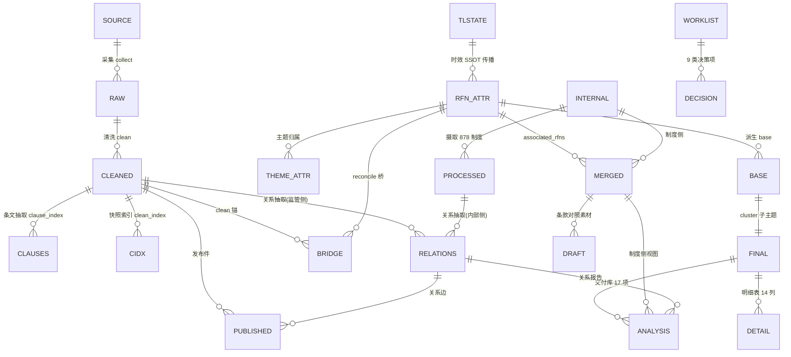
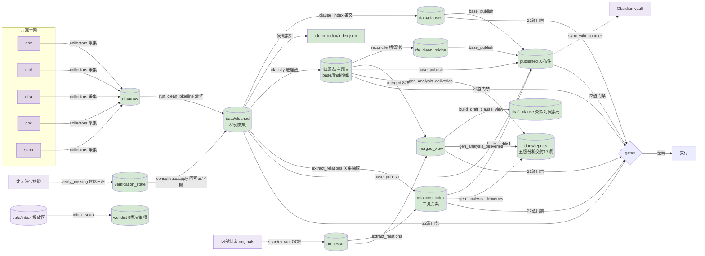

# 监管合规治理编排仓（regulatory_compliance_orchestrator）

> **项目名称**：监管合规治理编排仓（五源法规采集 · RFN 监管分类 · 内部制度对齐 · 制度起草 · 分析交付库）
> **文档版本**：`v3.0.0`
> **维护团队**：数据治理与合规工程组
> **最后更新**：2026-09-26
> **演进状态**：本仓为唯一演进点（原四仓只读冻结，见 §7 来源映射）。**v2 全链路重构已闭环**（九批执行报告见 §7），
> 运行时卫生（`gate_runtime_hygiene` 五判据）、类型检查（mypy）、数据校验（dedup_key 唯一性）与调度/触发
> 事实源（`schedule.yaml`/`triggers.yaml`/`inbox_registry.yaml`）均已落地为阻断级门禁。

---

## 1. 项目概述 (Project Overview)

- **背景与痛点**：保险机构合规治理依赖的监管文件散落五源官网（gov/mof/nfra/pbc/supp），采集/清洗/分类链路分布在四个独立仓库、脚本互不统一；内部制度正文与外部监管依据之间缺少可核验的对齐关系，起草时引用文号/标题存在"臆造漂移"风险；时效（废止/修订）核验结果在多副本间重复维护，无单一事实源。
- **核心目标**：构建单入口的监管合规编排器——五源采集清洗 → RFN（监管文件编号）唯一实体分类 → 内部制度对齐 → 起草条款对照素材 → 五级分析交付库，全部经**程序可读契约**、**唯一事实源（SSOT）**与**交付门禁**收敛为可审计、可重建、可回归的单一数据管道。
- **技术栈全景**：
  - **后端核心**：Python 3.13+（脚本编排式，无常驻服务）；标准库 + PyYAML / requests / beautifulsoup4 / lxml / numpy / pypdf / pdfplumber / chardet / Pillow / urllib3 / PyMuPDF
  - **数据契约与门禁**：`interfaces/contract.py`（程序可读契约）+ `interfaces/protocols.py`（四协议：CleanIndex/Rfn/InternalPolicy/Relations）+ `config/enums.py`（受控枚举）+ `config/exitcodes.py`（退出码 IntEnum）+ `gates/`（**22 道交付门禁**）
  - **唯一事实源**：`config/sources.yaml`（源目录）、`config/schedule.yaml`（定时任务）、`config/triggers.yaml`（条件触发）、`config/inbox_registry.yaml`（投放区）、`interfaces/theme_api`（主题集合）、`config/enums.py`（枚举域）
  - **OCR（按需部署）**：PaddleOCR 3.7.0（主引擎）+ Tesseract 5.4（备引擎）；引擎/语言包不入 git（见 §6）
  - **测试与静态检查**：pytest（**487 用例** = 代码级 + `@data` 数据依赖）/ ruff（dev 依赖）/ **mypy（owned 层 0 error，阻断）** / coverage（**45%**）
  - **统一执行入口**：`cli.py run/doctor/status/schedule/triggers`（18 命令）；`tools/ci_check.py` 本地 CI 5/5
  - **知识库联动**：Obsidian vault（`tools/sync_wiki_sources.py` 同步）/ llm_wiki v0.6.11（契约见 `reports/llm_wiki接入适配契约_20260912.md`）
  - **可选外部组件**：`@pkulaw/mcp-cli` + 托管 Node（北大法宝时效核验；**Node 侧依赖，非 Python extra**，零 LLM 消耗）
  - **依赖管理**：Pyproject.toml（PEP 621，`[project.optional-dependencies]` 分 **dev/ocr**；PDF 文本层解析与编码探测属 base 依赖）

---

## 2. 目录结构规范与文件用途详解 (Directory Structure & File Manifest)

> **核心原则**：本仓为脚本编排型工程（无常驻服务、无 Web 框架），沿用"常规流程脚本 / 特殊工具脚本"分类：
> **常规流程脚本**（clean/classify/align/reconcile/gates/analysis/run 等）随数据推进被调度执行；
> **特殊/工具脚本**（迁移、拍平、基准登记、知识库同步、一次性修复）由人工按需执行。

### 2.1 根目录与一级模块总览

```
regulatory_compliance_orchestrator/
├── cli.py                    # 【常规流程·入口】统一命令分发（18 命令注册 + build_parser + main）
├── commands/                 # 【常规流程·命令实现】18 命令实现包（各含 run(argv)）
│                             #   analysis/base/classify/doctor/draft/gates/governance/internal/ping/
│                             #   relations/rfn/run/schedule/source/status/timeliness/triggers/worklist
├── paths.py                  # 【常规流程】路径唯一解析（ROOT/MODULES_DIR/GOVERNANCE_DB…，禁盘符字面量）
├── config/                   # 【常规流程】配置层（唯一事实源）
│   ├── enums.py              #   受控枚举唯一源（SOURCE_SET/TIMELINESS_STATUS/doc_type/category/RELATION_*…含自检）
│   ├── exitcodes.py          #   退出码 IntEnum（OK/FAIL/DATA/ENV/NOT_SOURCE_TREE…，裸整数 return 判据参照）
│   ├── constants.py          #   模块清单/结构清单 SSOT（MODULE_PKGS/MODULE_KEYS）
│   ├── loader.py             #   sources.yaml/ocr.yaml 唯一读取口（${VAR} 嵌套展开、collector 路由 API）
│   ├── sources.yaml          #   源目录唯一事实源（五源 collector/clean_project 字段消费，R15）
│   ├── schedule.yaml         #   定时任务唯一事实源（P2-2；反向生成运行手册定时表）
│   ├── triggers.yaml         #   条件触发唯一事实源（P2-1；TriggerRunner 消费）
│   ├── inbox_registry.yaml   #   投放区注册唯一事实源（P2-3b；inbox_scan 消费）
│   └── ocr.yaml              #   OCR 引擎配置（Paddle/Tesseract 双引擎 + 质量闸门阈值）
├── interfaces/               # 【常规流程】跨层唯一调用面（R4：模块间禁止直接互引）
│   ├── contract.py           #   数据契约 SSOT（列头/键集/枚举域/别名映射/中文列注册/附件字段）
│   ├── protocols.py          #   依赖协议（4 个 Protocol：CleanIndex/Rfn/InternalPolicy/Relations + assert_provider）
│   └── *_api.py              #   访问网关（全部实装）：clean_index/clause_index/timeliness/rfn/theme/
│                             #   internal_policy/relations/base/governance —— modules/ 跨模块唯一入口
├── modules/
│   ├── regulatory_scrapers/  # 【常规流程·外部域】五源采集/清洗/条文固定节点/时效核验/发布件/投放区
│   ├── regulatory_classifier/# 【常规流程·分类域】RFN 归属/主题/底座/明细(14列)/桥表/召回审计/关系图
│   ├── internal_policy_base/ # 【常规流程·内部域】制度扫描/摄取(878)/条文抽取/对齐/merged 视图
│   └── internal_policy_drafter/  # 【常规流程·起草域】条款级对照素材 + 引用核验门禁
├── std_lib/                  # 【共享库单副本】scraper_std（doc_type/category/unified_schema/ocr_engine…）
│   └── common_lib/           #   fs_lock / io_atomic / governance_store / logging / notify / triggers /
│                             #   retention / relations / norm（原子写、审计、日志、触发、保留策略、关系抽取）
├── gates/                    # 【常规流程·门禁】ALL_GATES 22 道交付门禁（gates/__init__.py 为准）
├── data/                     # 【环境】仓根运行数据（治理库 governance.db / inbox 投放区 / archive 归档；git 忽略）
├── exports/                  # 【环境】治理库文本快照（governance export 产出；git 忽略，派生只读层）
├── tests/                    # 【常规流程·验收】pytest：487 用例（33 文件；`@data` 依赖本机产物）
├── tools/                    # 【特殊工具/编排】见 §2.2（编排、迁移、基准、知识库同步、交付库生成、调度…）
├── docs/reports/             # 【特殊辅助·交付库】五级分析 17 项交付（analysis gen 生成 + _manifest）
├── reports/                  # 【特殊辅助】蓝图/检视/专项报告/重构执行报告/README 规范（权威交付文档）
├── external/                 # 【环境】tesseract junction（→ 系统安装目录，git 忽略）
├── tessdata/                 # 【环境】Tesseract 语言包（chi_sim 等，git 忽略）
├── BENCHMARK.md              # 【特殊辅助·基准登记】交付基准（tools/gen_benchmark.py 生成，回归对照）
├── data_migration_manifest.json  # 【特殊工具】旧仓→新仓数据复制追踪（P0 产物）
├── .git-blame-ignore-revs    # 【元数据】git blame 忽略纯格式化/机械改造提交（R7）
├── pyproject.toml            # 【元数据】PEP 621 依赖与 optional-dependencies + ruff/mypy/coverage/pytest 配置
└── README.md                 # 本文档
```

### 2.2 核心文件用途清单（脚本分类明细）

*按"核心入口 / 各模块通识"分级；全量文件级清单见 `reports/物理目录结构.txt`。*

| 路径 (Path) | 类型 | 脚本分类 (Script Type) | 用途描述 (Description) | 依赖/被调用方 (Caller) |
| :--- | :--- | :--- | :--- | :--- |
| `cli.py` | 文件 | **常规流程（入口）** | 统一命令分发（18 命令：`gates/source/internal/classify/timeliness/draft/rfn/base/analysis/relations/governance/run/doctor/status/schedule/triggers/worklist/ping`） | 由用户/automation 调用；`python cli.py <cmd>` |
| `paths.py` | 文件 | **常规流程** | ROOT/MODULES_DIR/SOURCES_YAML/OCR_YAML/GOVERNANCE_DB/INBOX_DIR 等路径唯一解析 | 被仓内几乎全部模块引用（R4，禁盘符） |
| `config/enums.py` | 文件 | **常规流程** | 受控枚举 SSOT：`SOURCE_SET`(5)/`TIMELINESS_STATUS`(7)/`INTERNAL_STATUS`(5)/`RELATION_*`/G1·G2 文种与位阶；`assert_enum_bindings()` 自检 | 被 `gates/gate_enum_values` 与各清洗/分类/关系模块引用 |
| `config/exitcodes.py` | 文件 | **常规流程** | 退出码 IntEnum（OK=0/FAIL=1/DATA=2/ENV=3/NOT_SOURCE_TREE=4…）；裸整数 `return N` 判据（gate_runtime_hygiene 判据①）参照 | 被 cli/commands/tools/modules 退出码语义化引用 |
| `config/loader.py` | 文件 | **常规流程** | sources.yaml/ocr.yaml 唯一读取口；`active_source_ids/collector_module/collector_path`（R15 路由）；OCRConfig 同源 | 被 `cli source`、clean `--project`、编排、extract 引用 |
| `config/schedule.yaml` | 文件 | **常规流程（配置）** | 定时任务唯一事实源（P2-2）；`tools/gen_schedule_doc.py` 反向生成运行手册定时表；`cli schedule install` 安装 Windows 计划任务 | 判据 S（gate_config_integrity）断言一致性 |
| `config/triggers.yaml` | 文件 | **常规流程（配置）** | 条件触发唯一事实源（P2-1）；`std_lib/common_lib/triggers.py` 的 TriggerRunner 消费 | 判据 T（gate_config_integrity）断言一致性；`cli triggers` 驱动 |
| `config/inbox_registry.yaml` | 文件 | **常规流程（配置）** | 投放区注册唯一事实源（P2-3b）；`tools/inbox_scan.py` 消费 | 判据 J7（worklist 双向闭合）断言 |
| `interfaces/contract.py` | 文件 | **常规流程** | 数据契约 SSOT（列头/键集/枚举域/别名映射/中文列注册/附件字段） | 被 gates、全部生成脚本引用 |
| `interfaces/protocols.py` | 文件 | **常规流程** | 4 个依赖协议（`CleanIndexProvider`/`RfnProvider`/`InternalPolicyProvider`/`RelationsProvider`）+ `assert_provider` | 被 gates/tools 治理层引用（不依赖 modules 内部实现） |
| `interfaces/theme_api.py` | 文件 | **常规流程** | 主题集合唯一入口（`theme_map/set_theme/by_theme/align_record`）；`THEME_MAP_P0` 改 re-export | 被 gate_contract、classifier、align 引用 |
| `modules/regulatory_scrapers/` | 目录 | **常规流程（外部域）** | 采集(collectors/)、清洗(clean/)、快照索引(clean_index/)、条文固定节点(clause_index/)、时效核验(timeliness_review/)、发布件(published/) | 被 classifier 经 clean_index 唯一消费（interfaces 面） |
| `.../clean/run_clean_pipeline.py` | 文件 | **常规流程** | 单源统一清洗 → `data/cleaned/{src}_cleaned_{date}.csv/jsonl`（39 列契约 + 空值告警 + 原子写 + **校验失败隔离** + **dedup_key 唯一性校验（转严格）**） | 每源采集后人工/automation 执行；`--project` 由 sources.yaml 派生 |
| `.../collectors/nfra_weekly.py` | 文件 | **常规流程（周度增量）** | nfra 周度增量链（列表顶部窗口刷新→详情续跑→离线重建）；编排经 `--collect nfra-weekly` 接入 | `tools/run_production_refresh.py` |
| `.../timeliness_review/verify_missing.py` | 文件 | **常规流程（定时/核验）** | 效力缺失记录北大法宝核验（R13 三态 success/partial/unavailable，摘要落盘，降级不误标） | `cli.py timeliness verify` 子进程；依赖 `@pkulaw/mcp-cli` + token env |
| `modules/regulatory_classifier/` | 目录 | **常规流程（分类域）** | RFN 归属/主题（rfn/registry）、底座/明细生成（scripts/）、召回审计（recall_audit/）、关系图（clause_graph） | 消费 scrapers clean；供给 internal merged / drafter / analysis |
| `.../rfn/registry.py` | 文件 | **常规流程** | RFN 归属与主题唯一写接口（`register_doc`/`set_theme`）；主题归属表唯一写者 | 被 `interfaces/rfn_api`、`rfn_backlog` 消费 |
| `.../scripts/classify.py` | 文件 | **常规流程** | 主题底座强序重建编排（base→cluster→match→detail→upper→clause_graph，hash 断点幂等） | `cli.py classify`；数据变更后重跑 |
| `.../scripts/reconcile_clean_drift.py` | 文件 | **常规流程** | RFN↔clean 溯源桥 + 漂移核验（桥表唯一写者；gate_rfn_drift 强制） | 清洗/快照推进后执行 |
| `modules/internal_policy_base/` | 目录 | **常规流程（内部域）** | indexer/extract/scan/align/merged：**878 制度**摄取→条文抽取→主题对齐→merged 视图（原件库 `originals/` 单一扁平层） | 消费 classifier RFN；供给 drafter / analysis / vault |
| `modules/internal_policy_drafter/` | 目录 | **常规流程（起草域）** | 起草条款对照素材（build_draft_clause_view）与引用核验（verify_regulatory_citations） | 读 merged_view + clauses |
| `std_lib/common_lib/governance_store.py` | 文件 | **常规流程** | 治理库唯一读写实现（11 表：run_log/watermark/artifact/audit_log/gate_result/worklist/run_step/document/theme_assign/relation/timeliness_history） | 被 `cli governance`、编排水位登记、worklist 队列消费 |
| `std_lib/common_lib/logging.py` | 文件 | **常规流程** | 日志统一入口（re-export `scraper_std.logging_setup` + `get_logger` + `setup_cli_logging` + `fatal`） | 被生产脚本、`run --json-logs` 调用 |
| `std_lib/common_lib/notify.py` | 文件 | **常规流程** | 通知通道（P2-6 告警；JSON 可读） | 被 `cli doctor`/`status`/`schedule verify` 调用 |
| `std_lib/common_lib/triggers.py` | 文件 | **常规流程** | 条件触发执行器（TriggerRunner，读 triggers.yaml） | 被 `cli triggers`/`cli run --triggers` 调用 |
| `std_lib/common_lib/retention.py` | 文件 | **常规流程** | 数据保留策略（P2-3；归档规则 + 到期清理） | 被 `tools/retention.py` 调用 |
| `std_lib/common_lib/relations.py` | 文件 | **常规流程** | 依据/废止关系统一抽取（唯一实现，七层结构 + 词表外置） | 被 `extract_relations`/`merged`/`build_detail_tables` 消费 |
| `gates/` | 目录 | **常规流程（质量门禁）** | **22 道**门禁实现（gate_*.py）；数量/实装以 `ALL_GATES` 为准 | `python cli.py gates`；提交/交付前必过 |
| `gates/gate_runtime_hygiene.py` | 文件 | **常规流程（门禁）** | 运行时卫生**五判据全阻断**：①裸整数退出码 ②宽泛吞异常 ③接口空壳 ④生产脚本日志化 ⑤owned 层卫生 | `cli gates` 子项 |
| `gates/gate_config_integrity.py` | 文件 | **常规流程（门禁）** | 配置完整性（判据 S 调度 / T 触发 / J7 worklist 双向 / R 步骤清单 / 结构清单派生一致） | `cli gates` 子项 |
| `tests/` | 目录 | **常规流程（验收）** | pytest：**487 用例**（33 文件；含 `@data` 数据依赖） | `python -m pytest tests -q`（无数据环境加 `-m "not data"`） |
| `tools/run_production_refresh.py` | 文件 | **常规流程（编排）** | 生产刷新编排：采集→清洗→全链→gates→变更监听基线；单实例锁；`--no-scrape`/`--resume`/`--json-logs` | 定时/人工触发；`cli run` 转调其 `main()` |
| `tools/ci_check.py` | 文件 | **常规流程（CI）** | 本地 CI 一键校验（ruff + mypy + pytest + gates + coverage）**5/5** | 提交前执行 |
| `tools/install_schedule.py` | 文件 | **特殊工具（调度安装）** | 由 schedule.yaml 安装 Windows 计划任务（N-44 修复后 5/5 成功） | `cli schedule install` |
| `tools/gen_schedule_doc.py` | 文件 | **常规流程（文档生成）** | 由 schedule.yaml 反向生成运行手册定时表 + crontab（判据 S 一致性） | `cli schedule print`；门禁校验 |
| `tools/inbox_scan.py` | 文件 | **常规流程（投放区）** | 投放区扫描（inbox_registry.yaml → worklist 决策项） | 数据投放入 data/inbox 后执行 |
| `tools/retention.py` | 文件 | **特殊工具（数据生命周期）** | 数据保留/归档/清理（P2-3；保留策略 + archive/） | 按月/按需执行 |
| `tools/gen_analysis_deliveries.py` | 文件 | **常规流程（交付库生成）** | 五级分析 **17 项交付生成**（全数据驱动 + `_manifest.json` 文件字节 sha256 登记 + `--dry`） | `cli.py analysis gen` |
| `tools/gen_benchmark.py` | 文件 | **特殊工具脚本（基准登记）** | 聚合当前产物统计渲染 `BENCHMARK.md`（数据重建后重跑刷新） | 手动执行 |
| `tools/sync_wiki_sources.py` | 文件 | **特殊工具脚本（知识库同步）** | 发布件 → Obsidian vault（`--scope all/internal` + `--prune`） | 数据更新后执行 |
| `tools/rfn_backlog.py` | 文件 | **常规流程（补登）** | RFN 补登候选（`dst_key` 线索 → 强关联；经 register_doc 唯一写口） | `cli relations` 联动 |
| `tools/extract_relations.py` | 文件 | **常规流程（关系抽取）** | 依据/废止关系编排（实体解析 + 三类产物） | `cli relations gen` |

---

## 3. 核心数据字典与物理模型 (Data Dictionary & Schema)

> **规范说明**：字段级定义以 `interfaces/contract.py` + `config/enums.py` 为单一事实来源（R24），下表为语义速查；下游一律经契约函数读取，禁止按列号/猜列直接解析。

### 3.1 实体关系总览 (ER Diagram)


- 数据血缘：各底座/明细/桥表/合并视图记录含 provenance（`generated_by/generated_at/source_snapshot`），gate_provenance 强制覆盖。
- 状态文件版本锚点：`classify_state / clause_index_state / rfn_drift_state / verification_state / _ingest_state` 写盘注入 `_meta{schema_version,written_by,written_at}`（副本写入防污染调用方），读侧剥离。
- 关系抽取（`extract_relations`）是**跨两类文本的唯一抽取实现**：读 `cleaned`（监管侧）+ `processed`（内部侧）→ 写 `relations_index.jsonl`（一张表三类关系）。

### 3.2 核心数据对象定义

| 数据项 (Field) | 类型 (Type) | 必填 | 枚举/格式约束 (Enum/Format) | 业务含义/示例 | 所属表/模块 (Scope) |
| :--- | :--- | :--- | :--- | :--- | :--- |
| `监管文件编号` | `string` | 是 | `^RFN-[0-9a-f]{16}$` | 外部监管文件全局唯一实体标识（文号\|标题派生）例：`RFN-4ab1a1555817bbc8` | 归属/主题归属/底座/桥 |
| `时效状态` | `enum` | 是 | 7 值：`valid/amended/repealed/partially_repealed/expired/pending/uncertain` | 文件效力状态；SSOT=verification_state → 归属表 → 底座（单路传播）；明细表 14 列同源投影 | 归属表、base `eff_status`、明细表 |
| `核验来源` | `string` | 否 | 例：`北大法宝` / `规则判断` | 时效判定来源（明细表 14 列之一） | 明细表 |
| `source` / `文件来源` | `enum` | 是 | 5 值：`gov/mof/nfra/pbc/supp` | 五源标识（子源经 SOURCE_ALIASES 归并） | cleaned/base/file_src |
| `主题` | `enum` | 是 | `T0`(上位法锚点)+`T1..T10`（THEME_MAP） | 主题归属（完整名见 `interfaces/theme_api`） | 主题归属表、明细 |
| `cluster` | `string` | 是 | 关键词聚类值或 `U未分类` | final 子主题（T9/T10 以 RFN u_fix 冻结） | final |
| `associated_rfns[]` | `array` | 否 | 元素：`{rfn,title,docno,matched_by}` | 内部制度引用的监管依据（matched_by∈{docno_sig,title}） | merged_view |
| `dedup_key` | `string` | 是 | 唯一 | 去重键（下游建索引依据；**唯一性校验转严格**：重复即 rc=2） | cleaned |
| `attachments[]` | `array` | 否 | 规范视图 7 字段 | 原文附件对象（pdf/docx/xlsx…），消费经 `contract.attachment_view()` 归一 | cleaned/published |
| `body_text` | `string` | 是 | 读侧别名归一 | 正文文本（读侧经 `contract.read_field()` 归一；写侧保留原始字段） | cleaned/JSONL |
| `generated_by/at/source_snapshot` | `string` | 是 | 时间 `%Y-%m-%d %H:%M:%S` | 行级血缘：写者/批次时间/源快照(mtime) | base/base 派生链 |

### 3.3 枚举值全量清单（关键受控枚举，源=config/enums.py）

- **`SOURCE_SET`**：`gov` / `mof` / `nfra` / `pbc` / `supp`——sources.yaml enabled 集合与之双向一致（gate_sources_config）。
- **`TIMELINESS_STATUS`（时效状态，7 值）**：`valid` 现行有效 / `amended` 已修改 / `repealed` 已废止 / `partially_repealed` 部分废止 / `expired` 已失效 / `pending` 核验中 / `uncertain` 不确定。
- **`INTERNAL_STATUS`（内部制度，5 值）**：`draft / active / expiring / deprecated / archived`；`INTERNAL_FILE_TYPE`：`policy / process / guideline / manual / other`。
- **G1 文种（doc_type）**：`FILE_TYPES` 60 项有序列表；`DOC_TYPE_GROUP`；别名 `DOC_TYPE_ALIAS={令→命令, 法→法律}`。
- **G2 效力位阶（category）**：13 级英文枚举 `constitution(1)…other(12)`；存量中文映射 `CATEGORY_MAP`。
- **附件对象字段（`ATTACHMENT_FIELDS`）**：`file_name / kind / local_path / sha256 / bytes / text_len / url`（别名收敛 `ATTACHMENT_ALIASES`）。
- **字段语义等价（`FIELD_SEMANTIC_EQUIV`）**：`body_text`(5 名)/`publish_date`/`effective_date`/`source_url`/`document_number`/`title`/`source`/`timeliness_status`——读侧 `read_field` 统一归口。
- **中文列名受控注册（`CN_FIELD_REGISTRY`）**：归属/主题/明细/桥/recall 各域中文列登记；新增明细列必须同步登记。
- **关系受控值**：`RELATION_KIND`/`RELATION_DOC_KIND`/`BASIS_TYPE`/`REPEAL_ACTION`/`REPEAL_SCOPE`/`RELATION_MATCH_METHOD`/`RELATION_TARGET_CLASS`（`entity/corpus/organ/generic/external`）。
- **编号空间**：外部 `RFN-<16hex>`；内部 `IPN-<16hex>`（独立空间不冲突）；`BRIDGE_RELATION`：`self/refresh/supersede`。
- **退出码（`config/exitcodes.ExitCode`）**：`OK=0 / FAIL=1 / DATA=2 / ENV=3 / NOT_SOURCE_TREE=4`（IntEnum；裸整数 `return N` 由 gate_runtime_hygiene 判据① 阻断）。

---

## 4. 数据流转与拓扑 (Data Flow & Topology)

### 4.1 端到端数据流图（Mermaid）


单向依赖纪律：scraper → classifier → internal_base → drafter → analysis；跨模块仅经 `interfaces/`；同仓唯一模块互引 = classifier→clean_index（gate_no_cross_module_import 守卫）。

### 4.2 数据处理管道明细

| 阶段 (Stage) | 数据源 (Source) | 目标存储 (Target) | 转换逻辑 (Transform) | 所属脚本/Job | 脚本分类 |
| :--- | :--- | :--- | :--- | :--- | :--- |
| **Extract 采集** | 五源官网 | `data/raw` → collectors 输出 | 各源 scraper；nfra 周度增量链 | `modules/.../collectors/<src>_*.py` | 常规流程（采集） |
| **Transform 清洗** | raw | `data/cleaned/{src}_cleaned_{date}.{csv,jsonl}` | unified_schema 归一（39 列契约 + enum 归并 + **校验失败隔离** + **dedup_key 唯一性**） | `clean/run_clean_pipeline.py --project <src>` | **常规流程** |
| **时效核验** | cleaned 效力空记录 | `verification_state.json` + 归属表 | 北大法宝 CLI 判定（7 值）；R13 三态摘要；降级不误标 | `timeliness_review/verify_missing.py` | **常规流程（需 token）** |
| **Load 底座** | 归属表（权威） | `_t{n}_base/final.json` | base 投影（血缘）→ cluster 子主题 | `classify --steps base,cluster` | 常规流程（幂等断点） |
| **关联 Load** | base/final + clean | 明细表（11 份 14 列）与桥表；clause_graph 关系边 | 条款引用/上位法抽取；RFN↔clean 漂移判定 | `build_detail_tables` / `reconcile_clean_drift` / `build_clause_graph` | 常规流程 |
| **Index 内部对齐** | internal originals | `processed/*_clauses.{json,md}` + `merged_view` | OCR →全文→条文结构→主题对齐×RFN 引用（**878 制度**） | `cli.py internal index/align/merged` | 常规流程 |
| **Export 起草** | merged_view | `drafter/data/draft_clause/*.md` | 条款级对照素材（逐条链接 RFN / ⚠ 待核文号） | `cli.py draft` | 常规流程 |
| **Publish 发布** | cleaned + merged | `published/external_*.jsonl` + internal 发布件 + FTS | 发布件构建（附件 7 字段契约/关系边汇聚） | `cli.py base publish` | 常规流程 |
| **Analysis 交付库** | final × 明细 × 图 × 关系产物 | `docs/reports/`（**17 项 + _manifest**） | 五级分析结构产出（全数据驱动）；关系类复用单源渲染 | `cli.py analysis gen` | **常规流程** |
| **Knowledge 同步** | 发布件 | `<Obsidian vault>\监管法规库` | frontmatter 溯源 + 截断声明 + `--prune` | `tools/sync_wiki_sources.py` | 特殊工具 |
| **Ingest 投放区** | data/inbox | worklist 决策项 | inbox_scan 按 inbox_registry.yaml 归类 → worklist | `tools/inbox_scan.py` | 常规流程 |
| **Validate 门禁** | 全仓数据/代码 | gates 报告 | **22 道** ALL_GATES（契约/枚举/漂移/时效 SSOT/血缘/水位/跨模块/运行时卫生/调度触发一致性…） | `cli.py gates` | 常规流程（阻断） |

---

## 5. 自动化任务节点与门禁设置 (Automation & Guardrails)

### 5.1 定时与事件驱动任务清单（唯一事实源 = config/schedule.yaml + config/triggers.yaml）

| 任务名称 | 触发方式 (Trigger) | 执行动作 (Action) | 入口位置 | 脚本分类 | 失败处理 |
| :--- | :--- | :--- | :--- | :--- | :--- |
| `REG_ORCH_refresh` | Cron 每日 06:00 | `cli.py run --no-scrape --resume`（全链刷新；无 raw 变化各阶段快跳） | `tools/run_production_refresh.py` | 常规流程（定时批） | 门禁 FAIL 输出清单留人工，不静默通过 |
| `REG_ORCH_nfra_weekly` | Cron 每周二 01:00 | `cli.py run --collect nfra-weekly`（nfra 周度增量链） | `tools/run_production_refresh.py` | 常规流程（定时） | 同上 |
| `REG_ORCH_verify` | Cron 每周一 07:00 | `cli.py run --only 6.9`（效力缺失核验批次，断点续跑） | `timeliness_review/verify_missing.py` | 常规流程（需 token） | 配额自动停，断点续跑 |
| `REG_ORCH_publish_wiki` | Cron 每周一 08:00 | `cli.py run --only 21.5`（发布件刷新 + llm_wiki 源同步） | `base_publish` + `sync_wiki_sources` | 常规流程 | 同上 |
| `REG_ORCH_monthly_check` | Cron 每月 1 日 09:00 | `cli.py gates` + `source diff` + `timeliness summary` + llm_wiki 巡检 | `cli.py gates` | 常规流程（月度巡检） | 同上 |
| （自动）分析交付库刷新 | 数据重建后自动（classify 尾部 + 编排阶段 6.8） | `cli.py analysis gen` → `docs/reports/` 17 项刷新 | `tools/gen_analysis_deliveries.py` | 常规流程（交付库） | 生成失败不阻断 classify（可手动补跑） |

> **调度事实源纪律（P2-2）**：定时任务**唯一事实源** = `config/schedule.yaml`；运行手册的定时表与 crontab 片段由
> `tools/gen_schedule_doc.py` 反向生成（**勿手改**）；`cli.py schedule install` 安装 Windows 计划任务、
> `cli.py schedule verify` 比对已装任务。判据 S（gate_config_integrity）断言「手册自动段 == yaml 渲染结果」。
> **触发事实源纪律（P2-1）**：条件触发唯一事实源 = `config/triggers.yaml`，`cli.py triggers` 驱动
> `std_lib/common_lib/triggers.TriggerRunner`（`cli.py run --triggers` 主链成功后追加执行）。判据 T 断言一致。
> **真实核验（北大法宝）**需 env：`PKULAW_NODE_EXE`/`PKULAW_PKG_DIR`（**指向包本体** `node_modules/@pkulaw/mcp-cli`）
> 与 token 文件 `.pkulaw_token`（git 忽略）。降级态（配额耗尽/令牌被拒）三脚本均不写判定（R13 不误标）。
> **变更监听**：`cli.py source diff [--record]` 对比 `data/watch_baseline.jsonl` 与当前快照。

### 5.2 数据与质量门禁 (Quality Gates)

- **代码门禁（CI = `tools/ci_check.py`，5 项全阻断）**：
  - `ruff check .` 零 Error（`[dev]` extra）。
  - **`mypy` owned 层 0 error（阻断）**——只检查 `std_lib/common_lib` + `config` + `interfaces` + `gates` + `commands`
    （`follow_imports="silent"` 排除历史层 scraper_std/modules 无注解遗留）。
  - `pytest tests -q`（**487 用例**；无数据环境 `pytest tests -m "not data"` 跑代码级回归）。
  - `cli.py gates` 全绿。
  - `coverage` ≥ 20%（当前 **45%**，只升不降）。
- **数据门禁（写入/交付拦截，ALL_GATES 22 道）**：
  - 数据契约（gate_contract 逐列比对）、受控枚举（gate_enum_values）、中文列名注册（gate_field_aliases）。
  - 时效单源（gate_timeliness_ssot）、RFN 一致（gate_rfn_sync）、漂移（gate_rfn_drift）、血缘（gate_provenance）。
  - 制度引用（gate_citations）、原件可解析（gate_original_resolvable）、关系产物（gate_relations）、产物水位（gate_watermark）。
  - **运行时卫生（gate_runtime_hygiene，五判据全阻断）**：①裸整数退出码（有顶层仓内导入的文件须 `ExitCode` 语义化）
    ②宽泛吞异常（`except Exception: pass` 且无意图声明）③接口空壳（`interfaces/**` 0 `NotImplementedError`）
    ④生产脚本日志化（LOG 下限 + print 上限）⑤owned 层卫生（config/interfaces/gates/commands 0 裸 return/except-pass）。
  - **cleaned schema（gate_clean_schema）**：交付文件含 validation_errors 即 FAIL（隔离机制生效后归零）；隔离率只披露。
  - **配置完整性（gate_config_integrity）**：判据 S（调度）/T（触发）/J7（worklist 双向）/R（步骤清单）/结构清单派生一致。
  - **导入引导纪律（gate_import_bootstrap）**：各层 sys.path 注入只减不增（基线冻结）。
  - **跨模块直连（gate_no_cross_module_import）**：modules/ 越权引导 + 裸 import + 兄弟模块路径拼接（判据 D）。
  - 目录拍平（gate_flat_layout）、硬编码零容忍（gate_hardcoded_paths / gate_hardcoded_snapshots）、
    重复工具扫描（gate_no_duplicate_libs）、密钥扫描（gate_secret_scan）、源配置（gate_sources_config）。
- **发布门禁**：
  - 交付前 `python cli.py gates` 全绿（PASS）方可；ALL_GATES 数量/实装以 `gates/__init__.py` 为准（禁止文本写死）。
  - 快照/归属表/时效数据变更纪律：先 reconcile → 再重建底座链（classify）→ gates → 刷新 `BENCHMARK.md` 与 analysis 交付库。

---

## 6. 环境搭建与本地开发 (Quick Start)

### 6.0 异机部署先决条件（必读）

> 本仓为**源码树编排工程**：`data/`、`published/`、`external/`、`tessdata/` 均不入 git。
> 克隆后**代码可运行，但业务链路需按下表补齐前提**（完整检视见 `reports/克隆可移植性检视报告_20260913.md`）。

| 前提 | 要求 | 缺失后果 |
| :--- | :--- | :--- |
| Python | **≥ 3.13**（`requires-python`） | pip 直接拒绝安装 |
| 安装方式 | `pip install -e ".[dev]"`（**必须可编辑**），或直接在仓库根运行 `python cli.py` | 非源码树安装不含 `modules/`；`cli.py` 启动校验以 rc=4 显式拒绝 |
| PDF/编码依赖 | 已列 base 依赖（pypdf/pdfplumber/chardet） | 缺则 `internal index` 对 PDF 静默产出空正文 |
| OCR（可选） | `pip install -e ".[ocr]"`；或设 `OCR_PADDLE_ROOT`/`OCR_TESSERACT_BIN`/`OCR_TESSDATA_DIR` | 扫描件走 OCR 降级 |
| 数据 | 活跃数据在 `modules/*/data`，**不入 git**：按 `data_migration_manifest.json` 恢复，或按 §6.5 重建 | `cli.py gates` 有 7 道数据门禁 FAIL（属预期，非代码缺陷） |
| 时效核验（可选） | env `PKULAW_NODE_EXE` + `PKULAW_PKG_DIR` + token 文件 | R13 三态降级为 `unavailable`（不误标） |
| 采集外网 | gov/mof/nfra/pbc 官网可达；mof 附件主机为内网地址 | mof 全量采集长时间空转 |

**无数据环境的验收口径**（代码级回归）：

```bash
%PY% -m pytest tests -m "not data" -q     # 代码级用例（不依赖本机数据产物）
%PY% cli.py ping                          # 骨架自检
%PY% cli.py source list                   # 源目录唯一事实源（sources.yaml）自检
```

---

1. **克隆代码**：`git clone <repo-url> regulatory_compliance_orchestrator && cd regulatory_compliance_orchestrator`
2. **准备 Python 运行时**（≥ 3.13）：
   ```bash
   PY=<你的 Python 3.13 解释器路径>
   %PY% -m pip install -e ".[dev]"        # OCR/扫描件场景追加 [ocr]
   ```
3. **数据就绪**：活跃数据在 `modules/*/data`，不入 git——按 `data_migration_manifest.json` 恢复，或按第 5 步重建。
4. **骨架自检**：`%PY% cli.py ping` / `%PY% cli.py source list`
5. **统一执行入口（推荐）**：
   ```bash
   %PY% cli.py run --no-scrape             # 全链刷新（跳过采集，仅清洗+全链）
   %PY% cli.py run --list-steps            # 列出步骤名（执行顺序）
   %PY% cli.py run --resume                # 从上次失败/未执行步骤续跑
   %PY% cli.py run --dry-run               # 只打印将执行的 argv
   %PY% cli.py run --json-logs             # 结构化日志（JSON lines）
   %PY% cli.py doctor                      # 环境自检（run 前置自动跑 --quick）
   %PY% cli.py status                      # 水位/待办/告警概览
   ```
6. **外部数据推进（按需，单步）**：
   ```bash
   %PY% modules\regulatory_scrapers\clean\run_clean_pipeline.py --project <gov|mof|nfra|pbc|supp> [--raw <path>]
   %PY% cli.py classify --all [--steps base,cluster,detail,...]
   %PY% modules\regulatory_classifier\scripts\reconcile_clean_drift.py [--apply]
   %PY% cli.py source diff
   ```
7. **内部制度链路（878 制度）**：
   ```bash
   %PY% cli.py internal index --source-dir <制度目录>
   %PY% cli.py internal align
   %PY% cli.py internal merged
   %PY% cli.py draft
   ```
8. **关系抽取与 RFN 补登**：
   ```bash
   %PY% cli.py relations gen [--source nfra] [--report]
   %PY% cli.py relations status --samples
   %PY% tools\rfn_backlog.py --apply --theme-mode suggested   # 补登候选 → 强关联
   ```
9. **调度与触发**：
   ```bash
   %PY% cli.py schedule print              # 打印 crontab（由 schedule.yaml）
   %PY% cli.py schedule install            # 安装 Windows 计划任务（5 项）
   %PY% cli.py schedule verify             # 比对已装任务
   %PY% cli.py triggers                    # 条件触发决策表（triggers.yaml）
   %PY% cli.py run --triggers              # 主链成功后追加触发项
   ```
10. **治理库与投放区**：
    ```bash
    %PY% cli.py governance init|status|edges|watermarks|sync|verify|export
    %PY% tools\governance_register_artifacts.py
    %PY% tools\inbox_scan.py               # 投放区扫描（inbox_registry.yaml → worklist）
    %PY% tools\retention.py                # 数据保留/归档/清理
    %PY% cli.py worklist                   # 待办队列（9 类决策项）
    ```
11. **交付验证**：
    ```bash
    %PY% cli.py gates                      # 22 道全绿（缺数据时数据门禁 FAIL 属预期）
    %PY% python -m pytest tests -q         # 487 用例
    %PY% python -m pytest tests -m "not data" -q   # 无数据环境：代码级用例
    %PY% python tools\ci_check.py --cov    # 本地 CI（ruff+mypy+pytest+gates+coverage）5/5
    %PY% python tools\gen_benchmark.py     # 刷新交付基准
    ```
    > 门禁示意输出：`PASS: 全部门禁通过`；任一 FAIL 给出问题明细，修复后重跑，不静默放行。

---

## 7. 附录与延伸阅读

- **README 撰写规范与内容大纲**：参见 `reports/README撰写规范与内容大纲.md`（本文件依其结构撰写）。
- **v2 全链路重构（九批执行报告）**：`reports/重构执行报告_20260926.md`（第一批）…`_第九批_20260926.md`；
  施工依据 `reports/全链路重构方案_修订版_v2_20260926.md`；数据流图 `reports/全链路数据流链路图_v2_20260926.md`。
- **运行手册（编排与定时）**：`reports/运行手册_编排与定时_20260912.md`（调度清单/命令基准/rc 告警语义表；定时表由 schedule.yaml 生成）。
- **分析交付库（五级）**：`docs/reports/`——**17 项** + `_manifest.json`（文件字节 sha256 登记）；由 `cli.py analysis gen` 生成。
- **F 系列遗留项报告**：`reports/遗留项完成报告_20260912.md` 等（2026-09-12 批次）。
- **知识库联动**：Obsidian vault（`<Obsidian vault>\监管法规库`）；llm_wiki v0.6.11 接入契约见 `reports/llm_wiki接入适配契约_20260912.md`。
- **交付基准登记**：`BENCHMARK.md`（`tools/gen_benchmark.py` 生成）。
- **来源映射（原仓只读冻结，R19）**：

  | 原仓（工作区根下旧四仓，现已冻结只读） | 新仓 modules/ | 迁移阶段 |
  |---|---|---|
  | regulatory_scrapers | `modules/regulatory_scrapers` | P1–P3 |
  | regulatory_classifier | `modules/regulatory_classifier` | P4–P5 |
  | internal_policy_base（原空） | `modules/internal_policy_base`（新实现） | P6 |
  | internal_policy_drafter | `modules/internal_policy_drafter` | P7 |

- **演进纪律**：
  1. 原四仓与旧 std_lib 冻结只读；复用一律"复制进新仓后修改"。
  2. 跨模块调用仅经 `interfaces/`；禁止盘符字面量（gate_hardcoded_paths 强检）。
  3. 枚举 import `config.enums`；退出码 import `config.exitcodes.ExitCode`；契约以 `interfaces/contract.py` 为准；来源以 `config/sources.yaml` 为准；调度/触发/投放区以 `config/schedule.yaml`/`triggers.yaml`/`inbox_registry.yaml` 为准。
  4. 数据不入 git（`data/` ignore）；活跃数据按 `data_migration_manifest.json` 复制追踪。
  5. 交付前 `cli.py gates` 全绿；数据重建后刷新 `BENCHMARK.md` 与 `cli.py analysis gen` 交付库。
  6. 新代码须过 mypy（owned 层）、ruff、pytest、gates（`tools/ci_check.py` 一键 5/5）。
  7. 远程同步：每次提交后自动 `git push origin main`（本地 post-commit hook；失败不阻断 commit）。
  8. git blame 忽略机械改造提交（`.git-blame-ignore-revs`，已启用）。

---

### 📌 撰写提示（分类与维护约定）

1. **脚本分类逻辑**：本仓为数据管道型工程，"常规流程脚本"指随数据推进按 §5 调度执行的链路成员（含完整摘要/审计输出）；"特殊工具脚本"指一次性/运维辅助（迁移、拍平、基准登记、知识库同步），运行前建议双人复核。
2. **文件级颗粒度**：本文档 2.2 按"核心入口 + 模块通识"分级列示，全量文件清单见 `reports/物理目录结构.txt`，避免 README 臃肿。
3. **依赖关系链**：2.2 表格"依赖/被调用方"列给出调用层级，助新人理解依赖方向。
4. **Mermaid 渲染**：§3.1/§4.1 图表在 GitHub/GitLab 原生渲染。
5. **保持同步**：本节内容随重构持续演进，新增模块/命令/门禁后同步更新 2.2 与 §5；
   **数字类事实以实测输出为准**（本版：命令 18 / 门禁 22 / 用例 487 / 制度 878 / 交付 17 / 覆盖率 45% / mypy 0 error）。
