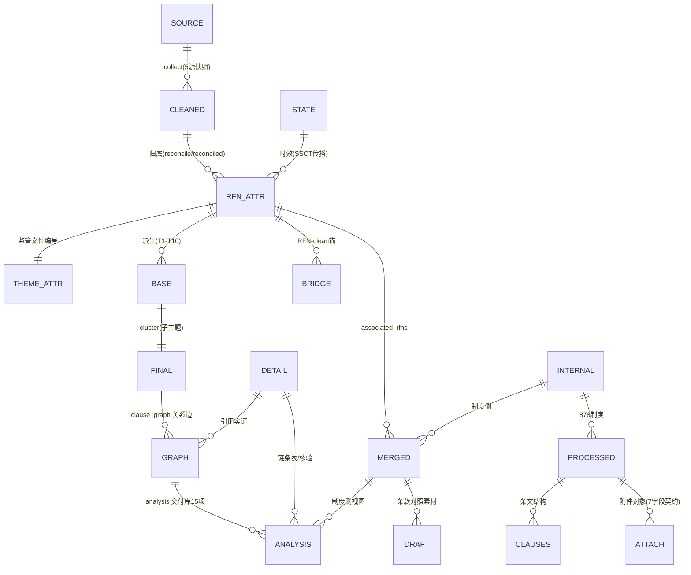
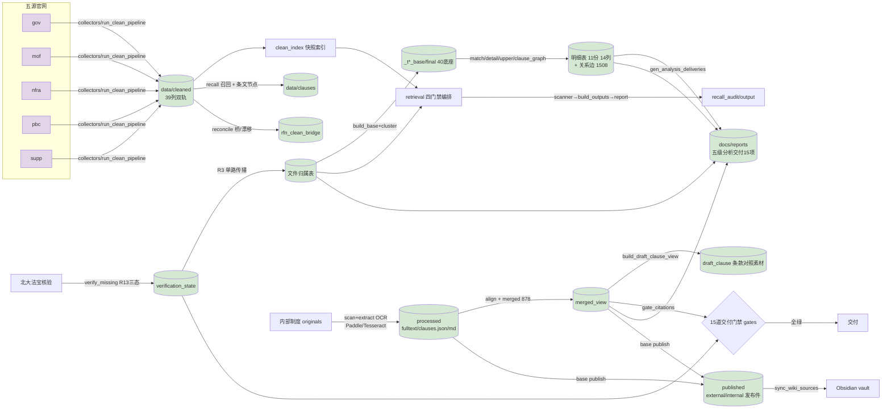

# 监管合规治理编排仓（regulatory_compliance_orchestrator）

> **项目名称**：监管合规治理编排仓（五源法规采集 · RFN 监管分类 · 内部制度对齐 · 制度起草 · 分析交付库）
> **文档版本**：`v2.1.0`
> **维护团队**：数据治理与合规工程组
> **最后更新**：2026-09-12
> **演进状态**：本仓为唯一演进点（原四仓只读冻结，见 §7 来源映射）；F 系列遗留项批次已全落地（详见 §7 报告索引）

---

## 1. 项目概述 (Project Overview)

- **背景与痛点**：保险机构合规治理依赖的监管文件散落五源官网（gov/mof/nfra/pbc/supp），采集/清洗/分类链路分布在四个独立仓库、脚本互不统一；内部制度正文与外部监管依据之间缺少可核验的对齐关系，起草时引用文号/标题存在"臆造漂移"风险；时效（废止/修订）核验结果在多副本间重复维护，无单一事实源。
- **核心目标**：构建单入口的监管合规编排器——五源采集清洗 → RFN（监管文件编号）唯一实体分类 → 内部制度对齐 → 起草条款对照素材 → **规划 §2.1 五级分析交付库**，全部经**程序可读契约**与**交付门禁**收敛为可审计、可重建、可回归的单一数据管道。
- **技术栈全景**：
  - **后端核心**：Python 3.13+（脚本编排式，无常驻服务）；标准库 + PyYAML / requests / beautifulsoup4
  - **数据契约与门禁**：`interfaces/contract.py`（程序可读契约，R24）/ `config/enums.py`（受控枚举）/ `gates/`（ALL_GATES 15 道交付门禁，R23）
  - **OCR（按需部署；引擎/语言包不入 git，见 §6.6）**：PaddleOCR 3.7.0（主引擎，源码目录经 `OCR_PADDLE_ROOT` 或 `external/PaddleOCR-3.7.0` 软链接入）+ Tesseract 5.4（备引擎，二进制经 `OCR_TESSERACT_BIN`，语言包置仓内 `tessdata/`）；pytesseract / numpy
  - **测试与静态检查**：pytest（tests/ **248 用例** = 235 代码级 + **13 数据依赖（`@data`）**）/ ruff（dev 依赖）
  - **知识库联动**：Obsidian vault（`<Obsidian vault>\监管法规库`，`tools/sync_wiki_sources.py` 同步）/ llm_wiki v0.6.11（已装，契约见 `reports/llm_wiki接入适配契约_20260912.md`）
  - **可选外部组件**：pdfplumber / python-docx（解析，**已列 base 依赖**）；`@pkulaw/mcp-cli` + 托管 Node（北大法宝时效核验 CLI；**Node 侧依赖，非 Python extra**，零 LLM 消耗）
  - **依赖管理**：Pyproject.toml（PEP 621，`[project.optional-dependencies]` 分 **dev/ocr**；PDF 文本层解析与编码探测属 base 依赖）

---

## 2. 目录结构规范与文件用途详解 (Directory Structure & File Manifest)

> **核心原则**：本仓为脚本编排型工程（无常驻服务、无 Web 框架），仍沿用"常规流程脚本 / 特殊工具脚本"分类，明确运维与数据治理责任：**常规流程脚本**（clean/classify/align/reconcile/gates/analysis 等）随数据推进被调度执行；**特殊/工具脚本**（flatten_collectors、gen_benchmark、一次性修复）由人工按需执行。

### 2.1 根目录与一级模块总览

```
regulatory_compliance_orchestrator/
├── cli.py                    # 【常规流程·入口】薄壳（2026-09-13 审查 P3：611→87 行）——
│                             #   COMMANDS 注册 + build_parser + main 分发仅此三件事
├── commands/                 # 【常规流程·命令实现】10 命令实现包（gates/source/internal/classify/
│                             #   timeliness/draft/rfn/base/analysis/ping，各含 run(argv)）
├── paths.py                  # 【常规流程】路径唯一解析（ROOT/MODULES_DIR/SOURCES_YAML…，禁盘符字面量）
├── config/                   # 【常规流程】配置层
│   ├── enums.py              #   受控枚举唯一源（SOURCE_SET/TIMELINESS_STATUS/doc_type/category…，含自检）
│   ├── loader.py             #   sources.yaml/ocr.yaml 唯一读取口（${VAR} 嵌套展开、collector 路由 API）
│   ├── sources.yaml          #   源目录唯一事实源（五源 collector/clean_project 字段消费，R15）
│   └── ocr.yaml              #   OCR 引擎配置（Paddle/Tesseract 双引擎 + 质量闸门阈值）
├── interfaces/               # 【常规流程】跨层唯一调用面（R4：模块间禁止直接互引）
│   └── contract.py           #   数据契约 SSOT：CLEANED_CSV_COLUMNS / BASE·FINAL·MATCHED·CITEREFS_KEYS /
│                              #   DETAIL_TABLE_FIELDS(14列) / ATTACHMENT_FIELDS / RFN_CLEAN_BRIDGE_FIELDS /
│                              #   CN_FIELD_REGISTRY(37+) / FIELD_SEMANTIC_EQUIV …
├── modules/
│   ├── regulatory_scrapers/  # 【常规流程·外部域】五源采集/清洗/条文固定节点/时效核验/发布件
│   ├── regulatory_classifier/# 【常规流程·分类域】RFN 归属/主题/底座/明细(14列)/桥表/召回审计/关系图
│   ├── internal_policy_base/ # 【常规流程·内部域】制度扫描/摄取(878)/条文抽取/对齐/merged 视图
│   └── internal_policy_drafter/  # 【常规流程·起草域】条款级对照素材 + 引用核验门禁
├── std_lib/                  # 【共享库单副本】scraper_std（doc_type/category/unified_schema/ocr_engine…）
│   └── common_lib/           #   fs_lock / io_atomic / logger（原子写与审计）
├── gates/                    # 【常规流程·门禁】ALL_GATES 15 道交付门禁（gates/__init__.py 为准，R23）
├── tests/                    # 【常规流程·验收】pytest：248 用例（13 项 @data 依赖本机产物）
├── tools/                    # 【特殊工具/编排】见 §2.2（编排、迁移、基准、知识库同步、交付库生成…）
├── docs/reports/             # 【特殊辅助·交付库】规划 2.1 五级分析 15 项交付（analysis gen 生成 + _manifest）
├── reports/                  # 【特殊辅助】蓝图/检视/专项报告/README 规范（权威交付文档）
├── external/                 # 【环境】tesseract junction（→ 系统安装目录，git 忽略）
├── tessdata/                 # 【环境】Tesseract 语言包（chi_sim 等，git 忽略）
├── BENCHMARK.md              # 【特殊辅助·基准登记】交付基准（tools/gen_benchmark.py 生成，回归对照）
├── data_migration_manifest.json  # 【特殊工具】旧仓→新仓数据复制追踪（P0 产物）
├── pyproject.toml            # 【元数据】PEP 621 依赖与 optional-dependencies
└── README.md                 # 本文档
```

### 2.2 核心文件用途清单（脚本分类明细）

*按"核心入口 / 各模块通识"分级；全量文件级清单见 `reports/物理目录结构.txt`。*

| 路径 (Path) | 类型 | 脚本分类 (Script Type) | 用途描述 (Description) | 依赖/被调用方 (Caller) |
| :--- | :--- | :--- | :--- | :--- |
| `cli.py` | 文件 | **常规流程（入口）** | 统一命令分发：`gates / source / internal / classify / timeliness / draft / rfn / base / analysis / ping` | 由用户/automation 调用；`python cli.py <cmd>` |
| `paths.py` | 文件 | **常规流程** | ROOT/MODULES_DIR/SOURCES_YAML/OCR_YAML 等路径唯一解析 | 被仓内几乎全部模块引用（R4，禁盘符） |
| `config/enums.py` | 文件 | **常规流程** | 受控枚举 SSOT：`SOURCE_SET`(5)/`TIMELINESS_STATUS`(7)/`INTERNAL_STATUS`(5)/G1·G2 文种与位阶；`assert_enum_bindings()` 自检 | 被 `gates/gate_enum_values` 与各清洗/分类模块引用 |
| `config/loader.py` | 文件 | **常规流程** | sources.yaml/ocr.yaml 唯一读取口；`active_source_ids/collector_module/collector_path`（R15 路由）；OCRConfig 同源 | 被 `cli source`、clean `--project`、编排、extract 引用 |
| `config/sources.yaml` | 文件 | **常规流程（配置）** | 源目录唯一事实源：`collector: collectors.<模块>` + `clean_project` | 启动即被 loader 消费（新增源走 `source add` checklist） |
| `interfaces/contract.py` | 文件 | **常规流程** | 数据契约 SSOT（列头/键集/枚举域/别名映射/中文列注册/附件字段），gate_contract 与 gate_field_aliases 逐列比对依据 | 被 gates、全部生成脚本引用 |
| `modules/regulatory_scrapers/` | 目录 | **常规流程（外部域）** | 采集(collectors/)、清洗(clean/)、快照索引(clean_index/)、条文固定节点(clause_index/)、时效核验(timeliness_review/)、发布件(published/) | 被 classifier 经 clean_index 唯一消费（interfaces 面） |
| `.../clean/run_clean_pipeline.py` | 文件 | **常规流程** | 单源统一清洗 → `data/cleaned/{src}_cleaned_{date}.csv/jsonl`（39 列契约 + 空值告警 + 原子写） | 每源采集后人工/automation 执行；`--project` 由 sources.yaml 派生 |
| `.../collectors/nfra_weekly.py` | 文件 | **常规流程（周度增量）** | nfra 周度增量链（列表顶部窗口刷新→详情续跑→离线重建）；编排经 `--collect nfra-weekly` 接入（F-O04） | `tools/run_production_refresh.py` |
| `.../timeliness_review/verify_missing.py` | 文件 | **常规流程（定时/核验）** | 效力缺失记录北大法宝核验（R13 三态 success/partial/unavailable，摘要落盘，降级不误标） | `cli.py timeliness verify` 子进程；依赖 `@pkulaw/mcp-cli` + token env |
| `modules/regulatory_classifier/` | 目录 | **常规流程（分类域）** | RFN 归属/主题（rfn/registry）、底座/明细生成（scripts/）、召回审计（recall_audit/）、关系图（clause_graph） | 消费 scrapers clean；供给 internal merged / drafter / analysis |
| `.../scripts/classify.py` | 文件 | **常规流程** | 主题底座强序重建编排（R8：base→cluster→match→detail→upper→clause_graph，hash 断点幂等） | `cli.py classify`；数据变更后重跑 |
| `.../scripts/build_base_from_attr.py` | 文件 | **常规流程** | 归属表→各主题 `_t{n}_base.json`（含 R10 provenance：generated_by/at/source_snapshot） | 被 classify base 子步调用；`--check` 校验模式 |
| `.../scripts/build_detail_tables.py` | 文件 | **常规流程** | 逐份条款引用与上位法依据明细表（`DETAIL_TABLE_FIELDS` 契约 **14 列**——含 F-L03 时效状态/核验来源，R10 血缘列） | classify detail 子步；`--apply` 才写盘 |
| `.../scripts/reconcile_clean_drift.py` | 文件 | **常规流程** | RFN↔clean 溯源桥 + 漂移核验（R7：桥表唯一写者；快照推进后须先跑再重建，gate_rfn_drift 强制） | 清洗/快照推进后执行；`--apply` 才刷新归属表展示字段 |
| `.../scripts/cluster_by_keywords.py` | 文件 | **常规流程** | final 子主题聚类（T1–T10；T9/T10 用 RFN 键 u_fix 冻结，R8 修复） | classify cluster 子步 |
| `.../scripts/build_clause_graph.py` | 文件 | **常规流程** | 主题内/跨主题引用关系边（book_title/docno/docno_sig；dst_theme 无 T 前缀——消费须归一） | classify 末步；供 relations 发布件与 analysis 交付库 |
| `modules/internal_policy_base/` | 目录 | **常规流程（内部域）** | indexer/extract/scan/align/merged：**878 制度**摄取→条文抽取→主题对齐→merged 视图（原件库 `originals/` 为**规范命名单一扁平层**：`文号_名称`，无文号则 `_名称`） | 消费 classifier RFN；供给 drafter / analysis / vault |
| `.../indexer.py` | 文件 | **常规流程** | 制度入库（IPN-16hex 指纹、正文、条文结构 `_clauses.json` + 渲染 `_clauses.md`，R21；同 IPN 多 sha 去重） | `cli.py internal index` |
| `.../merged.py` | 文件 | **常规流程** | 制度 × RFN 引用关联 → `merged_view.json`（associated_rfns + matched_by；同 IPN 多版本去重透明登记） | `cli.py internal merged`；被 gate_citations 消费 |
| `modules/internal_policy_drafter/` | 目录 | **常规流程（起草域）** | 起草条款对照素材（build_draft_clause_view）与引用核验（verify_regulatory_citations） | 读 merged_view + clauses |
| `.../scripts/build_draft_clause_view.py` | 文件 | **常规流程** | 条款级端到端对照素材（P8：merged_view × clauses → 每制度 md，自动链接 RFN/⚠待核文号；F-L02 覆盖 878 制度） | `cli.py draft` |
| `.../scripts/verify_regulatory_citations.py` | 文件 | **特殊工具脚本（起草门禁）** | 对齐表 R-01~R-43 + 文档监管引用核验（`--strict` 门禁；旧仓 docs 权威件链路） | 起草/修订制度后人工执行 |
| `gates/` | 目录 | **常规流程（质量门禁）** | **15 道**门禁实现（gate_*.py）；数量/实装以 `ALL_GATES` 为准（R23） | `python cli.py gates`；提交/交付前必过 |
| `tests/` | 目录 | **常规流程（验收）** | pytest：**248 用例**（235 代码级 + 13 `@data` 数据依赖；含 common_lib / 流水线断言 / 发布件契约 / 可移植性回归 / 原件路径治理 / 命名规则等） | `python -m pytest tests -q`（无数据环境加 `-m "not data"`） |
| `tools/run_production_refresh.py` | 文件 | **常规流程（编排）** | 生产刷新编排：采集→清洗→全链→gates→**变更监听基线（F-O02）**；`--collect nfra-weekly` 周增量链（F-O04） | 定时/人工触发（运行手册见 §7） |
| `tools/ingest_corpus.py` | 文件 | **特殊工具脚本（语料归集）** | 本地语料归集进 IPB（`--exclude-top` 目录排除、`_update_index` 索引维护；EAST 报送文档等按指示排除） | 归集制度/法规目录时执行 |
| `tools/gen_analysis_deliveries.py` | 文件 | **常规流程（交付库生成）** | **规划 §2.1 五级分析 15 项交付生成**（全数据驱动 + `_manifest.json` sha 登记 + `--dry`） | `cli.py analysis gen`；数据重建后刷新 |
| `tools/sync_wiki_sources.py` | 文件 | **特殊工具脚本（知识库同步）** | 发布件 → Obsidian vault（`<Obsidian vault>\监管法规库`；`--scope all/internal` + `--prune` + 截断声明 F-L08） | 数据更新后执行；llm_wiki 喂数同款 |
| `tools/gen_theme_moc.py` | 文件 | **特殊工具脚本（知识库）** | 主题 MOC（双体系归一，13 页 → vault 主题索引） | vault 同步后可选执行 |
| `tools/check_llm_wiki_upstream.py` | 文件 | **特殊工具脚本（上游适配）** | llm_wiki 版本巡检（基线 v0.6.11 登记；大版本变更 4 步核对清单） | 月度巡检（运行手册并入） |
| `tools/gen_benchmark.py` | 文件 | **特殊工具脚本（基准登记）** | 聚合当前产物统计渲染 `BENCHMARK.md`（数据重建后重跑刷新，回归对照） | 手动执行 |
| `tools/flatten_collectors.py` | 文件 | **特殊工具脚本（一次性迁移）** | collectors 物理拍平（单层 + 源前缀 + 互引改写；`--fix` 幂等修复） | 仅目录重构时执行 |

---

## 3. 核心数据字典与物理模型 (Data Dictionary & Schema)

> **规范说明**：字段级定义以 `interfaces/contract.py` + `config/enums.py` 为单一事实来源（R24），下表为语义速查；下游一律经契约函数读取，禁止按列号/猜列直接解析。

### 3.1 实体关系总览 (ER Diagram)


- 数据血缘：各底座/明细/桥表/合并视图记录含 **R10 provenance**（`generated_by/generated_at/source_snapshot/finalized_*`），gate_provenance 强制覆盖。
- 状态文件版本锚点：`classify_state / clause_index_state / rfn_drift_state / verification_state / _ingest_state` 写盘注入 `_meta{schema_version,written_by,written_at}`（**副本写入**防污染调用方），读侧剥离（F-D14）。

### 3.2 核心数据对象定义

| 数据项 (Field) | 类型 (Type) | 必填 | 枚举/格式约束 (Enum/Format) | 业务含义/示例 | 所属表/模块 (Scope) |
| :--- | :--- | :--- | :--- | :--- | :--- |
| `监管文件编号` | `string` | 是 | `^RFN-[0-9a-f]{16}$` | 外部监管文件全局唯一实体标识（文号\|标题派生）例：`RFN-4ab1a1555817bbc8` | 归属/主题归属/底座/桥 |
| `时效状态` | `enum` | 是 | 7 值：`valid/amended/repealed/partially_repealed/expired/pending/uncertain` | 文件效力状态；SSOT=verification_state → 归属表 → 底座（R3 单路传播）；**明细表 14 列同源投影（F-L03）** | 归属表、base `eff_status`、明细表 |
| `核验来源` | `string` | 否 | 例：`北大法宝` / `规则判断` | 时效判定来源（**F-L03**：法宝核验标记联入分析层；明细表 14 列之一） | 明细表（CN_FIELD_REGISTRY 登记） |
| `source` / `文件来源` | `enum` | 是 | 5 值：`gov/mof/nfra/pbc/supp` | 五源标识（子源经 SOURCE_ALIASES 归并） | cleaned/base/file_src |
| `主题` | `enum` | 是 | `T0`(上位法锚点)+`T1..T10`（THEME_MAP） | 主题归属（完整名见 `rfn.THEME_MAP`） | 主题归属表、明细 |
| `cluster` | `string` | 是 | 关键词聚类值或 `U未分类` | final 子主题（T9/T10 以 RFN u_fix 冻结） | final |
| `associated_rfns[]` | `array` | 否 | 元素：`{rfn,title,docno,matched_by}` | 内部制度引用的监管依据（matched_by∈{docno_sig,title}） | merged_view |
| `attachments[]` | `array` | 否 | 规范视图 7 字段（见 §3.3） | 原文附件对象（pdf/docx/xlsx…），消费经 `contract.attachment_view()` 归一（五源 5 套字段收敛，F-D07） | cleaned/published external_attachments |
| `body_text` | `string` | 是 | 读侧别名归一（`full_text/content_text/content`） | 正文文本（**读侧一律经 `contract.read_field()` 归一**；写侧保留原始字段防历史重写，F-D06） | cleaned/JSONL |
| `generated_by/at/source_snapshot` | `string` | 是 | 时间 `%Y-%m-%d %H:%M:%S` | 行级血缘（R10）：写者/批次时间/源快照(mtime) | base/base 派生链 |

### 3.3 枚举值全量清单（关键受控枚举，源=config/enums.py）

- **`SOURCE_SET`**：`gov`（国务院及地方 gov.cn）/ `mof`（财政部）/ `nfra`（金融监管总局）/ `pbc`（人民银行）/ `supp`（补充法规库）——sources.yaml enabled 集合与之双向一致（gate_sources_config）。
- **`TIMELINESS_STATUS`（时效状态，7 值）**：`valid` 现行有效 / `amended` 已修改 / `repealed` 已废止 / `partially_repealed` 部分废止 / `expired` 已失效 / `pending` 核验中(占位) / `uncertain` 不确定。语义：北大法宝等核验结论（fresh≤90 日）→ 归属表人工权威 → 底座派生。
- **`INTERNAL_STATUS`（内部制度，5 值）**：`draft / active / expiring / deprecated / archived`。
- **`INTERNAL_FILE_TYPE`**：`policy / process / guideline / manual / other`。
- **G1 文种（doc_type）**：`FILE_TYPES` 60 项有序列表（命令/通知/条例/办法…）；`DOC_TYPE_GROUP`（规划部署/制度治理/说明解释/文书凭证等）；别名 `DOC_TYPE_ALIAS={令→命令, 法→法律}`。
- **G2 效力位阶（category）**：13 级英文枚举 `constitution(1)…other(12)`，数值型 `AUTHORITY_RANK`（司法解释 2.5）；存量中文映射 `CATEGORY_MAP`（法律解释=司法解释，更正 3）。
- **附件对象字段（`ATTACHMENT_FIELDS`，F-D07）**：`file_name / kind / local_path / sha256 / bytes / text_len / url`（别名收敛 `ATTACHMENT_ALIASES`——五源 attachment_name/name/file_name 等 5 套）。
- **字段语义等价（`FIELD_SEMANTIC_EQUIV`，F-D06）**：`body_text`(5 名)/`publish_date`(+original)/`effective_date`(+original)/`source_url`(detail_url,url)/`document_number`/`title`/`source`/`timeliness_status`——**读侧 `read_field` 统一归口**。
- **中文列名受控注册（`CN_FIELD_REGISTRY`，gate_field_aliases）**：归属/主题/明细/桥/recall 各域中文列登记（37+ 项）；**新增明细列必须同步登记**（F-L03 实证：漏登记即门禁 FAIL）。
- **编号空间**：外部 `RFN-<16hex>`；内部 `IPN-<16hex>`（独立空间不冲突）；`BRIDGE_RELATION`：`self/refresh/supersede`。

---

## 4. 数据流转与拓扑 (Data Flow & Topology)

### 4.1 端到端数据流图（Mermaid）


单向依赖纪律：scraper → classifier → internal_base → drafter → analysis；跨模块仅经 `interfaces/`；同仓唯一模块互引 = classifier→clean_index。

### 4.2 数据处理管道明细

| 阶段 (Stage) | 数据源 (Source) | 目标存储 (Target) | 转换逻辑 (Transform) | 所属脚本/Job | 脚本分类 |
| :--- | :--- | :--- | :--- | :--- | :--- |
| **Extract 采集** | 五源官网 | `data/raw` → collectors 输出 | 各源 scraper（gov/mof/nfra/pbc/supp，源前缀拍平命名）；nfra 另有周度增量链 | `modules/.../collectors/<src>_*.py` | 常规流程（采集） |
| **Transform 清洗** | raw | `data/cleaned/{src}_cleaned_{date}.{csv,jsonl}` | unified_schema 归一（39 列契约 + enum 归并 + 空值告警阈值 3%） | `clean/run_clean_pipeline.py --project <src>` | **常规流程** |
| **时效核验** | cleaned 效力空记录 | `verification_state.json` + 归属表 | 北大法宝 CLI 判定（7 值）；R13 三态摘要；降级不误标 | `timeliness_review/verify_missing.py` | **常规流程（定时/需 token）** |
| **Load 底座** | 归属表（权威） | `_t{n}_base/final.json`（40） | base 投影（R10 血缘）→ cluster 子主题 | `classify --steps base,cluster` | 常规流程（幂等断点） |
| **关联 Load** | base/final + clean | 明细表（11 份 **14 列**）与桥表（11 列）；clause_graph 关系边（1508） | 条款引用/上位法抽取；时效/核验联入（F-L03）；RFN↔clean 漂移判定 | `build_detail_tables` / `reconcile_clean_drift` / `build_clause_graph` | 常规流程 |
| **Index 内部对齐** | internal originals | `processed/*_clauses.{json,md}` + `merged_view` | OCR（Paddle 主/Tesseract 备，质量闸门）→全文→条文结构（R21）→主题对齐×RFN 引用（**878 制度**） | `cli.py internal index/align/merged`；`internal reocr` 重扫 | 常规流程 |
| **Export 起草** | merged_view | `drafter/data/draft_clause/*.md` | 条款级对照素材（逐条链接 RFN / ⚠ 待核文号；覆盖 878 制度） | `cli.py draft` | 常规流程（P8） |
| **Publish 发布** | cleaned + merged | `published/external_*.jsonl`（records/clauses/attachments/relations）+ internal 发布件 + FTS | 发布件构建（附件 7 字段契约/关系边 1508 汇聚） | `cli.py base publish` | 常规流程 |
| **Analysis 交付库** | final × 明细 × 图 × upper_laws | `docs/reports/`（**15 项 + _manifest**） | 规划 §2.1 五级分析结构产出（全数据驱动） | `cli.py analysis gen` | **常规流程（F-L01）** |
| **Knowledge 同步** | 发布件 | `<Obsidian vault>\监管法规库`（Obsidian） | frontmatter 溯源 + 截断声明（F-L08）+ `--prune` 旧名清理 | `tools/sync_wiki_sources.py` | 特殊工具（知识库） |
| **Validate 门禁** | 全仓数据/代码 | gates 报告 | **15 道** ALL_GATES（契约/枚举/拍平/血缘/漂移/时效 SSOT/字段别名/原件可解析…） | `cli.py gates` | 常规流程（阻断） |

---

## 5. 自动化任务节点与门禁设置 (Automation & Guardrails)

### 5.1 定时与事件驱动任务清单（IDE automation，R11）

| 任务名称 | 触发方式 (Trigger) | 执行动作 (Action) | 脚本/入口位置 | 脚本分类 | 失败处理 |
| :--- | :--- | :--- | :--- | :--- | :--- |
| `orchestrator-五源周采集与漂移核验` | Cron 每周二 01:00 | 五源采集（含 **nfra-weekly 增量链**）→清洗→快照重建→retrieval 编排→reconcile 桥/漂移→**变更监听基线（source diff --record）**→`cli.py gates` | `tools/run_production_refresh.py` + `cli.py gates`（prompt 编排） | 常规流程（定时批） | 门禁 FAIL 输出清单留人工，不静默通过 |
| `orchestrator-每日检索门禁核验` | Cron 每日 06:00 | retrieval 四门禁编排（签名幂等，变化则重跑）→ `cli.py gates` 全绿确认 | `recall_audit/run_retrieval_after_checks.py` + `cli.py gates` | 常规流程（定时） | 任一 FAIL 输出失败门禁与原因清单，不改数据 |
| （自动）分析交付库刷新 | **数据重建后自动**（`cli.py classify` 成功尾部触发；编排阶段 6.8 显式再跑） | `cli.py analysis gen` → `docs/reports/` 15 项刷新（幂等，~2s） | `tools/gen_analysis_deliveries.py` | 常规流程（交付库） | 生成失败不阻断 classify（可手动 `analysis gen` 补跑；`--no-analysis` 跳过） |

> 真实核验（北大法宝）运行需环境：`PKULAW_NODE_EXE`/`PKULAW_PKG_DIR`（托管 Node + `@pkulaw/mcp-cli`）与 token 文件 `.pkulaw_token`（git 忽略）。
> **变更监听**：`cli.py source diff [--record]`——对比 `data/watch_baseline.jsonl` 基线与当前各源快照（日期/记录数/内容 sha），编排阶段 6.5 自动 `--record`（F-O02）。
> **编排与定时全景**：见 `reports/运行手册_编排与定时_20260912.md`（调度清单/命令基准/rc 告警语义表；新增任务须登记）。

### 5.2 数据与质量门禁 (Quality Gates)

- **代码门禁**：
  - `ruff check .` 零 Error（手动执行；`[dev]` extra）。
  - 自动化验收 `pytest tests -q`（**248 用例** = 235 代码级 + 13 `@data` 数据依赖；无数据环境用 `pytest tests -m "not data"` 跑代码级回归）。
- **数据门禁（写入/交付拦截，ALL_GATES 15 道）**：
  - 数据契约：归属表/明细/底座/桥 列头与键集须匹配 `interfaces/contract.py`（gate_contract 逐列比对，超集允许、缺必报）。
  - **中文列名受控注册**：CSV 中文列须在 `CN_FIELD_REGISTRY` 登记（gate_field_aliases；明细加列须同步，F-L03 实证）。
  - 受控枚举：所有枚举取值 ∈ `config/enums.py`（gate_enum_values）。
  - 时效单源：SSOT `verification_state` → 归属表 → 底座逐层一致（gate_timeliness_ssot；pending/陈旧/时间差容忍语义）。
  - RFN 一致性：归属表与 40 底座/11 明细 RFN 全一致（gate_rfn_sync）；快照推进后未跑 reconcile 即阻断重建（gate_rfn_drift）。
  - 数据血缘：底座/明细/桥表 provenance 字段覆盖 100%（gate_provenance）。
  - 制度引用：merged_view associated_rfns 全部在 classifier 存在（gate_citations）；起草引用核验见 drafter `verify_regulatory_citations.py --strict`（R-01~R-43 对齐表，旧仓 docs 权威件）。
  - 目录拍平：modules data/docs 禁止未经白名单的子目录（gate_flat_layout）。
  - 硬编码零容忍：盘符字面量（gate_hardcoded_paths）与 cleaned 快照日期 N-3 外推（gate_hardcoded_snapshots）扫描。
  - 重复工具/重名再定义扫描（gate_no_duplicate_libs；SSOT 分层 + `# norm-specialization` 豁免标记）。
  - **内部制度原件可解析**：`internal_policy_index.json` 的 `relative_path` 逐条须在 `originals/` 可解析（gate_original_resolvable）——**制度正文 100%**；非正文表格类失效台账不超**登记基线 0**（2026-09-13 治理后收紧：台账已隔离至 `data/ledgers/`，索引内不应再有非正文件）。漂移处置：`python tools/reconcile_original_paths.py [--apply]`（详见 `reports/内部制度原件双份存储与索引漂移分析_20260913.md`）。
- **发布门禁**：
  - 交付前 `python cli.py gates` **全绿（PASS）** 方可；ALL_GATES 数量/实装以 `gates/__init__.py` 为准（R23，禁止文本写死）。
  - 快照/归属表/时效数据变更纪律：先 reconcile → 再重建底座链（classify）→ gates → 刷新 `BENCHMARK.md` 与 **analysis 交付库**；禁手动直接改归属表核心字段（应经 reconcile C1/核验路径，C2 一律人工）。

---

## 6. 环境搭建与本地开发 (Quick Start)

### 6.0 异机部署先决条件（必读 · 2026-09-13 可移植性补强）

> 本仓为**源码树编排工程**：`data/`、`published/`、`external/`、`tessdata/` 均不入 git。
> 在新机器上克隆后**代码可运行，但业务链路需要按下表补齐前提**。
> 完整检视与实测证据见 `reports/克隆可移植性检视报告_20260913.md`。

| 前提 | 要求 | 缺失后果 |
| :--- | :--- | :--- |
| Python | **≥ 3.13**（`requires-python`） | pip 直接拒绝安装 |
| 安装方式 | `pip install -e ".[dev]"`（**必须可编辑**），或直接在仓库根运行 `python cli.py` | 非源码树安装（`pip install .`）不含 `modules/`；`cli.py` 启动校验会以 **rc=4** 显式拒绝并给出指引（不再抛晦涩的 `ModuleNotFoundError`） |
| PDF/编码依赖 | 已列 **base** 依赖（`pypdf` / `pdfplumber` / `chardet`） | 缺则 `internal index` 对 PDF **静默**产出空正文（`extract_status=library_missing`，不报错） |
| OCR（可选） | `pip install -e ".[ocr]"`；或设 `OCR_PADDLE_ROOT` / `OCR_TESSERACT_BIN` / `OCR_TESSDATA_DIR` 指向本地引擎 | 扫描件走 OCR 降级（不影响有文本层的 PDF） |
| 数据 | 活跃数据在 `modules/*/data`，**不入 git**：按 `data_migration_manifest.json`（**相对路径 + sha256**）从备份恢复，或按 §6.5 重新采集/重建 | `cli.py gates` 会有 **7 道数据门禁 FAIL**（契约 / RFN 一致性 / RFN 漂移 / 时效单源 / 引用 / 血缘 / 原件可解析）——**属预期，非代码缺陷** |
| 时效核验（可选） | env `PKULAW_NODE_EXE` + `PKULAW_PKG_DIR`（Node ≥22 + `npm install @pkulaw/mcp-cli`）+ token 文件 `modules/regulatory_scrapers/timeliness_review/.pkulaw_token` | R13 三态降级为 `unavailable`（不误标，但零核验） |
| 采集外网前提 | gov/mof/nfra/pbc 官网可达；**mof 附件主机为内网地址**，外网需 `MOF_COLLECT_ARGS="--no-attachments"` | mof 全量采集长时间空转 |
| 非 Windows | 旧 `.doc` 抽取依赖 WPS COM（Windows 专属）；非 Windows 需装 LibreOffice 并以 `LO_BIN` 指向其可执行文件 | `.doc`（仓内主力格式之一）大面积抽取降级 |

**无数据环境的验收口径**（代码级回归，可直接用于新克隆）：

```bash
%PY% -m pytest tests -m "not data" -q     # 235 用例：不依赖本机数据产物
%PY% cli.py source list                   # 源目录唯一事实源（sources.yaml）自检
%PY% cli.py ping                          # 骨架自检
```

---

1. **克隆代码**：
   ```bash
   git clone <repo-url> regulatory_compliance_orchestrator
   cd regulatory_compliance_orchestrator
   ```
2. **准备 Python 运行时**（本机采用托管 Python 3.13）：
   ```bash
   PY=<你的 Python 3.13 解释器路径>       # 例：托管 Python 3.13.12 的 python.exe
   %PY% -m pip install -e ".[dev]"        # OCR/扫描件场景追加 [ocr]；PDF 文本层解析已在 base 依赖
   ```
3. **数据就绪**：活跃数据在 `modules/*/data`（`data/` 同样被忽略），**不入 git**——按 `data_migration_manifest.json`（schema 1.1：**相对仓库根**路径 + size + sha256）从备份复制并校验，或按第 5 步重新采集/重建（内部制度：`%PY% cli.py internal index --source-dir <制度目录>`）。**注意**：无数据时 `cli.py gates` 会有 7 道数据门禁 FAIL，属预期而非代码缺陷（见 §6.0）。
4. **骨架自检**：
   ```bash
   %PY% cli.py ping                      # 骨架自检
   %PY% cli.py source list               # 五源 + internal（sources.yaml 唯一事实源）
   ```
5. **外部数据推进（按需）**：
   ```bash
   # 清洗单源（--project 由 sources.yaml 派生；raw 缺省自动探测）
   %PY% modules\regulatory_scrapers\clean\run_clean_pipeline.py --project <gov|mof|nfra|pbc|supp> [--raw <path>]
   # 底座强序重建（R8 幂等断点：base→cluster→match→detail→upper→clause_graph）
   %PY% cli.py classify --all [--steps base,cluster,detail,...]
   # 漂移核验/桥表（快照推进后必跑，gate_rfn_drift 前置）
   %PY% modules\regulatory_classifier\scripts\reconcile_clean_drift.py [--apply]
   # 变更监听（对比上次运行基线）
   %PY% cli.py source diff
   ```
6. **OCR（已部署；扫描件补扫按需）**：
   ```bash
   # 环境：PaddleOCR 3.7.0（源码目录经 OCR_PADDLE_ROOT / external 软链接入）+ Tesseract 5.4
   #      （OCR_TESSERACT_BIN 指向二进制 + 仓内 tessdata/chi_sim、tessdata/eng）
   %PY% cli.py internal reocr              # 零文本/低质 PDF 重扫（质量闸门；幂等）
   %PY% cli.py internal reocr --force      # 强制重扫（判据：fitz<30 或文本层<100 字；done 标记防重）
   ```
7. **时效核验（可选，需 token + CLI）**：
   ```bash
   set PKULAW_NODE_EXE=<托管 Node 的 node.exe 绝对路径>            # Node ≥ 22
   set PKULAW_PKG_DIR=<node_modules>\@pkulaw\mcp-cli              # npm install @pkulaw/mcp-cli 的安装目录
   %PY% cli.py timeliness verify --source gov --probe 1    # 冒烟；--source all 全量
   ```
   > R13 三态 exit：`0=success / 2=partial(可续跑) / 3=unavailable(降级不误标)`；token 位于 `modules/.../timeliness_review/.pkulaw_token`（git 忽略）。
8. **内部制度链路（878 制度）**：
   ```bash
   %PY% cli.py internal index --source-dir <制度目录>     # 制度摄取（幂等；同 IPN 多版本自动去重）
   %PY% cli.py internal align                              # 主题对齐（UNALIGNED 兜底）
   %PY% cli.py internal merged                             # 制度×RFN 引用视图
   %PY% cli.py draft                                       # 条款级对照素材（P8）
   ```

   **制度原件命名与归集规范（用户指令，2026-09-13）**：
   - 命名格式 **`文号_名称`**；未取得文号则 **`_名称`**（如 `_振兴计划规划师基本管理办法（2022版）.pdf`）；
   - **文号与名称优先从文档内容获取**（`scan.parse_content_identity`，内容权威）；内容未取得
     **文号**时，按名称匹配 `originals/制度清单.xlsx`（列：起草部门/制度名称/发文文号/…）兜底；
     名称不回退清单；
   - 规范化后**归集至 `originals/` 根层**（单一扁平原件层）；生产该状态的工具与流程：
     ```bash
     %PY% tools\normalize_internal_naming.py                # dry-run：解析质量统计 + 抽样
     %PY% tools\normalize_internal_naming.py --apply        # 规范命名 + 归集根层（含备份/manifest，幂等）
     %PY% tools\split_internal_nonpolicy.py --apply --prune-index   # 非正文件隔离（台账→data/ledgers、其余→data/misc）并清理失效索引
     %PY% cli.py internal index --source-dir modules\internal_policy_base\data\originals --only-unindexed
                                                            # 定向补摄取：把归集后仍未被索引的制度正文纳入索引
     %PY% cli.py internal merged                            # 索引变更后重建视图（否则 gate_citations 阻断）
     ```
   - 纪律：`originals/` 只放**制度正文**（pdf/doc/docx）+ 文号兜底用的 `制度清单.xlsx`；
     台账/清单类与图片/压缩/数据库等非正文件一律不进原件库（`gate_flat_layout` 白名单
     `{originals, processed, ledgers, misc}`；`gate_original_resolvable` 基线 0 保证索引内无失效路径）。
9. **发布件 / 分析交付库 / 知识库**：
   ```bash
   %PY% cli.py base publish --base all    # 双底座发布件 + FTS（external_relations 等）
   %PY% cli.py analysis gen               # 规划 §2.1 五级分析交付库 → docs/reports/（15 项）
   %PY% cli.py analysis status            # 交付库在位检查
   %PY% tools\sync_wiki_sources.py --out "<Obsidian vault>\监管法规库" --scope all --prune   # Obsidian 同步
   ```
10. **交付验证**：
    ```bash
    %PY% cli.py gates                    # 15 道全绿（需数据就绪；缺数据时 7 道数据门禁 FAIL 属预期）
    %PY% python -m pytest tests -q       # 248 用例（235 代码级 + 13 @data）
    %PY% python -m pytest tests -m "not data" -q   # 无数据环境：235 用例
    %PY% python tools\gen_benchmark.py   # 刷新交付基准（数据重建后执行）
    ```
    > 门禁示意输出：`PASS: 全部门禁通过`；任一 FAIL 会给出问题明细，修复后重跑，不静默放行。

---

## 7. 附录与延伸阅读

- **架构与演进文档（ADR 类比）**：参见 `reports/`（整体重构方案评估 v3 / 最终实施蓝图 v1.1 + 检视报告 / 专项评估 v2 / 端到端联动流程图.mermaid / 最终版审查报告 / 中间产物衔接分析）。
- **README 撰写规范与内容大纲**：参见 `reports/README撰写规范与内容大纲.md`（本文件依其结构撰写）。
- **运行手册（编排与定时）**：参见 `reports/运行手册_编排与定时_20260912.md`（调度清单/命令基准/rc 告警语义表/新增任务登记；llm_wiki 月度巡检并入）。
- **分析交付库（规划 §2.1）**：`docs/reports/`——**15 项**（2.1.1 纵向深化 5 + 2.1.2 横向整合 3 + 2.1.3 全景分析 7）+ `_manifest.json`（sha 登记）；由 `cli.py analysis gen` 全数据驱动生成；关键数据：10 主题 / 1051 文件 / 2000–2026 / 明细 1060 行（时效核验 94.9%）/ 关系边 1508（内部 660 + 跨 848）。
- **F 系列遗留项报告索引**：`reports/遗留项完成报告_20260912.md` / `_第二批_20260912.md` / `遗留项执行报告_第三批_20260912.md` / `F-L01_五级分析交付库专项报告_20260912.md` / `三项落地完成报告_20260912.md` / `剩余任务完成报告_20260912.md`。
- **知识库联动**：Obsidian vault（`<Obsidian vault>\监管法规库`，4985 篇）；llm_wiki v0.6.11 接入契约见 `reports/llm_wiki接入适配契约_20260912.md`（耦合面 2 处；0.6.x 零适配）。
- **交付基准登记**：参见 `BENCHMARK.md`（`tools/gen_benchmark.py` 生成：门禁/测试/cleaned 快照/归属/base·final/明细/桥/时效 state/内部 878/merged 878）。
- **来源映射（原仓只读冻结，R19）**：

  | 原仓（工作区根下旧四仓，现已冻结只读） | 新仓 modules/ | 迁移阶段 |
  |---|---|---|
  | regulatory_scrapers | `modules/regulatory_scrapers` | P1–P3 |
  | regulatory_classifier | `modules/regulatory_classifier` | P4–P5 |
  | internal_policy_base（原空） | `modules/internal_policy_base`（新实现） | P6 |
  | internal_policy_drafter | `modules/internal_policy_drafter`（verify/dump 迁入） | P7 |

- **演进纪律**：
  1. 原四仓与旧 std_lib 冻结只读；复用一律"复制进新仓后修改"。
  2. 跨模块调用仅经 `interfaces/`；禁止盘符字面量（gate_hardcoded_paths 强检）。
  3. 枚举 import `config.enums`；契约以 `interfaces/contract.py` 为准（**加列/新列须同步 CN_FIELD_REGISTRY**）；来源以 `config/sources.yaml` 为准。
  4. 数据不入 git（`data/` ignore）；活跃数据按 `data_migration_manifest.json` 复制追踪。
  5. 交付前 `cli.py gates` 全绿；快照推进先 reconcile 再重建底座（gate_rfn_drift）；数据重建后刷新 `BENCHMARK.md` 与 `cli.py analysis gen` 交付库。
  6. 运行核验/采集等外部依赖任务的执行环境与 token 纪律见 §5.1（automation 词内已内置）。
  7. 远程同步：每次提交后自动 `git push origin main`（本地 `.git/hooks/post-commit`，fast-forward 语义；push 失败不阻断 commit，手工 `git push origin main` 补推）。

---

### 📌 撰写提示（分类与维护约定，与规范文档一致）

1. **脚本分类逻辑**：本仓为数据管道型工程，"常规流程脚本"指随数据推进按 §5 调度执行的链路成员（含完整摘要/审计输出）；"特殊工具脚本"指一次性/运维辅助（迁移、拍平、基准登记、知识库同步），运行前建议双人复核。
2. **文件级颗粒度**：本文档 2.2 按"核心入口 + 模块通识"分级列示，全量文件清单见 `reports/物理目录结构.txt`，避免 README 臃肿。
3. **依赖关系链**：2.2 表格"依赖/被调用方"列给出调用层级（如 base 生成器被 classify 子步调用、merged_view 被 gate_citations/draft 消费），助新人理解依赖方向。
4. **Mermaid 渲染**：§3.1/§4.1 图表在 GitHub/GitLab 原生渲染；本地可用 VS Code Markdown Preview Mermaid 支持查看。
5. **保持同步**：本节内容随 R/F 系列重构持续演进，新增模块/命令/门禁后请同步更新 2.2 与 §5（门禁数量一律以 `gates/__init__.py ALL_GATES` 为准）；**数字类事实（制度数/用例数/门禁数/交付项数）更新时以实测输出为准**（本版：gates 15 / pytest 248 / 制度 878 / 交付 15）。
