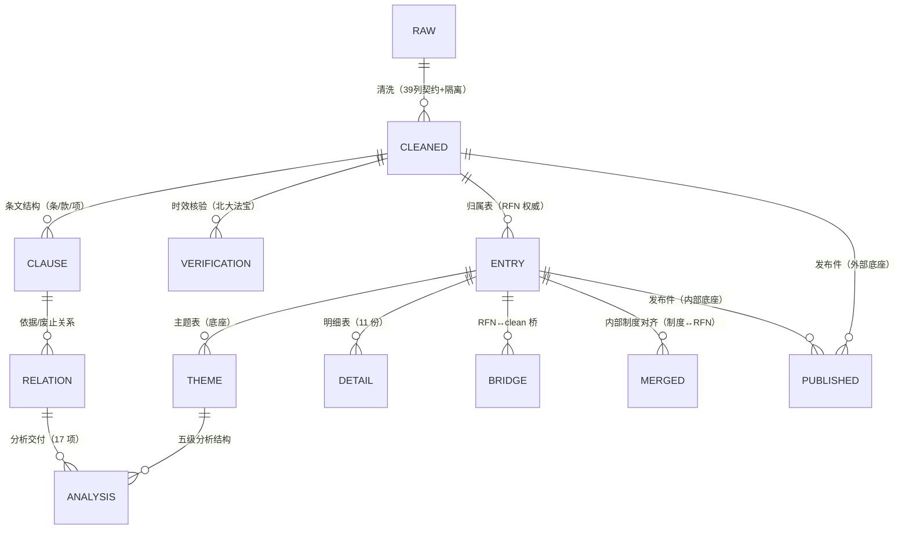
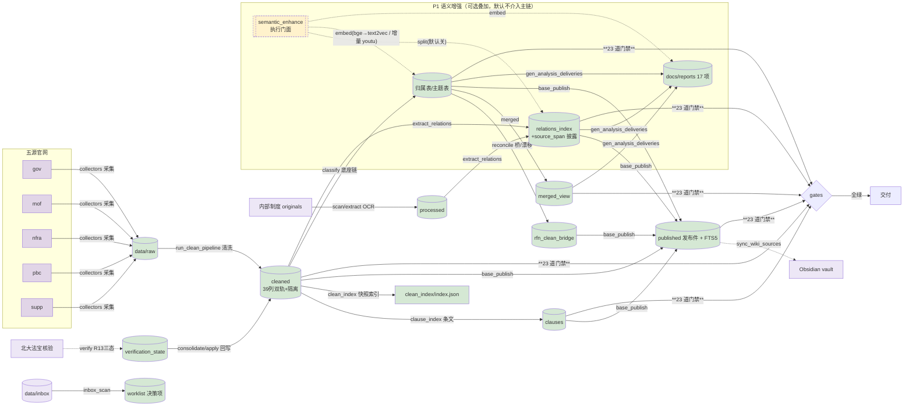

# 监管合规治理编排仓（regulatory_compliance_orchestrator）

> **文档版本**：`v3.0.0`（覆盖式重写，2026-09-30）
> **撰写依据**：`reports/README撰写规范与内容大纲.md`（七节结构 + 脚本分类 + 调用关系列）
> **本仓定位**：**源码树编排工程**（Single-Repo Orchestrator）——以统一入口把
> 「采集 → 清洗 → 时效核验 → 条文 → 归属/主题 → 关系 → 内部制度 → 发布 → 分析交付 → 门禁」
> 串成**一条可复跑、可审计、可断点续跑**的生产链路。

---

## 1. 项目概述 (Project Overview)

- **背景与痛点**：监管文件来自**五个异构官网**（gov/mof/nfra/pbc/supp），体裁混杂（法律/通知/公告/计划），
  且内部制度以扫描件与多格式文档分散存放。若各处理环节各自为政，会同时出现四类问题：
  ① **口径二重**（同一概念多处各写一份字面量）；② **静默劣化**（增强能力未生效却无人知）；
  ③ **断点不可复现**（换个模型/权重，产物变了但无人能判定）；④ **失败被吞**（步骤超时被杀，
  产物仍落盘被下游采用，而门禁报"全绿"）。
- **核心目标**：以**唯一入口 + 唯一事实源 + 可观测降级 + 机器化门禁**四条纪律，
  构建一条**端到端高可用、无阻断、可审计**的监管合规治理链路；任何增强能力**可缺失**（零硬依赖）
  但**不可静默**，任何失败**可恢复**但**不可隐藏**。
- **技术栈全景**：
  - **语言/运行**：Python **≥ 3.13**（`requires-python`）；Windows 计划任务调度（`cli.py schedule`）
  - **数据存储**：文件产物（JSONL/CSV）+ **SQLite FTS5**（全文检索）+ **PostgreSQL/pgvector**（向量检索，可选）
  - **治理留痕**：`data/governance.db`（SQLite 治理库：水位/门禁结果/步骤台账）
  - **质量工具**：`ruff`（Lint）/ `mypy`（类型）/ `pytest`（测试）/ 自研 **23 道门禁**（`cli.py gates`）
  - **P1 语义增强（可选叠加）**：`sentence-transformers` / `transformers` / `torch` / `ltp`；
    模型权重**随仓外置于 `external/models/`**（git 忽略）
  - **依赖管理**：`pyproject.toml`（PEP 621，含 `[dev]` `[ocr]` `[semantic]` 三个 extra）

---

## 2. 目录结构规范与文件用途详解 (Directory Structure & File Manifest)

> **核心原则**：本节定义物理文件组织规范。标注 **【常规流程】** 与 **【特殊/工具】**，
> 用于区分**随链运行的运行时逻辑**与**运维/一次性辅助逻辑**（SRE 责任划分依据）。

### 2.1 根目录与一级模块总览

```
regulatory_compliance_orchestrator/
├── cli.py                      # 【常规流程·唯一入口】全部命令的统一入口（run/gates/relations/...）
├── bootstrap.py                # 【常规流程】唯一引导点（sys.path 注入 + 环境归一）
├── paths.py                    # 【常规流程】**路径唯一事实源**（ROOT/DATA_DIR/*_DIR + 访问器）
├── file_list_watcher.py        # 【特殊/工具】FILE_LIST.md 生成器
├── pyproject.toml              # 【元数据】PEP 621 依赖与 extras（dev/ocr/semantic）
├── config/                     # 【常规流程】**配置唯一事实源**
├── interfaces/                 # 【常规流程】数据契约 + 四协议 + `*_api` 进程内接口层
├── gates/                      # 【常规流程·门禁】ALL_GATES **23 道**交付门禁
├── commands/                   # 【常规流程】cli.py 子命令实现（自 cli.py 迁移）
├── modules/                    # 【常规流程】**业务模块**（五模块，单向依赖）
├── std_lib/                    # 【常规流程】**共享库**（scraper_std + common_lib）
├── tools/                      # 【混合】编排与运维工具（**入口消费** + **刻意独立**两类）
├── tests/                      # 【常规流程】自动化测试
├── docs/                       # 【特殊辅助】机器生成的链路总图等
├── reports/                    # 【混合】每批重构报告 + 评测基线 + `_tmp` 运行台账
├── external/                   # 【特殊辅助】**外部大资产**（git 忽略：PaddleOCR/tesseract/**models**）
├── data/                       # 【运行期】governance.db / corpus / inbox（git 忽略）
├── exports/ · archive/ · backups/ · logs/ · tessdata/   # 【运行期/辅助】（git 忽略或按规则）
├── BENCHMARK.md                # 【生成物】**语义质量基线**（每轮全链刷新，勿手改）
├── CHANGELOG.md · CODEBUDDY.md · FILE_LIST.md
└── README.md                   # 本文档
```

### 2.2 核心目录文件用途清单（脚本分类明细）

| 路径 (Path) | 类型 | **脚本分类** | 用途描述 | 依赖/被调用方 (Caller) |
| :--- | :--- | :--- | :--- | :--- |
| `cli.py` | 文件 | **常规流程（唯一入口）** | 全部命令入口；启动校验安装形态（非源码树安装以 `rc=4` 拒绝） | 被人工/`schedule`/`tools/run_production_refresh` 调用 |
| `bootstrap.py` | 文件 | **常规流程（引导）** | **唯一引导点**：注入 `sys.path` + 环境归一；`gate_import_bootstrap` 断言各层插入**只减不增** | 被 `cli.py`、`tools/*`、`tests/*` 引用 |
| `paths.py` | 文件 | **常规流程** | **路径唯一事实源**（含 `module_dir()` / `relations_index()` 等访问器） | 被全仓引用 |
| `config/` | 目录 | **常规流程（配置 SSOT）** | `enums.py`（**31 个受控域**）/ `sources.yaml`（源清单）/ `schedule.yaml`（定时） / `triggers.yaml`（条件触发）/ `schema/*.json`（清单与契约） | 被 `interfaces/`、`modules/`、`gates/` 引用 |
| `interfaces/` | 目录 | **常规流程（契约层）** | `contract.py`（字段契约）/ `protocols.py`（四协议）/ `*_api.py`（进程内接口，**跨模块唯一通道**） | 被 `modules/`、`tools/`、`gates/` 引用 |
| `gates/` | 目录 | **常规流程（质量门禁）** | **23 道**门禁实现（`gate_*.py`）；**唯一注册表 = `gates/__init__.py:ALL_GATES`** | 由 `cli.py gates` / `tools/ci_check.py` 驱动 |
| `commands/` | 目录 | **常规流程** | 子命令实现（`gates.py` / `relations.py` / `schedule.py` …） | 被 `cli.py` 分发调用 |
| `modules/regulatory_scrapers/` | 目录 | **常规流程** | 五源采集 + 清洗 + 条文 + 关系 + 时效核验（含 `collectors/` `clean/` `clause_index/` `clean_index/`） | 入口 `cli.py run`；产 `data/{raw,cleaned,clauses}` |
| `modules/regulatory_classifier/` | 目录 | **常规流程** | 归属表/主题表底座链 + 明细表 + 桥表 + 关系产物消费 + `recall_audit` | 被 `cli.py classify` / `analysis` 调用 |
| `modules/internal_policy_base/` | 目录 | **常规流程（内部域）** | 内部制度索引/抽取/扫描/对齐/合并视图 | 被 `cli.py internal …` 调用 |
| `modules/internal_policy_drafter/` | 目录 | **常规流程** | 条款级对照素材（`draft_clause`） | 被 `cli.py draft` 调用 |
| `modules/base_publish/` | 目录 | **常规流程（交付层）** | 双底座发布件 + FTS5 索引（`write_jsonl` 为**包级唯一实现**） | 被 `cli.py base publish` 调用 |
| `std_lib/scraper_std/` | 目录 | **常规流程（共享库）** | 采集/清洗通用能力（`crawler_common` / `unified_schema` / `sentence_split` / `attachments` …） | 被 `modules/regulatory_scrapers` 引用 |
| `std_lib/common_lib/` | 目录 | **常规流程（共享库）** | 跨模块公共能力：`relations`（关系抽取）/ `sentence_boundary`（**句读 SSOT**）/ `semantic_tools`（探测）/ `semantic_models`（加载）/ **`semantic_enhance`（执行门面）** / `governance_store` / `vector_store` … | 被 `modules/`、`tools/`、`gates/` 引用 |
| `tools/run_production_refresh.py` | 文件 | **常规流程（编排）** | **全链编排器**：`STEP_ORDER` **28 项**、按源展开执行、`--resume` 续跑、稳定运行台账 | 被 `cli.py run` / 计划任务调用 |
| `tools/ci_check.py` | 文件 | **常规流程（CI）** | 六项阻断检查：ruff / mypy / schedule / pytest / gates / coverage | 被人工/CI 调用 |
| `tools/smoke_semantic_models.py` | 文件 | **特殊工具** | P1 模型**真实初始化 + 真实调用**冒烟自检 | 按需人工执行 |
| `tools/audit_health.py` | 文件 | **特殊工具** | **九类缺陷机器化审计**（统一入口/断点/门禁/数据源/阻塞/冗余/重复/硬编码/README 一致性） | 按需人工执行 |
| `tools/gen_flow_map.py` | 文件 | **特殊工具** | 生成 `docs/全链数据流总图.md`（含全部接入模型节点与启用状态） | 链路变更后重跑 |
| `tools/gen_benchmark.py` | 文件 | **常规流程** | 刷新 `BENCHMARK.md`（语义质量基线，含 §6.3 定位正确性、§6.6 增强能力） | 全链 `analysis:gen` 后 |
| `tools/retention.py` | 文件 | **常规流程（披露）** | 产物轮转计划（**只移动不删除**；`--apply` 为人工闸门） | 全链 `retention:plan` |
| `tools/governance_sync.py` | 文件 | **常规流程** | 治理库同步（`--apply` 人工闸门） | 全链 `governance:sync` |
| `tools/gen_schedule_doc.py` / `install_schedule.py` | 文件 | **特殊工具** | 由 `schedule.yaml` **反向生成**手册定时表 / 安装计划任务 | 按需人工执行 |
| `tests/` | 目录 | **常规流程** | 单元/集成/E2E（`-m "not data"` 可跑纯代码集） | `pytest` / `tools/ci_check.py` |
| `docs/全链数据流总图.md` | 文件 | **生成物** | 链路事实源（顺序 ←`STEP_ORDER`；命令 ←源码 `_run` 调用点） | 由 `gen_flow_map` 生成，**勿手改** |
| `BENCHMARK.md` | 文件 | **生成物** | 质量基线（关系定位/条文结构/主题/召回/增强能力） | 由 `gen_benchmark` 生成，**勿手改** |
| `external/models/` | 目录 | **特殊辅助（资产）** | P1 语义模型权重（**≈13.1GB，git 忽略**）：`bge-base-zh-v1.5` / `text2vec-base-chinese` / `Youtu-Embedding` / `LTPbase` | 由 `semantic_models` 只读加载 |

> **文件级颗粒度**：完整文件树（数千项）见 `FILE_LIST.md`；本表只保留**关键路径**，避免 README 臃肿。

---

## 3. 核心数据字典与物理模型 (Data Dictionary & Schema)

> **规范**：所有数据项在此定义，作为客户端/服务端/下游消费方的**单一事实来源**。
> 程序可读契约 = `interfaces/contract.py`；受控域 = `config/enums.py`（**31 个**）。

### 3.1 实体关系总览 (ER Diagram)


```mermaid
erDiagram
    RAW ||--o{ CLEANED : "清洗（39列契约+隔离）"
    CLEANED ||--o{ CLAUSE : "条文结构（条/款/项）"
    CLEANED ||--o{ VERIFICATION : "时效核验（北大法宝）"
    CLEANED ||--o{ ENTRY : "归属表（RFN 权威）"
    ENTRY ||--o{ THEME : "主题表（底座）"
    ENTRY ||--o{ DETAIL : "明细表（11 份）"
    ENTRY ||--o{ BRIDGE : "RFN↔clean 桥"
    CLAUSE ||--o{ RELATION : "依据/废止关系"
    ENTRY ||--o{ MERGED : "内部制度对齐（制度↔RFN）"
    CLEANED ||--o{ PUBLISHED : "发布件（外部底座）"
    ENTRY ||--o{ PUBLISHED : "发布件（内部底座）"
    RELATION ||--o{ ANALYSIS : "分析交付（17 项）"
    THEME ||--o{ ANALYSIS : "五级分析结构"
```

### 3.2 核心数据对象定义

| 数据项名称 (Field) | 类型 | 必填 | 枚举值/格式约束 | 业务含义/示例 | 所属模块 |
| :--- | :--- | :--- | :--- | :--- | :--- |
| `dedup_key` | `string` | 是 | 稳定哈希；**全库唯一** | 清洗层唯一键；重复即覆盖（`SENT/dedup` 门禁守护） | `cleaned` |
| `source_id` | `enum` | 是 | `gov` `mof` `nfra` `pbc` `supp`（`SOURCE_ORDER`） | 五源标识，顺序即权威顺序 | `cleaned` |
| `parse_mode` | `enum` | 是 | `law` `notice` `bulletin` `plain` `plan` `empty`（`CLAUSE_PARSE_MODES`） | **体裁**（非质量等级）；`degraded` 旧口径 = 非 `law` 计数 | `clauses` |
| `article.no` | `string` | 是 | 规范条号（如 `12`） | 条文序号；`article_placement` 记录定位来源 | `clauses` |
| `relation_id` | `string` | 是 | 判别字段 = `src/dst_ref/relation/article/action/scope/reason`（**不含 snippet**） | 关系唯一键（改 snippet 不换 id） | `relations` |
| `source_snippet` | `string` | 是 | ±100 字符**窗口** | 溯源上下文（**定位输入**） | `relations` |
| `source_span` | `string` | 否 | 引用跨度（命中+紧随尾部） | **纯披露字段**（N-98 实测：收窄会劣化定位，故不参与定位） | `relations` |
| `article_placement` | `enum` | 否 | `""` / `src_offset` / `snippet` / `src_offset+snippet` | 目标侧条款定位来源；空 = 未定位 | `relations` |
| `extractor_version` | `string` | 是 | 如 `relations-1.2` | 抽取器版本（产物可否由当前抽取器生成） | `relations` |
| `rfn` | `string` | 是 | 监管文件号（RFN）规范形态 | 归属表权威实体键 | `entry` |
| `is_fallback` | `boolean` | 否 | `true`/`false` | 是否走**回退路径**（可观测降级的留痕） | 全层 |

### 3.3 枚举值（Enum）全量清单（源 = `config/enums.py`，**31 个受控域**）

| 域 (Domain) | 取值（节选/全量） | 语义 |
| :--- | :--- | :--- |
| `SOURCE_ORDER` | `gov` `mof` `nfra` `pbc` `supp` | 五源**规范顺序**（亦是权威优先级） |
| `CLAUSE_PARSE_MODES` | `law` `notice` `bulletin` `plain` `plan` `empty` | 条文**体裁**（不等于质量） |
| `RELATION_KIND` | 依据 / 废止 / （跨底座） | 关系大类 |
| `BASIS_TYPE` | `substantive` / `procedural` | 依据类型（实体/程序） |
| `REPEAL_ACTION` / `REPEAL_SCOPE` | 废止动作 / 废止范围 | 废止关系两维 |
| `ARTICLE_PLACEMENT` | `""` `src_offset` `snippet` `src_offset+snippet` | 条款定位来源标记 |
| `EXIT_CODE`（`config/exitcodes.py`） | `OK` `FAIL` `USAGE` `ENV` `DATA` | 语义化退出码（禁裸整数） |
| 其余 24 域 | `ALIGN_METHOD` `BODY_SOURCE` `BRIDGE_RELATION` `CATEGORY_SET` `FILE_TYPES` `INTERNAL_STATUS` `LEGAL_DOC_TYPES` `REF_MATCH_METHOD` `RELATION_TARGET_CLASS` … | 见 `config/enums.py` 与门禁 `gate_enum_values` |

> **纪律**：受控域是"属性全部合法取值的集合"——**不得含永不产出的值**（N-105：方案否决后必须回退域取值）。

---

## 4. 数据流转与拓扑 (Data Flow & Topology)

### 4.1 业务端到端数据流图（Mermaid）

> 精确链路（**含全部接入模型节点与启用状态**）见生成物 `docs/全链数据流总图.md`；本节为概览。


```mermaid
flowchart LR
    subgraph SRC[五源官网]
        G[gov] ; M[mof] ; N[nfra] ; P[pbc] ; S[supp]
    end
    G & M & N & P & S -->|collectors 采集| RAW[(data/raw)]
    RAW -->|run_clean_pipeline 清洗| C[(cleaned<br/>39列双轨+隔离)]
    C -->|clause_index 条文| CL[(clauses)]
    C -->|clean_index 快照索引| CIDX[clean_index/index.json]
    V[北大法宝核验] -.->|verify R13三态| STV[(verification_state)]
    STV -->|consolidate/apply 回写| C
    C -->|classify 底座链| AT[(归属表/主题表)]
    C -->|extract_relations| REL[(relations_index<br/>+source_span 披露)]
    INT[内部制度 originals] -->|scan/extract OCR| PC[(processed)]
    PC -->|extract_relations| REL
    AT -->|reconcile 桥/漂移| BR[(rfn_clean_bridge)]
    AT -->|merged| MV[(merged_view)]
    C & CL & BR & AT & REL -->|base_publish| PUB[(published 发布件 + FTS5)]
    AT & MV & REL -->|gen_analysis_deliveries| AN[(docs/reports 17 项)]
    INBOX[(data/inbox)] -->|inbox_scan| WL[(worklist 决策项)]
    PUB -.->|sync_wiki_sources| KB[Obsidian vault]
    C & CL & AT & REL & MV & PUB -->|**23 道门禁**| G8{gates}
    G8 -->|全绿| OK[交付]
    subgraph P1[P1 语义增强（可选叠加，默认不介入主链）]
        SE[["semantic_enhance<br/>执行门面"]]
        SE -.->|"split(默认关)"| REL
        SE -.->|"embed(bge→text2vec / 增量 youtu)"| AT
        SE -.->|"embed"| AN
    end
    classDef src fill:#e1d5e7
    classDef store fill:#d5e8d4
    classDef ext fill:#ede7f6
    classDef enh fill:#fff2cc,stroke-dasharray:4 3
    class G,M,N,P,S src
    class RAW,C,CL,CIDX,STV,AT,REL,PC,BR,MV,PUB,AN,WL store
    class V,INT,INBOX,KB ext
    class SE enh
```

**依赖纪律**：`scraper → classifier → internal_base → drafter → analysis` **单向**；跨模块仅经 `interfaces/`；
唯一同仓互引 = `classifier → clean_index`（由 `gate_no_cross_module_import` 守卫）。

### 4.2 ETL/数据处理管道明细

| 阶段 (Stage) | 数据源 (Source) | 目标存储 (Target) | 转换逻辑 (Transform) | 所属脚本/Job | **脚本分类** |
| :--- | :--- | :--- | :--- | :--- | :--- |
| **Extract 采集** | 五源官网 | `data/raw` | 各源 collector；nfra 另有周度增量链 | `modules/.../collectors/*.py` | **常规流程** |
| **Transform 清洗** | raw | `cleaned/{src}_cleaned_{date}.{csv,jsonl}` | `unified_schema` 归一（39 列 + 枚举归并 + **校验失败隔离** + `dedup_key` 唯一性）；**超时按源体量配置**（大源 6h 上限） | `clean/run_clean_pipeline.py --project <src>` | **常规流程** |
| **时效核验** | cleaned 效力空记录 | `verification_state.json` + 归属表 | 北大法宝 CLI 判定（7 值）+ R13 三态摘要；**降级不误标** | `timeliness_review/verify_missing.py` | **常规流程（需 token）** |
| **Load 底座** | 归属表（权威） | `_t{n}_base/final.json` | base 投影（血缘）→ cluster 子主题 | `cli.py classify --steps base,cluster` | **常规流程（幂等断点）** |
| **关联 Load** | base/final + clean | 明细表（11 份 14 列）/ 桥表 / 关系 | 条款引用与上位法抽取；RFN↔clean 漂移判定 | `build_detail_tables` / `reconcile_clean_drift` / `extract_relations` | **常规流程** |
| **Index 内部对齐** | internal originals | `processed/*_clauses.{json,md}` + `merged_view` | OCR → 全文 → 条文结构 → 主题对齐 × RFN 引用 | `cli.py internal index/align/merged` | **常规流程** |
| **Export 起草** | merged_view | `drafter/data/draft_clause/*.md` | 条款级对照素材（逐条链接 RFN / ⚠ 待核文号） | `cli.py draft` | **常规流程** |
| **Publish 发布** | cleaned + merged | `published/external_*.jsonl` + internal 发布件 + FTS5 | 发布件构建（附件 7 字段契约 / 关系边汇聚） | `cli.py base publish` | **常规流程** |
| **Analysis 交付库** | final × 明细 × 图 × 关系 | `docs/reports/`（**17 项 + `_manifest`**） | 五级分析结构（全数据驱动）；关系类复用**单源渲染** | `cli.py analysis gen` | **常规流程** |
| **Disclose 披露** | 运行态/能力 | 控制台 + `BENCHMARK.md` + 运行台账 | `retention:plan`（轮转计划·只移动）/ `quarantine:triage`（隔离体检）/ `semantic:preflight`（P1 五闸）/ `pg:health`（向量后端） | 各披露步骤 | **常规流程（只读披露·恒 rc=0）** |
| **Knowledge 同步** | 发布件 | `<Obsidian vault>/监管法规库` | frontmatter 溯源 + 截断声明 + `--prune` | `tools/sync_wiki_sources.py` | **特殊工具** |
| **Ingest 投放区** | `data/inbox` | worklist 决策项 | 按 `inbox_registry.yaml` 归类 → worklist | `tools/inbox_scan.py` | **常规流程** |
| **Validate 门禁** | 全仓数据/代码 | 门禁报告（+ 治理库归档） | **23 道** `ALL_GATES`（契约/枚举/漂移/时效 SSOT/血缘/水位/跨模块/运行时卫生/调度触发一致性/运行台账…） | `cli.py gates` | **常规流程（阻断）** |

---

## 5. 自动化任务节点与门禁设置 (Automation & Guardrails)

### 5.1 CI/CD 流水线任务矩阵（`tools/ci_check.py`，**六项全阻断**）

| 任务节点 (Job) | 触发条件 (Trigger) | 执行动作 (Action) | 失败处理 (Failure Handling) |
| :--- | :--- | :--- | :--- |
| **ruff** | 提交前 / CI | `ruff check .`（零 Error） | 阻断；输出文件:行:规则 |
| **mypy** | 提交前 / CI | `mypy std_lib modules tools config interfaces gates commands` | 阻断；按文件报类型错误 |
| **schedule** | CI | 比对已装计划任务与 `schedule.yaml` | 阻断；列出差异 |
| **pytest** | CI | `pytest -q`（含 `data` 标记用例） | 阻断；输出失败用例 |
| **gates** | CI | `cli.py gates`（**23 道**） | 阻断；输出未过门禁清单 |
| **coverage** | CI | `pytest --cov`（当前 ≈42%） | 阻断；输出 TOTAL |

### 5.2 定时与事件驱动任务清单（**唯一事实源 = `config/schedule.yaml` + `config/triggers.yaml`**）

| 任务名称 | 触发方式 | 执行动作 | 脚本分类 | 失败处理 |
| :--- | :--- | :--- | :--- | :--- |
| `REG_ORCH_refresh` | Cron 每日 06:00 | `cli.py run --no-scrape --resume`（全链刷新；无 raw 变化快跳） | **常规流程（定时批）** | 门禁 FAIL 留人工；**通知通道**告警 |
| `REG_ORCH_nfra_weekly` | Cron 每周二 01:00 | `cli.py run --collect nfra-weekly` | **常规流程（定时）** | 同上 |
| `REG_ORCH_verify` | Cron 每周一 07:00 | `cli.py run --only 6.9`（效力缺失核验，断点续跑） | **常规流程（需 token）** | 配额自动停，断点续跑 |
| `REG_ORCH_publish_wiki` | Cron 每周一 08:00 | `cli.py run --only 21.5`（发布件刷新 + wiki 同步） | **常规流程** | 同上 |
| `REG_ORCH_monthly_check` | Cron 每月 1 日 09:00 | `cli.py gates` + `source diff` + `timeliness summary` + wiki 巡检 | **常规流程（月度巡检）** | 同上 |

> **调度纪律**：定时表由 `tools/gen_schedule_doc.py` **反向生成**（**勿手改**）；`cli.py schedule install/verify`
> 负责安装与比对；判据 S 断言"手册自动段 == yaml 渲染"。**条件触发**唯一事实源 = `triggers.yaml`（判据 T 断言）。

### 5.3 代码与数据质量门禁 (Quality Gates)

- **代码门禁**：`ruff` 零 Error；`mypy` 零 error；`pytest` 全绿；**引导纪律**（`gate_import_bootstrap`：
  `sys.path.insert` **只减不增**，新代码一律经 `bootstrap`）；**运行时卫生**（`gate_runtime_hygiene`：禁裸整数
  `return N`、禁无意图声明的宽泛吞异常、`interfaces/` 禁 `NotImplementedError` 空壳）。
- **数据门禁（写入/交付拦截，**23 道**）**：契约清单一致性（`gate_contract`）/ 受控枚举（`gate_enum_values`）
  / 清洗契约（`gate_clean_schema`）/ 目录拍平（`gate_flat_layout`）/ 关系产物（`gate_relations`）
  / RFN 漂移与同步 / 血缘与水位 / 跨模块越权（`gate_no_cross_module_import`）/ 时效 SSOT
  / **运行台账（`gate_run_steps`：失败步骤的产物**若落在该步时间窗内 → FAIL**，可经人工确认降级为告警）**
  / 盘符硬编码 / 密钥扫描（`gate_secret_scan`）…
- **发布门禁**：**人工闸门**保留在三处破坏性动作 —— `retention --apply`（归档）、`governance_sync --apply`
  （写治理库）、`acknowledged.json`（失败步骤知悉登记）；其余一律**机器判定**。
- **门禁不可执行 ≠ 通过**：判据因缺输入无法执行时（如克隆无数据），**显式披露**而非静默放行。

---

## 6. 环境搭建与本地开发 (Quick Start)

### 6.0 异机部署先决条件（必读）

> 本仓为**源码树编排工程**：`data/`、`published/`、`external/`、`tessdata/` **均不入 git**。
> 克隆后**代码可运行，但业务链路需按下表补齐前提**。

| 前提 | 要求 | 缺失后果 |
| :--- | :--- | :--- |
| Python | **≥ 3.13** | pip 直接拒绝安装 |
| 安装方式 | `pip install -e ".[dev]"`（**必须可编辑**），或直接在仓根 `python cli.py` | 非源码树安装不含 `modules/`；`cli.py` 以 `rc=4` 显式拒绝 |
| PDF/编码依赖 | 已列 base 依赖（pypdf/pdfplumber/chardet） | 缺则 `internal index` 对 PDF 静默产出空正文 |
| OCR（可选） | `pip install -e ".[ocr]"`；或设 `OCR_PADDLE_ROOT` / `OCR_TESSERACT_BIN` / `OCR_TESSDATA_DIR` | 扫描件走 OCR 降级 |
| 数据 | 活跃数据在 `modules/*/data`，**不入 git**：按 `data_migration_manifest.json` 恢复或按 §6.5 重建 | `cli.py gates` 有数据门禁 FAIL（**属预期，非代码缺陷**） |
| 时效核验（可选） | env `PKULAW_NODE_EXE` + `PKULAW_PKG_DIR` + token 文件 `.pkulaw_token` | R13 三态降级为 `unavailable`（**不误标**） |
| 采集外网 | gov/mof/nfra/pbc 官网可达；mof 附件主机为内网地址 | mof 全量采集长时间空转 |
| **P1 语义增强（可选）** | `pip install -e ".[semantic]"`；清单 = `config/schema/semantic_tools.json`；**启用前置** `python -m std_lib.common_lib.semantic_tools --preflight`（五闸） | 全链走既有**确定性正则**路径（`deps` 闸否）；**模型权重**另见下行 |
| **模型权重（已随仓预置）** | 4 项权重在 `external/models/`（**git 忽略，不入库**）：`bge-base-zh-v1.5` / `text2vec-base-chinese` / `Youtu-Embedding`（嵌入）+ `LTPbase`（分词·词性）。清单以 `local_dir` 声明、`probe` **实检目录**；加载层强制 `local_files_only` + `HF_HUB_OFFLINE=1` | 缺目录 → `offline_ready=False`；`python -m tools.smoke_semantic_models` 复核真实加载与调用 |
| **向量检索（可选）** | PostgreSQL + `vector` 扩展 + env `PGVECTOR_DSN`（**口令仅经 env**）；业务用最小权限角色（`vec` schema） | 探测 `service_reachable=False` → 降级 `sqlite_vec`（与既有 FTS5 同库同源）→ 再退全文 |

### 6.1 标准步骤

1. **克隆代码**：`git clone <repo-url> regulatory_compliance_orchestrator && cd regulatory_compliance_orchestrator`
2. **准备 Python 运行时（≥ 3.13）**：
   ```bash
   PY=<你的 Python 3.13 解释器路径>
   %PY% -m pip install -e ".[dev]"        # OCR/扫描件场景追加 [ocr]；P1 增强追加 [semantic]
   ```
3. **数据就绪**：活跃数据在 `modules/*/data`（不入 git）——按 `data_migration_manifest.json` 恢复或按 §6.5 重建。
4. **骨架自检**：`%PY% cli.py ping` ／ `%PY% cli.py source list`
5. **统一执行入口（推荐）**：
   ```bash
   %PY% cli.py run                       # 完整全链（含采集；大源清洗按体量给足超时）
   %PY% cli.py run --no-scrape           # 跳过采集，仅清洗 + 全链
   %PY% cli.py run --list-steps          # 列出步骤名（执行顺序）
   %PY% cli.py run --resume              # 从上次失败/未执行步骤续跑
   %PY% cli.py run --dry-run             # 只打印将执行的 argv
   %PY% cli.py run --json-logs           # 结构化日志（JSON lines）
   ```
6. **质量自检**：`%PY% tools/ci_check.py --cov`（六项阻断）；`%PY% cli.py gates`（23 道）
7. **缺陷审计（可选）**：`%PY% -m tools.audit_health`（九类）→ `%PY% -m tools.gen_audit_ledger`（判定台账）
8. **P1 语义增强（可选）**：
   ```bash
   %PY% -m std_lib.common_lib.semantic_tools --probe        # 能力与离线就绪
   %PY% -m std_lib.common_lib.semantic_tools --preflight    # 五闸（可启用？）
   %PY% -m tools.smoke_semantic_models                      # 真实加载+调用冒烟
   %PY% -m std_lib.common_lib.semantic_enhance --describe   # 生效选型与就绪度
   ```
9. **验证**：`%PY% cli.py gates` 全绿 + `BENCHMARK.md` 基线刷新 + `docs/全链数据流总图.md` 与源码一致。

### 6.2 P1 语义增强：调用入口 / 选型 / 参数 / 异常路径（**唯一约定**）

**三层分工（不得混用）**：探测 `semantic_tools`（事实源 = 清单）→ 加载 `semantic_models`
（本地路径/强制离线/池化）→ **执行 `semantic_enhance`（选型/传参/异常）**。业务代码**只依赖执行门面**。

**模型选型策略（唯一事实源 = 清单 `selection_policy`）**：

| 场景 (`mode`) | 首选 | 降级链 | 依据 |
| :--- | :--- | :--- | :--- |
| **`full`（全量，默认）** | **`bge_base_zh`** | `text2vec` | 全量批处理（17k+ 制度）：768 维、CPU ≈0.06s/句 |
| **`incremental`（增量/显式指定）** | **`youtu_embedding`** | `bge_base_zh` → `text2vec` | 2B/2048 维表示更强，但 CPU ≈3.5s/句 → 仅小批量 |
| 显式 `model="…"` | 该模型 | 同 mode 链 | **优先级最高**（覆盖 mode） |

**分句增强（P1-3，挂接 `relations:gen`）**：**默认关闭**（`REG_ORCH_SEMANTIC_SPLIT=1` 才启用）——
因"改分句口径"会改变条文/关系产物，须先在**可评样本**量出 P/R（v2：无度量不得上线）。
关闭时走 `sentence_boundary.split_by`（受控 SSOT），**与既有实现逐字节对等**。

```python
from std_lib.common_lib import semantic_enhance as se

r = se.embed(texts, mode="full")            # 或 mode="incremental" / model="text2vec"
if r.ok:
    use(r.vectors, fingerprint=se.fingerprint(mode="full"))   # 须写产物 provenance
else:
    fallback_to_rules()                     # r.notice 为可观测回退说明（不得静默）

s = se.split_sentences(text, level="strict")   # level ∈ {strict, loose}（受控 SSOT）
```

**参数传递**：`mode`（场景）/ `model`（显式覆盖）/ `batch`（分批，控内存）/ `normalize`（L2 归一，默认 True）
/ `strict`（**异常语义开关**：`False` 默认回退并留痕；`True` 直接抛 `EnhanceUnavailable`）。

**异常处理路径（唯一约定）**：候选链**逐个尝试** → 成功即返回（带实际模型名 + 指纹）；
**链耗尽**时 `strict=False` 返回 `ok=False` 并打印 `fallback_notice`（**可观测**），
`strict=True` 抛 `EnhanceUnavailable`（含每个候选的失败原因）。**任何路径都不吞错。**

---

## 7. 附录与延伸阅读

| 资源 | 位置 | 说明 |
| :--- | :--- | :--- |
| **链路事实源** | `docs/全链数据流总图.md` | 机器生成：顺序 ←`STEP_ORDER`，命令 ←源码 `_run` 调用点，**含全部接入模型节点与启用状态**；**勿手改** |
| **质量基线** | `BENCHMARK.md` + `reports/评测基线_<date>.json` | 每轮全链刷新：主题/条文/关系定位/召回/清洗/增强能力（§6.6） |
| **重构报告** | `reports/重构执行报告_第<N>批_<date>.md` | 每批任务清单、变更摘要、遗留风险 |
| **审计台账** | `reports/审计判定台账_<date>.md` | 九类审计发现的**逐条判定**（需修/待人工/接受），规则可复算 |
| **数据迁移** | `data_migration_manifest.json` | 活跃数据清单（克隆后按此恢复） |
| **填充规范** | `reports/README撰写规范与内容大纲.md` | 本文档的撰写依据（七节结构 + 脚本分类 + 调用关系） |
| **代码索引** | `FILE_LIST.md` | 全仓文件树（含体积/时间戳），由 `file_list_watcher.py` 生成 |
| **助手约定** | `CODEBUDDY.md` | 本仓的 AI 协作约定（入库） |
| **变更日志** | `CHANGELOG.md` | 按批次的变更记录 |

### 📌 撰写与维护提示（据规范 + 本仓实践）

1. **脚本分类的意义**：**常规流程脚本**随链运行、异常须可自动恢复（有日志与埋点）；
   **特殊/工具脚本**按需人工执行（建议双人复核）。分类**决定 SRE 责任**，不是体例装饰。
2. **依赖关系链**：描述文件用途时**必须带"被谁调用"**——本仓的跨层纪律（`scraper→classifier→…` 单向、
   跨模块仅经 `interfaces/`）靠此显式化，README 中每行都标了 Caller。
3. **事实源优先于叙述**：链路/门禁/能力等**易漂移事实**一律**指向机器生成物**
   （`docs/全链数据流总图.md`、`BENCHMARK.md`、`ALL_GATES`）；**人工概览与机器产物冲突时，以机器产物为准**。
4. **门禁数/步骤数等数字**由 `tools/audit_health.py` 的「README 一致性」检查**机器核验**
   （声明值与 `len(ALL_GATES)`/`STEP_ORDER` 不符即 FAIL）——改代码后**必须同步本文件**。
5. **Mermaid** 在 GitHub/GitLab **原生渲染**，无需额外工具。
