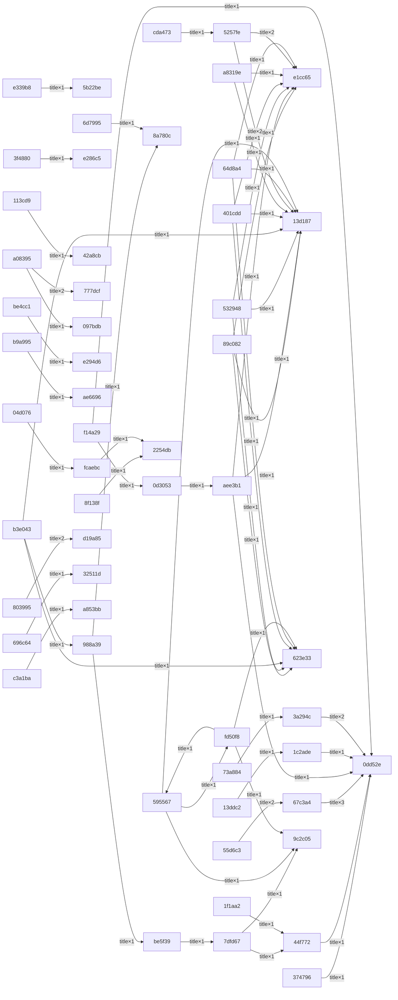

# 2.1.1.3 内部关联关系图

> 生成：gen_analysis_deliveries · 2026-09-21 00:33:27（数据源：`_t*_clause_graph.json` edges，同主题内部边）

## 关系性质说明

| 关系类型 | 含义 | 累计次数 |
|---|---|---|
| article | （见 clause_graph 规则） | 56 |
| title | （见 clause_graph 规则） | 851 |

## 关系图（前 60 边，节点=RFN 短尾）

## 关系明细（内部边）

| 主题 | 主题名 | 源文件 | 目标文件 | 关系 | 次数 |
|---|---|---|---|---|---|
| T1 | T1 | 关于保险兼业代理机构外设网点合规性等问题的复函 | 关于印发《保险兼业代理管理暂行办法》的通知 | title | 1 |
| T1 | T1 | 关于印发《保险中介机构外部审计指引》的通知 | 保险专业代理机构监管规定 | title | 1 |
| T1 | T1 | 关于印发《保险中介机构外部审计指引》的通知 | 保险经纪机构监管规定 | title | 1 |
| T1 | T1 | 关于印发《保险中介机构外部审计指引》的通知 | 保险公估机构监管规定 | title | 1 |
| T1 | T1 | 关于加强保险公估机构管理的通知 | 中国保监会办公厅关于保险销售、保险经纪、保险公估从业人员 | title | 1 |
| T1 | T1 | 关于明确保险营销员佣金构成的通知 | 保险营销员管理规定 | title | 1 |
| T1 | T1 | 关于规范保险经纪、公估机构法人许可证期满换发流程的通知 | 保险经纪机构管理规定（已废止） | title | 1 |
| T1 | T1 | 关于规范保险经纪、公估机构法人许可证期满换发流程的通知 | 关于加强保险公估机构管理的通知 | title | 1 |
| T1 | T1 | 保险销售从业人员监管办法 | 保险营销员管理规定 | title | 1 |
| T1 | T1 | 关于印发《保险营销员诚信记录管理办法》的通知 | 保险营销员管理规定 | title | 3 |
| T1 | T1 | 关于规范保险营销团队管理的通知 | 保险营销员管理规定 | title | 1 |
| T1 | T1 | 关于规范保险营销团队管理的通知 | 保险专业代理机构监管规定 | title | 1 |
| T1 | T1 | 关于规范保险营销团队管理的通知 | 保险经纪机构监管规定 | title | 1 |
| T1 | T1 | 关于规范代理制保险营销员管理制度的通知（已废止） | 保险营销员管理规定 | title | 1 |
| T1 | T1 | 关于实施农村保险营销员资格分类管理有关事宜的通知 | 保险营销员管理规定 | title | 2 |
| T1 | T1 | 关于印发《保险专业中介机构分类监管暂行办法》的通知 | 保险专业代理机构监管规定 | title | 1 |
| T1 | T1 | 关于印发《保险专业中介机构分类监管暂行办法》的通知 | 保险经纪机构监管规定 | title | 1 |
| T1 | T1 | 关于印发《保险专业中介机构分类监管暂行办法》的通知 | 保险公估机构监管规定 | title | 1 |
| T1 | T1 | 关于提示人身保险银邮代理业务风险的通知 | 关于规范银行代理保险业务的通知 | title | 1 |
| T1 | T1 | 关于进一步规范代理制保险营销员管理有关问题的通知 | 关于规范代理制保险营销员管理制度的通知（已废止） | title | 1 |
| T1 | T1 | 关于调整农村保险营销员资格直接授予方案报备程序的通知 | 关于实施农村保险营销员资格分类管理有关事宜的通知 | title | 1 |
| T1 | T1 | 关于调整保险经纪、保险公估法人许可证换发和高级管理人员任 | 关于规范保险经纪、公估机构法人许可证期满换发流程的通知 | title | 1 |
| T1 | T1 | 关于调整保险经纪、保险公估法人许可证换发和高级管理人员任 | 保险经纪机构监管规定 | title | 1 |
| T1 | T1 | 关于调整保险经纪、保险公估法人许可证换发和高级管理人员任 | 保险公估机构监管规定 | title | 1 |
| T1 | T1 | 关于加强和完善保险营销员管理工作有关事项的通知 | 关于规范保险营销团队管理的通知 | title | 1 |
| T1 | T1 | 关于贯彻落实《保险专业代理机构监管规定》、《保险经纪机构 | 保险专业代理机构监管规定 | title | 1 |
| T1 | T1 | 关于贯彻落实《保险专业代理机构监管规定》、《保险经纪机构 | 保险经纪机构监管规定 | title | 1 |
| T1 | T1 | 关于贯彻落实《保险专业代理机构监管规定》、《保险经纪机构 | 保险公估机构监管规定 | title | 1 |
| T1 | T1 | 关于进一步加强和完善保险营销员管理工作有关事项的通知 | 关于加强和完善保险营销员管理工作有关事项的通知 | title | 1 |
| T1 | T1 | 关于进一步加强和完善保险营销员管理工作有关事项的通知 | 保险营销员管理规定 | title | 1 |
| T1 | T1 | 关于单位能否为员工投保个人保险产品的复函 | 关于规范人身保险经营行为有关问题的通知（已废止） | title | 1 |
| T1 | T1 | 关于保险公司中介业务检查中代理人、经纪人佣金监管有关问题 | 保险经纪机构监管规定 | title | 1 |
| T1 | T1 | 关于保险公司中介业务检查中代理人、经纪人佣金监管有关问题 | 保险专业代理机构监管规定 | title | 1 |
| T1 | T1 | 关于加强银行代理寿险业务结构调整促进银行代理寿险业务健康 | 关于进一步加强投资连结保险销售管理的通知 | title | 2 |
| T1 | T1 | 关于加强银行代理寿险业务结构调整促进银行代理寿险业务健康 | 关于推进投保提示工作的通知 | title | 1 |
| T1 | T1 | 关于进一步规范人身保险电话营销和电话约访行为的通知 | 关于促进寿险公司电话营销业务规范发展的通知 | title | 1 |
| T1 | T1 | 关于调整保险营销员诚信记录登记事项的通知 | 关于印发《保险营销员诚信记录管理办法》的通知 | title | 2 |
| T1 | T1 | 关于印发《保险代理、经纪公司互联网保险业务监管办法（试行 | 保险专业代理机构监管规定 | title | 2 |
| T1 | T1 | 关于印发《保险代理、经纪公司互联网保险业务监管办法（试行 | 保险经纪机构监管规定 | title | 2 |
| T1 | T1 | 关于进一步规范保险专业中介机构激励行为的通知 | 关于严格规范保险专业中介机构激励行为的通知 | title | 1 |
| T1 | T1 | 中国保监会关于印发《人身保险电话销售业务管理办法》的通知 | 人身保险业务基本服务规定 | title | 1 |
| T1 | T1 | 关于实施《保险专业代理机构基本服务标准》《保险经纪机构基 | 保险专业代理机构监管规定 | title | 1 |
| T1 | T1 | 关于实施《保险专业代理机构基本服务标准》《保险经纪机构基 | 保险经纪机构监管规定 | title | 1 |
| T1 | T1 | 关于实施《保险专业代理机构基本服务标准》《保险经纪机构基 | 保险公估机构监管规定 | title | 1 |
| T1 | T1 | 中国保监会办公厅关于保险销售、保险经纪、保险公估从业人员 | 保险销售从业人员监管办法 | title | 1 |
| T1 | T1 | 中国保监会办公厅关于保险销售、保险经纪、保险公估从业人员 | 保险经纪从业人员、保险公估从业人员监管办法 | title | 1 |
| T1 | T1 | 中国保监会关于印发《人身保险公司服务评价管理办法》的通知 | 人身保险业务基本服务规定 | title | 1 |
| T1 | T1 | 保险经纪机构监管规定（2015年修订） | 保险经纪机构管理规定（已废止） | title | 1 |
| T1 | T1 | 中国保监会关于印发《保险小额理赔服务指引（试行）》的通知 | 关于印发《中国保监会关于加强保险消费者权益保护工作的意见 | title | 2 |
| T1 | T1 | 关于印发《保险公司服务评价管理办法（试行）》的通知 | 中国保监会关于印发《人身保险公司服务评价管理办法》的通知 | title | 1 |
| T1 | T1 | 保险公估机构监管规定（2015年修订） | 保险公估机构管理规定  | title | 1 |
| T1 | T1 | 中国保监会关于印发《互联网保险业务监管暂行办法》的通知 | 关于印发《保险代理、经纪公司互联网保险业务监管办法（试行 | title | 1 |
| T1 | T1 | 保险经纪人监管规定 | 保险经纪机构监管规定 | title | 1 |
| T1 | T1 | 保险经纪人监管规定 | 保险经纪从业人员、保险公估从业人员监管办法 | title | 1 |
| T1 | T1 | 保险经纪人监管规定 | 保险公估人监管规定 | title | 1 |
| T1 | T1 | 保险公估人监管规定 | 保险公估机构监管规定 | title | 1 |
| T1 | T1 | 保险公估人监管规定 | 保险经纪从业人员、保险公估从业人员监管办法 | title | 1 |
| T1 | T1 | 保险公估人监管规定 | 保险经纪人监管规定 | title | 1 |
| T1 | T1 | 中国银保监会办公厅关于坚决杜绝保险机构及从业人员违规销售 | 中国保监会关于严格规范非保险金融产品销售的通知 | title | 1 |
| T1 | T1 | 《关于开展保险公司销售从业人员执业登记数据清核工作的通知 | 保险销售从业人员监管办法 | title | 1 |
| T1 | T1 | 中国银保监会办公厅关于印发《商业银行代理保险业务管理办法 | 关于规范银行代理保险业务的通知 | title | 1 |
| T1 | T1 | 中国银保监会办公厅关于印发《商业银行代理保险业务管理办法 | 中国银监会关于进一步加强商业银行代理保险业务合规销售与风 | title | 1 |
| T1 | T1 | 中国银保监会办公厅关于印发《商业银行代理保险业务管理办法 | 中国保监会 中国银监会关于进一步规范商业银行代理保险业务 | title | 1 |
| T1 | T1 | 中国银保监会办公厅关于印发《商业银行代理保险业务管理办法 | 关于银行类保险兼业代理机构行政许可有关事项的通知 | title | 1 |
| T1 | T1 | 互联网保险业务监管办法 | 中国保监会关于印发《互联网保险业务监管暂行办法》的通知 | title | 1 |
| T1 | T1 | 保险代理人监管规定 | 保险专业代理机构监管规定 | title | 1 |
| T1 | T1 | 保险代理人监管规定 | 保险销售从业人员监管办法 | title | 1 |
| T1 | T1 | 保险代理人监管规定 | 关于印发《保险兼业代理管理暂行办法》的通知 | title | 1 |
| T1 | T1 | 中国银行保险监督管理委员会办公厅关于发展独立个人保险代理 | 保险代理人监管规定 | title | 2 |
| T1 | T1 | 中国银保监会办公厅关于落实保险公司主体责任 加强保险销售 | 中国银保监会办公厅关于加强保险公司中介渠道业务管理的通知 | title | 1 |
| T1 | T1 | 中国银保监会办公厅关于切实加强保险专业中介机构从业人员管 | 保险公估人监管规定 | article | 1 |
| T1 | T1 | 中国银保监会办公厅关于切实加强保险专业中介机构从业人员管 | 保险公估人监管规定 | title | 1 |
| T1 | T1 | 银行业保险业消费投诉处理管理办法 | 中华人民共和国消费者权益保护法实施条例 | title | 1 |
| T1 | T1 | 银行业保险业消费投诉处理管理办法 | 保险消费投诉处理管理办法 | title | 1 |
| T1 | T1 | 中国银保监会办公厅关于进一步规范保险机构互联网人身保险业 | 互联网保险业务监管办法 | title | 2 |
| T1 | T1 | 中国银保监会办公厅关于印发保险中介机构信息化工作监管办法 | 保险代理人监管规定 | article | 1 |
| T1 | T1 | 中国银保监会办公厅关于印发保险中介机构信息化工作监管办法 | 保险代理人监管规定 | article | 1 |
| T1 | T1 | 中国银保监会办公厅关于印发保险中介机构信息化工作监管办法 | 保险代理人监管规定 | article | 1 |
| T1 | T1 | 中国银保监会办公厅关于印发保险中介机构信息化工作监管办法 | 保险经纪人监管规定 | article | 1 |
| T1 | T1 | 中国银保监会办公厅关于印发保险中介机构信息化工作监管办法 | 保险经纪人监管规定 | article | 1 |
| T1 | T1 | 中国银保监会办公厅关于印发保险中介机构信息化工作监管办法 | 保险公估人监管规定 | article | 1 |
| T1 | T1 | 中国银保监会办公厅关于印发保险中介机构信息化工作监管办法 | 保险公估人监管规定 | article | 1 |
| T1 | T1 | 中国银保监会办公厅关于印发保险中介机构信息化工作监管办法 | 保险代理人监管规定 | title | 2 |
| T1 | T1 | 中国银保监会办公厅关于印发保险中介机构信息化工作监管办法 | 保险经纪人监管规定 | title | 2 |
| T1 | T1 | 中国银保监会办公厅关于印发保险中介机构信息化工作监管办法 | 保险公估人监管规定 | title | 2 |
| T1 | T1 | 中国银保监会关于清理规章规范性文件的决定 | 保险专业代理机构监管规定 | title | 1 |
| T1 | T1 | 中国银保监会关于清理规章规范性文件的决定 | 保险经纪机构监管规定 | title | 1 |
| T1 | T1 | 中国银保监会关于清理规章规范性文件的决定 | 保险公估机构监管规定 | title | 1 |
| T1 | T1 | 中国银保监会关于清理规章规范性文件的决定 | 保险销售从业人员监管办法 | title | 1 |
| T1 | T1 | 中国银保监会关于清理规章规范性文件的决定 | 保险经纪从业人员、保险公估从业人员监管办法 | title | 1 |
| T1 | T1 | 中国银保监会关于清理规章规范性文件的决定 | 保险消费投诉处理管理办法 | title | 1 |
| T1 | T1 | 中国银保监会办公厅关于进一步加强消费投诉处理工作的通知 | 银行业保险业消费投诉处理管理办法 | title | 1 |
| T1 | T1 | 国家金融监督管理总局关于印发《金融机构消费者权益保护监管 | 中国银保监会关于印发银行保险机构消费者权益保护监管评价办 | title | 1 |
| T1 | T1 | 银行保险机构消费者权益保护管理办法 | 中华人民共和国消费者权益保护法实施条例 | title | 2 |
| T1 | T1 | 保险公估机构管理规定 | 中国保监会办公厅关于保险销售、保险经纪、保险公估从业人员 | title | 1 |
| T1 | T1 | 保险营销员管理规定 | 关于印发《保险中介从业人员继续教育暂行办法》的通知 | title | 1 |
| T1 | T1 | 保险经纪从业人员、保险公估从业人员监管办法 | 中国保监会办公厅关于保险销售、保险经纪、保险公估从业人员 | title | 2 |
| T1 | T1 | 国家金融监督管理总局关于印发《商业银行代理销售业务管理办 | 中国银监会办公厅关于商业银行开展代理销售基金和保险产品相 | title | 1 |
| T1 | T1 | 保险产品适当性管理自律规范 | 金融机构产品适当性管理办法 | title | 1 |
| T1 | T1 | 中国银保监会2022年规章立法工作计划 | 保险销售行为管理办法 | title | 1 |
| T1 | T1 | 关于规范团体保险经营行为有关问题的通知 | 关于人身保险业务有关问题的通知（已废止） | title | 1 |
| T1 | T1 | 关于规范团体保险经营行为有关问题的通知 | 关于规范人身保险经营行为有关问题的通知（已废止） | title | 1 |
| T1 | T1 | 关于调整保险代理从业人员基本资格考试有关事项的通知（已失 | 中华人民共和国消费者权益保护法实施条例 | title | 1 |
| T1 | T1 | 关于银行类保险兼业代理机构行政许可有关事项的通知 | 中国保监会关于深化保险中介市场改革的意见 | title | 1 |
| T1 | T1 | 中国保监会 国家发展改革委关于印发《中国保险业信用体系建 | 关于印发《保险监管人员行为准则》和《保险从业人员行为准则 | title | 1 |
| T1 | T1 | 中国保监会 国家发展改革委关于印发《中国保险业信用体系建 | 关于印发《保险监管人员行为准则》和《保险从业人员行为准则 | title | 1 |
| T1 | T1 | 中国保监会 国家发展改革委关于印发《中国保险业信用体系建 | 关于印发《保险营销员诚信记录管理办法》的通知 | title | 1 |
| T1 | T1 | 关于加强保险业宣传工作的通知（已失效） | 关于印发《保险业对外宣传管理暂行规定》的通知（已废止） | title | 2 |
| T1 | T1 | 关于加强保险中介从业人员继续教育管理工作的通知（已废止） | 关于印发《保险中介从业人员继续教育暂行办法》的通知 | title | 1 |
| T1 | T1 | 关于2005年下半年保险代理从业人员资格考试有关事项的通 | 中华人民共和国消费者权益保护法实施条例 | title | 1 |
| T1 | T1 | 中国保监会关于修改《中国保监会关于严格规范非保险金融产品 | 中国保监会关于严格规范非保险金融产品销售的通知 | title | 1 |
| T1 | T1 | 中国保监会办公厅关于贯彻实施《中国保险业信用体系建设规划 | 中国保监会 国家发展改革委关于印发《中国保险业信用体系建 | title | 1 |
| T1 | T1 | 关于支持汽车企业代理保险业务专业化经营有关事项的通知 | 保险专业代理机构监管规定 | title | 1 |
| T1 | T1 | 关于支持汽车企业代理保险业务专业化经营有关事项的通知 | 保险经纪机构监管规定 | title | 1 |
| T1 | T1 | 关于废止部分保险中介规范性文件的通知 | 保险经纪机构管理规定（已废止） | title | 1 |
| T1 | T1 | 保险公估机构监管规定 | 保险公估机构管理规定  | title | 1 |
| T1 | T1 | 保险经纪机构监管规定 | 保险经纪机构管理规定（已废止） | title | 1 |
| T1 | T1 | 关于加强保险中介从业人员继续教育管理工作的通知（已废止） | 关于印发《保险中介从业人员继续教育暂行办法》的通知 | title | 1 |
| T1 | T1 | 关于做好2009年保险消费者教育工作的通知（已失效） | 关于印发《加强保险消费者教育工作方案》的通知 | title | 2 |
| T1 | T1 | 关于进一步落实保险营销员持证上岗制度的通知（已失效） | 关于启用保险代理从业人员基本资格证书和展业证书的通知（已 | title | 1 |
| T1 | T1 | 关于印发《保险中介从业人员继续教育暂行办法》的通知 | 保险专业代理机构监管规定 | title | 2 |
| T1 | T1 | 关于印发《保险中介从业人员继续教育暂行办法》的通知 | 保险经纪机构监管规定 | title | 2 |
| T1 | T1 | 关于印发《保险中介从业人员继续教育暂行办法》的通知 | 保险公估机构监管规定 | title | 2 |
| T1 | T1 | 财政部、国家税务总局关于修改《中华人民共和国增值税暂行条 | 财政部、国家税务总局关于修改《中华人民共和国增值税暂行条 | article | 1 |
| T1 | T1 | 财政部、国家税务总局关于修改《中华人民共和国增值税暂行条 | 财政部、国家税务总局关于修改《中华人民共和国增值税暂行条 | article | 1 |
| T2 | T2 | 关于加强新型产品销售管理工作的紧急通知（已失效） | 人身保险新型产品信息披露管理暂行办法 | title | 1 |
| T2 | T2 | 关于加强航空意外保险管理有关事项的通知 | 人身保险产品审批和备案管理办法 | title | 1 |
| T2 | T2 | 关于规范激活注册式意外险业务经营行为的通知 | 关于印发《人身意外伤害保险业务经营标准》的通知 | title | 1 |
| T2 | T2 | 中国保监会关于规范人身保险公司赠送保险有关行为的通知 | 人身保险公司保险条款和保险费率管理办法 | title | 1 |
| T2 | T2 | 中国保监会关于规范人身保险公司赠送保险有关行为的通知 | 关于印发《人身意外伤害保险业务经营标准》的通知 | title | 1 |
| T2 | T2 | 关于印发 《个人税收递延型商业养老保险产品开发指引 》的 | 人身保险公司保险条款和保险费率管理办法（2015年修订） | title | 1 |
| T2 | T2 | 关于印发 《个人税收递延型商业养老保险产品开发指引 》的 | 《重大疾病保险的疾病定义使用规范（2020年修订版）》 | title | 1 |
| T2 | T2 | 中国银保监会办公厅关于规范两全保险产品有关问题的通知 | 人身保险公司保险条款和保险费率管理办法 | title | 1 |
| T2 | T2 | 中国银保监会办公厅关于规范两全保险产品有关问题的通知 | 中国保监会关于规范中短存续期人身保险产品有关事项的通知 | title | 1 |
| T2 | T2 | 中国银保监会办公厅关于规范两全保险产品有关问题的通知 | 中国保监会关于进一步完善人身保险精算制度有关事项的通知 | title | 1 |
| T2 | T2 | 中国银保监会办公厅关于印发普通型人身保险精算规定的通知 | 关于下发有关精算规定的通知 | title | 1 |
| T2 | T2 | 中国银保监会办公厅关于印发普通型人身保险精算规定的通知 | 关于普通型定期寿险、普通型终身寿险费率厘定等有关问题的通 | title | 1 |
| T2 | T2 | 中国银保监会关于使用《中国人身保险业重大疾病经验发生率表 | 《重大疾病保险的疾病定义使用规范（2020年修订版）》 | title | 1 |
| T2 | T2 | 中国银保监会办公厅关于印发意外伤害保险业务监管办法的通知 | 中国银保监会办公厅关于印发普通型人身保险精算规定的通知 | title | 2 |
| T2 | T2 | 中国银保监会办公厅关于印发意外伤害保险业务监管办法的通知 | 中国保监会关于强化人身保险产品监管工作的通知 | title | 1 |
| T2 | T2 | 中国银保监会办公厅关于印发意外伤害保险业务监管办法的通知 | 关于加强航空意外保险管理有关事项的通知 | title | 1 |
| T2 | T2 | 中国银保监会办公厅关于印发意外伤害保险业务监管办法的通知 | 关于规范激活注册式意外险业务经营行为的通知 | title | 1 |
| T2 | T2 | 中国银保监会办公厅关于印发意外伤害保险业务监管办法的通知 | 关于人身保险伤残程度与保险金给付比例有关事项的通知 | title | 1 |
| T2 | T2 | 中国银保监会关于印发一年期以上人身保险产品信息披露规则的 | 人身保险产品信息披露管理办法 | title | 1 |
| T2 | T2 | 中国银保监会关于印发保险公司非寿险业务准备金管理办法实施 | 关于印发《保险公司非寿险业务准备金管理办法实施细则（试行 | title | 1 |
| T2 | T2 | 中国银保监会关于印发保险公司非寿险业务准备金管理办法实施 | 关于印发《非寿险业务准备金评估工作底稿规范》的通知 | title | 1 |
| T2 | T2 | 中国银保监会关于印发保险公司非寿险业务准备金管理办法实施 | 关于印发《保险公司非寿险业务准备金回溯分析管理办法》的通 | title | 1 |
| T2 | T2 | 中国银保监会关于印发保险公司非寿险业务准备金管理办法实施 | 关于编报保险公司非寿险业务准备金评估报告有关事项的通知 | title | 1 |
| T2 | T2 | 中国银保监会关于印发保险公司非寿险业务准备金管理办法实施 | 中国银保监会办公厅关于印发意外伤害保险业务监管办法的通知 | title | 1 |
| T2 | T2 | 人身保险公司保险条款和保险费率管理办法（2015年修订） | 关于放开短期意外险费率及简化短期意外险备案手续的通知 | title | 1 |
| T2 | T2 | 人身保险公司保险条款和保险费率管理办法（2015年修订） | 人身保险产品审批和备案管理办法 | title | 1 |
| T2 | T2 | 人身保险新型产品信息披露管理办法 | 人身保险新型产品信息披露管理暂行办法 | title | 1 |
| T2 | T2 | 关于做好分红保险专题财务报告编报工作的通知 | 关于下发《分红保险管理暂行办法》、《投资连结保险管理暂行 | title | 1 |
| T2 | T2 | 关于人身保险新型产品信息披露有关问题的通知 | 人身保险新型产品信息披露管理暂行办法 | title | 1 |
| T2 | T2 | 关于贯彻执行《人身保险新型产品信息披露管理暂行办法》有关 | 人身保险新型产品信息披露管理暂行办法 | title | 1 |
| T2 | T2 | 关于《人身保险新型产品精算规定》实施若干问题的通知（已失 | 关于印发人身保险新型产品精算规定的通知 | title | 1 |
| T2 | T2 | 关于印发人身保险新型产品精算规定的通知 | 关于下发有关精算规定的通知 | title | 1 |
| T2 | T2 | 关于印发人身保险条款存在问题示例的通知 | 关于继续使用《人身保险残疾程度与保险金给付比例表》的通知 | title | 2 |
| T2 | T2 | 关于印发人身保险条款存在问题示例的通知 | 关于在保险条款中设立仲裁条款的通知（已废止） | title | 1 |
| T2 | T2 | 关于印发人身保险条款存在问题示例的通知 | 关于下发《分红保险管理暂行办法》、《投资连结保险管理暂行 | title | 1 |
| T2 | T2 | 关于印发人身保险条款存在问题示例的通知 | 人身保险新型产品信息披露管理暂行办法 | title | 1 |
| T2 | T2 | 保险公司总精算师管理办法 | 人身保险产品审批和备案管理办法 | title | 1 |
| T2 | T2 | 关于《人身保险产品审批和备案管理办法》若干问题的通知 | 关于印发人身保险新型产品精算规定的通知 | title | 3 |
| T2 | T2 | 关于《人身保险产品审批和备案管理办法》若干问题的通知 | 人身保险产品审批和备案管理办法 | title | 1 |
| T2 | T2 | 关于《人身保险产品审批和备案管理办法》若干问题的通知 | 关于下发有关精算规定的通知 | title | 1 |
| T2 | T2 | 关于企业年金产品备案有关问题的通知（已废止） | 人身保险产品审批和备案管理办法 | title | 1 |
| T2 | T2 | 关于2005年末非寿险业务准备金评估有关要求的通知（已失 | 关于印发《保险公司非寿险业务准备金管理办法实施细则（试行 | title | 1 |
| T2 | T2 | 关于修订精算规定中生命表使用有关事项的通知 | 关于印发人身保险新型产品精算规定的通知 | title | 4 |
| T2 | T2 | 关于修订精算规定中生命表使用有关事项的通知 | 关于下发有关精算规定的通知 | title | 2 |
| T2 | T2 | 关于修订精算规定中生命表使用有关事项的通知 | 关于调整终身年金生命表有关事项的通知 | title | 1 |
| T2 | T2 | 关于印发《精算报告》的通知 | 关于2000年末人身保险责任准备金计算有关要求的通知（已 | title | 2 |
| T2 | T2 | 关于印发投资连结保险万能保险精算规定的通知 | 关于印发人身保险新型产品精算规定的通知 | title | 1 |
| T2 | T2 | 关于《保险公司总精算师管理办法》实施有关问题的通知（已废 | 保险公司总精算师管理办法 | title | 1 |
| T2 | T2 | 关于修订短期意外伤害保险法定责任准备金评估有关事项的通知 | 关于下发有关精算规定的通知 | title | 1 |
| T2 | T2 | 关于执行《人身保险新型产品信息披露管理办法》有关事项的通 | 人身保险新型产品信息披露管理办法 | title | 1 |
| T2 | T2 | 关于执行《人身保险新型产品信息披露管理办法》有关事项的通 | 关于人身保险新型产品信息披露有关问题的通知 | title | 1 |
| T2 | T2 | 关于印发《分红保险专题财务报告编报规则问题解答第1号》的 | 关于修订分红保险专题财务报告编报规则的通知 | title | 1 |
| T2 | T2 | 关于修订分红保险专题财务报告编报规则的通知 | 关于做好分红保险专题财务报告编报工作的通知 | title | 1 |
| T2 | T2 | 关于修订分红保险专题财务报告编报规则的通知 | 关于做好分红保险专题财务报告编报工作的补充通知 | title | 1 |
| T2 | T2 | 关于贯彻落实新《保险法》做好人身保险产品变更管理工作的通 | 人身保险产品审批和备案管理办法 | title | 2 |
| T2 | T2 | 关于加强非寿险精算工作有关问题的通知 | 保险公司总精算师管理办法 | title | 2 |
| T2 | T2 | 关于加强非寿险精算工作有关问题的通知 | 关于加强非寿险精算责任人任职管理的通知（已废止） | title | 1 |
| T2 | T2 | 关于父母为其未成年子女投保以死亡为给付保险金条件人身保险 | 关于父母为其未成年子女投保死亡人身保险限额的通知 | title | 1 |
| T2 | T2 | 关于开展变额年金保险试点的通知 | 关于印发《变额年金保险管理暂行办法》的通知 | title | 1 |
| T2 | T2 | 关于开展变额年金保险试点的通知 | 人身保险产品审批和备案管理办法 | title | 1 |
| T2 | T2 | 关于印发《全面推广小额人身保险方案》的通知 | 关于进一步扩大农村小额人身保险试点的通知 | title | 1 |
| T2 | T2 | 关于《人身保险公司保险条款和保险费率管理办法》若干问题的 | 人身保险公司保险条款和保险费率管理办法 | title | 1 |
| T2 | T2 | 关于《人身保险公司保险条款和保险费率管理办法》若干问题的 | 关于印发人身保险新型产品精算规定的通知 | title | 1 |
| T2 | T2 | 关于印发《保险公司非寿险业务准备金基础数据、评估与核算内 | 关于印发《非寿险业务准备金评估工作底稿规范》的通知 | title | 1 |
| T2 | T2 | 关于印发《保险公司非寿险业务准备金基础数据、评估与核算内 | 关于印发《保险公司费用分摊指引》的通知 | title | 1 |
| T2 | T2 | 关于印发《保险公司非寿险业务准备金回溯分析管理办法》的通 | 关于印发《保险公司非寿险业务准备金基础数据、评估与核算内 | title | 2 |
| T2 | T2 | 关于印发《保险公司非寿险业务准备金回溯分析管理办法》的通 | 关于印发《非寿险业务准备金评估工作底稿规范》的通知 | title | 1 |
| T2 | T2 | 关于编报保险公司非寿险业务准备金评估报告有关事项的通知 | 关于加强非寿险精算工作有关问题的通知 | title | 1 |
| T2 | T2 | 中国保监会关于普通型人身保险费率政策改革有关事项的通知 | 人身保险公司保险条款和保险费率管理办法 | title | 2 |
| T2 | T2 | 中国保监会关于普通型人身保险费率政策改革有关事项的通知 | 关于调整寿险保单预定利率的紧急通知 | title | 1 |
| T2 | T2 | 中国保监会关于加强人身保险公司总精算师管理的通知 | 保险公司总精算师管理办法 | article | 1 |
| T2 | T2 | 中国保监会关于加强人身保险公司总精算师管理的通知 | 保险公司总精算师管理办法 | title | 2 |
| T2 | T2 | 中国保监会关于加强人身保险费率政策改革产品管理有关事项的 | 人身保险公司保险条款和保险费率管理办法 | title | 2 |
| T2 | T2 | 中国保监会关于推进分红型人身保险费率政策改革有关事项的通 | 人身保险公司保险条款和保险费率管理办法 | title | 1 |
| T2 | T2 | 中国保监会关于推进分红型人身保险费率政策改革有关事项的通 | 关于印发人身保险新型产品精算规定的通知 | title | 1 |
| T2 | T2 | 中国保监会关于规范投资连结保险投资账户有关事项的通知 | 关于下发《分红保险管理暂行办法》、《投资连结保险管理暂行 | title | 1 |
| T2 | T2 | 中国保监会关于万能型人身保险费率政策改革有关事项的通知 | 关于印发投资连结保险万能保险精算规定的通知 | title | 2 |
| T2 | T2 | 中国保监会关于万能型人身保险费率政策改革有关事项的通知 | 人身保险公司保险条款和保险费率管理办法 | title | 1 |
| T2 | T2 | 中国保监会关于促进团体保险健康发展有关问题的通知 | 人身保险公司保险条款和保险费率管理办法 | title | 1 |
| T2 | T2 | 中国保监会关于父母为其未成年子女投保以死亡为给付保险金条 | 关于父母为其未成年子女投保以死亡为给付保险金条件人身保险 | title | 1 |
| T2 | T2 | 中国保监会关于强化人身保险产品监管工作的通知 | 人身保险新型产品信息披露管理办法 | title | 1 |
| T2 | T2 | 中国保监会关于进一步完善人身保险精算制度有关事项的通知 | 中国保监会关于规范中短存续期人身保险产品有关事项的通知 | title | 1 |
| T2 | T2 | 中国保监会关于规范中短存续期人身保险产品有关事项的通知 | 中国保监会关于规范高现金价值产品有关事项的通知 | title | 1 |
| T2 | T2 | 人身保险产品信息披露管理办法 | 人身保险新型产品信息披露管理办法 | title | 1 |
| T2 | T2 | 国家金融监督管理总局关于加强万能型人身保险监管有关事项的 | 关于印发投资连结保险万能保险精算规定的通知 | article | 1 |
| T2 | T2 | 国家金融监督管理总局关于加强万能型人身保险监管有关事项的 | 关于印发投资连结保险万能保险精算规定的通知 | article | 1 |
| T2 | T2 | 国家金融监督管理总局关于加强万能型人身保险监管有关事项的 | 关于印发投资连结保险万能保险精算规定的通知 | article | 1 |
| T2 | T2 | 国家金融监督管理总局关于加强万能型人身保险监管有关事项的 | 关于印发投资连结保险万能保险精算规定的通知 | article | 1 |
| T2 | T2 | 国家金融监督管理总局关于加强万能型人身保险监管有关事项的 | 关于印发投资连结保险万能保险精算规定的通知 | article | 1 |
| T2 | T2 | 国家金融监督管理总局关于加强万能型人身保险监管有关事项的 | 中国保监会关于万能型人身保险费率政策改革有关事项的通知 | title | 1 |
| T2 | T2 | 国家金融监督管理总局关于加强万能型人身保险监管有关事项的 | 关于印发投资连结保险万能保险精算规定的通知 | title | 1 |
| T2 | T2 | 国家金融监督管理总局关于加强万能型人身保险监管有关事项的 | 中国保监会关于强化人身保险产品监管工作的通知 | title | 1 |
| T2 | T2 | 人身保险公司保险条款和保险费率管理办法 | 关于放开短期意外险费率及简化短期意外险备案手续的通知 | title | 1 |
| T2 | T2 | 人身保险公司保险条款和保险费率管理办法 | 人身保险产品审批和备案管理办法 | title | 1 |
| T2 | T2 | 关于对取得国外精算师资格的拟任总精算师进行考核的通知（已 | 保险公司总精算师管理办法 | title | 2 |
| T2 | T2 | 关于投资连结型团体年金保险、万能型团体年金保险风险保额有 | 人身保险产品审批和备案管理办法 | title | 1 |
| T2 | T2 | 关于保险业新会计准则培训有关事项的通知（已失效） | 关于保险业实施新会计准则有关事项的通知 | title | 1 |
| T3 | T3 | 中国银保监会关于实施保险公司偿付能力监管规则（Ⅱ）有关事 | 中国保监会关于正式实施中国风险导向的偿付能力体系有关事项 | title | 1 |
| T3 | T3 | 中国银保监会关于实施保险公司偿付能力监管规则（Ⅱ）有关事 | 中国银保监会关于印发《保险公司偿付能力监管规则——问题解 | title | 1 |
| T3 | T3 | 关于印发《保险公司偿付能力报告编报规则——问题解答第1号 | 保险公司偿付能力额度及监管指标管理规定 | title | 1 |
| T3 | T3 | 关于做好2002年度偿付能力报告编报工作的通知（已失效） | 保险公司偿付能力额度及监管指标管理规定 | title | 3 |
| T3 | T3 | 关于报送偿付能力季度报告的通知 | 保险公司偿付能力额度及监管指标管理规定 | title | 1 |
| T3 | T3 | 关于2004年度偿付能力报告编报工作有关问题的通知（已失 | 保险公司偿付能力额度及监管指标管理规定 | title | 2 |
| T3 | T3 | 关于2004年度偿付能力报告编报工作有关问题的通知（已失 | 关于做好2002年度偿付能力报告编报工作的通知（已失效） | title | 1 |
| T3 | T3 | 关于保险公司提存资本保证金有关问题的通知 | 关于保险公司资本保证金存放商业银行有关规定的通知 | title | 1 |
| T3 | T3 | 关于2005年度偿付能力报告编报工作有关问题的通知（已失 | 保险公司偿付能力额度及监管指标管理规定 | title | 2 |
| T3 | T3 | 关于印发保险公司偿付能力报告编报规则问题解答（3－6号） | 保险公司偿付能力额度及监管指标管理规定 | article | 1 |
| T3 | T3 | 关于印发保险公司偿付能力报告编报规则问题解答（3－6号） | 保险公司偿付能力额度及监管指标管理规定 | article | 1 |
| T3 | T3 | 关于印发保险公司偿付能力报告编报规则问题解答（3－6号） | 保险公司偿付能力额度及监管指标管理规定 | title | 4 |
| T3 | T3 | 关于印发保险公司偿付能力报告编报规则问题解答（3－6号） | 保险公司偿付能力管理规定 | title | 1 |
| T3 | T3 | 关于保险公司偿付能力报告编报工作有关问题的通知 | 关于2005年度偿付能力报告编报工作有关问题的通知（已失 | title | 1 |
| T3 | T3 | 关于印发《保险公司资本保证金管理暂行办法》的通知 | 关于保险公司提存资本保证金有关问题的通知 | title | 2 |
| T3 | T3 | 关于印发《保险公司资本保证金管理暂行办法》的通知 | 关于保险公司资本保证金存放商业银行有关规定的通知 | title | 1 |
| T3 | T3 | 关于保险集团（控股）公司、相互制保险公司资本保证金提存有 | 关于印发《保险公司资本保证金管理暂行办法》的通知 | title | 1 |
| T3 | T3 | 关于编报年度偿付能力报告有关事项的通知 | 关于保险公司偿付能力报告编报工作有关问题的通知 | title | 1 |
| T3 | T3 | 关于编报保险集团偿付能力报告有关事项的通知 | 关于印发《保险公司偿付能力报告编报规则第14号：保险集团 | title | 1 |
| T3 | T3 | 关于实施《保险公司偿付能力管理规定》有关事项的通知 | 保险公司偿付能力管理规定 | title | 1 |
| T3 | T3 | 关于印发《保险公司偿付能力报告编报规则——问题解答第8号 | 保险公司偿付能力管理规定 | article | 1 |
| T3 | T3 | 关于印发《保险公司偿付能力报告编报规则——问题解答第8号 | 保险公司偿付能力管理规定 | article | 1 |
| T3 | T3 | 关于印发《保险公司偿付能力报告编报规则——问题解答第8号 | 保险公司偿付能力管理规定 | article | 1 |
| T3 | T3 | 关于印发《保险公司偿付能力报告编报规则——问题解答第8号 | 保险公司偿付能力管理规定 | title | 4 |
| T3 | T3 | 关于印发《保险公司偿付能力报告编报规则——问题解答第8号 | 关于印发《保险公司偿付能力报告编报规则第14号：保险集团 | title | 1 |
| T3 | T3 | 关于保监局履行偿付能力监管职责有关事项的通知 | 保险公司偿付能力管理规定 | title | 1 |
| T3 | T3 | 关于启用偿付能力监管信息系统的通知 | 关于编报保险集团偿付能力报告有关事项的通知 | title | 1 |
| T3 | T3 | 关于印发《保险公司偿付能力报告编报规则——问题解答第9号 | 关于印发《保险公司偿付能力报告编报规则第15号：再保险业 | title | 2 |
| T3 | T3 | 关于动态偿付能力测试有关事项的通知 | 关于保险公司偿付能力报告编报工作有关问题的通知 | title | 1 |
| T3 | T3 | 关于印发《保险公司资本保证金管理办法》的通知 | 关于印发《保险公司资本保证金管理暂行办法》的通知 | title | 1 |
| T3 | T3 | 关于印发《保险公司偿付能力报告编报规则——问题解答第13 | 保险公司次级定期债务管理办法 | title | 5 |
| T3 | T3 | 关于保险公司加强偿付能力管理有关事项的通知 | 保险公司偿付能力管理规定 | title | 2 |
| T3 | T3 | 中国保监会关于建立分类监管评价结果通报制度的通知 | 关于实施保险公司分类监管有关事项的通知 | title | 1 |
| T3 | T3 | 关于部分保险公司纳入分类监管实施范围的通知 | 关于实施保险公司分类监管有关事项的通知 | title | 1 |
| T3 | T3 | 中国保监会关于印发《保险公司偿付能力报告编报规则——问题 | 关于印发《保险公司偿付能力报告编报规则第14号：保险集团 | title | 1 |
| T3 | T3 | 中国保监会关于正式实施中国风险导向的偿付能力体系有关事项 | 关于编报季度偿付能力报告有关事项的通知 | title | 1 |
| T3 | T3 | 中国保监会关于正式实施中国风险导向的偿付能力体系有关事项 | 关于编报年度偿付能力报告有关事项的通知 | title | 1 |
| T3 | T3 | 中国保监会关于正式实施中国风险导向的偿付能力体系有关事项 | 关于编报保险集团偿付能力报告有关事项的通知 | title | 1 |
| T3 | T3 | 中国保监会关于正式实施中国风险导向的偿付能力体系有关事项 | 关于实施保险公司分类监管有关事项的通知 | title | 1 |
| T3 | T3 | 中国保监会关于正式实施中国风险导向的偿付能力体系有关事项 | 关于动态偿付能力测试有关事项的通知 | title | 1 |
| T3 | T3 | 保险公司偿付能力管理规定 | 保险公司偿付能力额度及监管指标管理规定 | title | 1 |
| T3 | T3 | 中国人民银行 中国银行保险监督管理委员会关于保险公司发行 | 中国人民银行 中国保险监督管理委员会公告〔2015〕第3 | title | 4 |
| T3 | T3 | 国家金融监督管理总局关于延长保险公司偿付能力监管规则（Ⅱ | 中国银保监会关于实施保险公司偿付能力监管规则（Ⅱ）有关事 | title | 1 |
| T3 | T3 | 中国人民银行 中国银行保险监督管理委员会关于保险公司发行 | 中国人民银行 中国保险监督管理委员会公告〔2015〕第3 | title | 4 |
| T4 | T4 | 中国银保监会关于印发《保险机构独立董事管理办法》的通知 | 关于印发《保险公司独立董事管理暂行办法》的通知 | title | 1 |
| T4 | T4 | 中国银保监会关于银行保险机构员工履职回避工作的指导意见 | 关于印发《保险公司内部控制基本准则》的通知 | title | 1 |
| T4 | T4 | 中国银保监会关于印发保险公司关联交易管理办法的通知 | 中国保监会关于进一步规范保险公司关联交易有关问题的通知 | title | 1 |
| T4 | T4 | 中国银保监会关于印发保险公司关联交易管理办法的通知 | 中国保监会关于进一步加强保险公司关联交易信息披露工作有关 | title | 1 |
| T4 | T4 | 中国银保监会关于印发保险公司关联交易管理办法的通知 | 中国保监会关于进一步加强保险公司关联交易管理有关事项的通 | title | 1 |
| T4 | T4 | 中国银保监会关于印发银行保险机构公司治理准则的通知 | 关于印发《关于规范保险公司治理结构的指导意见（试行）》的 | title | 1 |
| T4 | T4 | 银行保险机构声誉风险管理办法（试行） | 中国保监会关于印发《保险公司声誉风险管理指引》的通知 | title | 1 |
| T4 | T4 | 中国银保监会关于加强保险机构资金运用关联交易监管工作的通 | 银行保险机构关联交易管理办法 | title | 1 |
| T4 | T4 | 银行保险机构公司治理监管评估办法 | 银行保险机构关联交易管理办法 | title | 1 |
| T4 | T4 | 银行保险机构关联交易管理办法 | 中国银保监会关于印发保险公司关联交易管理办法的通知 | title | 1 |
| T4 | T4 | 关于印发《保险公司财会工作规范》的通知 | 保险公司财务负责人任职资格管理规定 | title | 1 |
| T4 | T4 | 关于《保险公司董事和高级管理人员任职资格管理规定》具体适 | 保险公司董事和高级管理人员任职资格管理规定 | title | 1 |
| T4 | T4 | 关于印发《保险公司风险管理指引（试行）》的通知 | 关于印发《关于规范保险公司治理结构的指导意见（试行）》的 | title | 1 |
| T4 | T4 | 关于印发《保险公司独立董事管理暂行办法》的通知 | 保险公司董事、监事和高级管理人员任职资格管理规定 | title | 2 |
| T4 | T4 | 关于印发《保险公司独立董事管理暂行办法》的通知 | 关于印发《关于规范保险公司治理结构的指导意见（试行）》的 | title | 1 |
| T4 | T4 | 关于印发《保险公司关联交易管理暂行办法》的通知 | 企业会计准则关联方关系及其交易的披露 | title | 1 |
| T4 | T4 | 关于印发《保险公司合规管理指引》的通知 | 关于印发《关于规范保险公司治理结构的指导意见（试行）》的 | title | 1 |
| T4 | T4 | 关于印发《保险公司合规管理指引》的通知 | 保险公司董事、监事和高级管理人员任职资格管理规定 | title | 1 |
| T4 | T4 | 关于印发《关于规范保险公司章程的意见》的通知 | 关于印发《保险公司董事会运作指引》的通知 | title | 2 |
| T4 | T4 | 关于印发《保险公司董事会运作指引》的通知 | 关于印发《保险公司独立董事管理暂行办法》的通知 | title | 2 |
| T4 | T4 | 关于向保监会派出机构报送保险公司分支机构内部审计报告有关 | 关于印发《保险公司内部审计指引（试行）》的通知 | title | 1 |
| T4 | T4 | 关于加强寿险公司内部控制自我评估工作有关问题的通知（已废 | 关于印发《寿险公司内部控制评价办法（试行）》的通知 | title | 1 |
| T4 | T4 | 关于加强寿险公司内部控制自我评估工作有关问题的通知（已废 | 关于印发《寿险公司内部控制评价办法（试行）》的通知 | title | 1 |
| T4 | T4 | 关于《保险公司合规管理指引》具体适用有关事宜的通知 | 保险公司董事、监事和高级管理人员任职资格管理规定 | title | 2 |
| T4 | T4 | 关于《保险公司合规管理指引》具体适用有关事宜的通知 | 保险公司董事和高级管理人员任职资格管理规定 | title | 1 |
| T4 | T4 | 关于执行《保险公司董事和高级管理人员任职资格管理规定》若 | 保险公司董事和高级管理人员任职资格管理规定 | title | 1 |
| T4 | T4 | 关于实施《保险公司财务负责人任职资格管理规定》有关事项的 | 保险公司财务负责人任职资格管理规定 | title | 1 |
| T4 | T4 | 关于实施《保险公司财务负责人任职资格管理规定》有关事项的 | 保险公司董事、监事和高级管理人员任职资格管理规定 | title | 1 |
| T4 | T4 | 关于印发《保险公司内部控制基本准则》的通知 | 财政部 证监会 审计署 银监会 保监会关于印发《企业内部 | title | 1 |
| T4 | T4 | 关于印发《保险公司内部控制基本准则》的通知 | 关于印发《保险公司内部控制制度建设指导原则》的通知（已废 | title | 1 |
| T4 | T4 | 中国保监会关于印发《保险公司董事及高级管理人员审计管理办 | 关于向保监会派出机构报送保险公司分支机构内部审计报告有关 | title | 1 |
| T4 | T4 | 中国保监会关于印发《人身保险公司全面风险管理实施指引》的 | 关于印发《保险公司风险管理指引（试行）》的通知 | title | 1 |
| T4 | T4 | 中国保监会关于《保险公司股权管理办法》第四条有关问题的通 | 保险公司股权管理办法 | article | 1 |
| T4 | T4 | 中国保监会关于《保险公司股权管理办法》第四条有关问题的通 | 保险公司股权管理办法 | article | 1 |
| T4 | T4 | 中国保监会关于《保险公司股权管理办法》第四条有关问题的通 | 保险公司股权管理办法 | title | 3 |
| T4 | T4 | 中国保监会关于《保险公司股权管理办法》第四条有关问题的通 | 保险公司控股股东管理办法 | title | 1 |
| T4 | T4 | 中国保监会关于印发《保险机构董事、监事和高级管理人员培训 | 保险公司董事、监事和高级管理人员任职资格管理规定 | title | 1 |
| T4 | T4 | 中国保监会关于印发《保险机构董事、监事和高级管理人员培训 | 关于印发《保险公司董事、监事及高级管理人员培训管理暂行办 | title | 1 |
| T4 | T4 | 中国保监会关于进一步规范报送《保险公司治理报告》的通知 | 关于印发《保险公司内部审计指引（试行）》的通知 | title | 1 |
| T4 | T4 | 中国保监会关于进一步规范报送《保险公司治理报告》的通知 | 关于印发《保险公司内部控制基本准则》的通知 | title | 1 |
| T4 | T4 | 中国保监会关于印发《保险机构内部审计工作规范》的通知 | 关于印发《保险公司内部审计指引（试行）》的通知 | title | 1 |
| T4 | T4 | 中国保监会关于进一步规范保险公司关联交易有关问题的通知 | 中国保监会关于印发《保险公司资金运用信息披露准则第1号： | title | 1 |
| T4 | T4 | 中国保监会关于进一步加强保险公司股权信息披露有关事项的通 | 保险公司股权管理办法 | title | 1 |
| T4 | T4 | 中国保监会关于印发《保险机构董事、监事和高级管理人员任职 | 保险公司董事、监事和高级管理人员任职资格管理规定 | title | 1 |
| T4 | T4 | 中国保监会关于印发《保险机构董事、监事和高级管理人员任职 | 中国保监会关于印发《关于规范保险机构董事、监事和高级管理 | title | 1 |
| T4 | T4 | 中国保监会关于印发《保险公司合规管理办法》的通知 | 保险公司董事、监事和高级管理人员任职资格管理规定 | title | 1 |
| T4 | T4 | 中国保监会关于进一步加强保险公司合规管理工作有关问题的通 | 保险公司董事、监事和高级管理人员任职资格管理规定 | title | 2 |
| T4 | T4 | 中国保监会关于进一步加强保险公司关联交易管理有关事项的通 | 企业会计准则关联方关系及其交易的披露 | title | 1 |
| T4 | T4 | 保险公司董事、监事和高级管理人员任职资格管理规定 | 中国保监会关于印发《保险机构董事、监事和高级管理人员任职 | title | 1 |
| T4 | T4 | 保险集团公司监督管理办法 | 关于印发《保险集团公司管理办法（试行）》的通知 | title | 1 |
| T4 | T4 | 保险集团公司监督管理办法 | 中国保监会关于印发《保险集团并表监管指引》的通知 | title | 1 |
| T4 | T4 | 金融机构合规管理办法 | 中国保监会关于印发《保险公司合规管理办法》的通知 | title | 1 |
| T4 | T4 | 金融机构合规管理办法 | 中国保监会关于进一步加强保险公司合规管理工作有关问题的通 | title | 1 |
| T4 | T4 | 国家金融监督管理总局关于印发《保险集团并表监督管理办法》 | 中国保监会关于印发《保险集团并表监管指引》的通知 | title | 1 |
| T4 | T4 | 国家金融监督管理总局办公厅关于印发《保险集团集中度风险监 | 保险集团公司监督管理办法 | title | 1 |
| T4 | T4 | 保险公司控股股东管理办法 | 关于印发《保险集团公司管理办法（试行）》的通知 | title | 1 |
| T4 | T4 | 保险公司财务负责人任职资格管理规定 | 保险公司董事、监事和高级管理人员任职资格管理规定 | title | 3 |
| T4 | T4 | 关于印发《保险公司内部控制制度建设指导原则》的通知（已废 | 企业会计准则关联方关系及其交易的披露 | title | 1 |
| T4 | T4 | 国家金融监督管理总局关于修改部分规章的决定 | 银行保险机构关联交易管理办法 | article | 1 |
| T4 | T4 | 国家金融监督管理总局关于修改部分规章的决定 | 银行保险机构关联交易管理办法 | title | 3 |
| T4 | T4 | 国家金融监督管理总局关于修改部分规章的决定 | 中国银保监会关于印发保险公司关联交易管理办法的通知 | title | 1 |
| T4 | T4 | 中国银保监会关于印发健全银行业保险业公司治理三年行动方案 | 保险公司董事、监事和高级管理人员任职资格管理规定 | title | 1 |
| T4 | T4 | 中国保监会关于保险公司在全国中小企业股份转让系统挂牌有关 | 保险公司股权管理办法 | title | 2 |
| T4 | T4 | 中国保监会办公厅关于优化保险公司章程修改等审批程序的通知 | 关于印发《关于规范保险公司章程的意见》的通知 | title | 1 |
| T4 | T4 | 中国保监会关于印发《保险公司收购合并管理办法》的通知 | 保险公司股权管理办法 | article | 1 |
| T4 | T4 | 中国保监会关于印发《保险公司收购合并管理办法》的通知 | 保险公司股权管理办法 | article | 1 |
| T4 | T4 | 中国保监会关于印发《保险公司收购合并管理办法》的通知 | 保险公司股权管理办法 | title | 2 |
| T4 | T4 | 关于开展保险公司治理结构专项自查活动的通知（已废止） | 关于印发《保险公司独立董事管理暂行办法》的通知 | article | 1 |
| T4 | T4 | 关于开展保险公司治理结构专项自查活动的通知（已废止） | 关于印发《保险公司独立董事管理暂行办法》的通知 | title | 2 |
| T4 | T4 | 关于开展保险公司治理结构专项自查活动的通知（已废止） | 关于印发《保险公司内部审计指引（试行）》的通知 | title | 2 |
| T4 | T4 | 关于开展保险公司治理结构专项自查活动的通知（已废止） | 关于印发《保险公司风险管理指引（试行）》的通知 | title | 2 |
| T4 | T4 | 关于开展保险公司治理结构专项自查活动的通知（已废止） | 关于印发《关于规范保险公司治理结构的指导意见（试行）》的 | title | 1 |
| T4 | T4 | 中国银监会关于印发《银行并表监管指引（试行）》的通知 | 企业会计准则关联方关系及其交易的披露 | title | 1 |
| T5 | T5 | 中国银保监会关于印发《个人税收递延型商业养老保险资金运用 | 保险资金运用管理办法 | title | 2 |
| T5 | T5 | 中国银行保险监督管理委员会关于保险资金参与长租市场有关事 | 保险资金运用管理办法 | title | 1 |
| T5 | T5 | 中国银行保险监督管理委员会关于保险资金参与长租市场有关事 | 中国保监会关于印发《保险资金投资不动产暂行办法》的通知 | title | 1 |
| T5 | T5 | 中国银保监会办公厅关于保险资金投资集合信托有关事项的通知 | 保险资金运用管理办法 | title | 1 |
| T5 | T5 | 中国银保监会办公厅关于保险资金投资集合信托有关事项的通知 | 关于保险资金投资集合资金信托计划有关事项的通知 | title | 1 |
| T5 | T5 | 中国银保监会办公厅关于保险资金参与信用风险缓释工具和信用 | 关于印发《保险资金参与金融衍生产品交易暂行办法》的通知 | title | 2 |
| T5 | T5 | 中国银保监会办公厅关于保险资金参与信用风险缓释工具和信用 | 保险资金运用管理办法 | title | 1 |
| T5 | T5 | 中国银保监会关于将澳门纳入保险资金境外可投资地区的通知 | 保险资金境外投资管理暂行办法 | title | 2 |
| T5 | T5 | 中国银保监会关于优化保险机构投资管理能力监管有关事项的通 | 保险资金运用管理办法 | title | 2 |
| T5 | T5 | 中国银保监会关于优化保险机构投资管理能力监管有关事项的通 | 关于加强和改进保险机构投资管理能力建设有关事项的通知 | title | 1 |
| T5 | T5 | 中国银保监会关于优化保险机构投资管理能力监管有关事项的通 | 关于保险资金投资股权和不动产有关问题的通知 | title | 1 |
| T5 | T5 | 中国银保监会关于保险资金财务性股权投资有关事项的通知 | 中国保监会关于印发《保险资金投资股权暂行办法》的通知 | title | 2 |
| T5 | T5 | 中国银保监会关于保险资金财务性股权投资有关事项的通知 | 保险资金运用管理办法 | title | 1 |
| T5 | T5 | 中国银保监会关于保险资金财务性股权投资有关事项的通知 | 关于保险资金投资股权和不动产有关问题的通知 | title | 1 |
| T5 | T5 | 中国银保监会关于保险资金财务性股权投资有关事项的通知 | 关于印发《保险资金境外投资管理暂行办法实施细则》的通知 | title | 1 |
| T5 | T5 | 中国银保监会办公厅关于印发保险资金参与金融衍生产品交易办 | 保险资金运用管理办法 | title | 1 |
| T5 | T5 | 中国银保监会办公厅关于印发保险资金参与金融衍生产品交易办 | 保险资金参与国债期货交易规定 | title | 1 |
| T5 | T5 | 中国银保监会办公厅关于印发保险资金参与金融衍生产品交易办 | 关于印发《保险资金参与股指期货交易规定》的通知 | title | 1 |
| T5 | T5 | 中国银保监会办公厅关于保险资金投资债转股投资计划有关事项 | 保险资金运用管理办法 | title | 1 |
| T5 | T5 | 中国银保监会办公厅关于保险资金投资债转股投资计划有关事项 | 关于保险资金投资有关金融产品的通知 | title | 1 |
| T5 | T5 | 中国银保监会办公厅关于印发组合类保险资产管理产品实施细则 | 中国人民银行 中国银行保险监督管理委员会 中国证券监督管 | title | 4 |
| T5 | T5 | 中国银保监会办公厅关于印发组合类保险资产管理产品实施细则 | 保险资金运用管理办法 | title | 4 |
| T5 | T5 | 中国银保监会办公厅关于印发组合类保险资产管理产品实施细则 | 《保险资产管理产品管理暂行办法》 | title | 4 |
| T5 | T5 | 中国银保监会办公厅关于印发组合类保险资产管理产品实施细则 | 保险资金间接投资基础设施项目管理办法 | title | 2 |
| T5 | T5 | 中国银保监会办公厅关于印发组合类保险资产管理产品实施细则 | 中国保监会关于保险资产管理公司开展资产管理产品业务试点有 | title | 1 |
| T5 | T5 | 中国银保监会办公厅关于印发组合类保险资产管理产品实施细则 | 中国保监会关于加强组合类保险资产管理产品业务监管的通知 | title | 1 |
| T5 | T5 | 中国银保监会办公厅关于印发组合类保险资产管理产品实施细则 | 中国保监会关于保险资产管理产品参与融资融券债权收益权业务 | title | 1 |
| T5 | T5 | 中国银保监会办公厅关于印发组合类保险资产管理产品实施细则 | 关于保险资金投资有关金融产品的通知 | title | 1 |
| T5 | T5 | 中国银保监会办公厅关于印发组合类保险资产管理产品实施细则 | 中国保监会关于债权投资计划投资重大工程有关事项的通知 | title | 1 |
| T5 | T5 | 中国银保监会办公厅关于优化保险公司权益类资产配置监管有关 | 保险资金运用管理办法 | title | 1 |
| T5 | T5 | 中国银保监会关于保险资金投资银行资本补充债券有关事项的通 | 保险资金运用管理办法 | title | 1 |
| T5 | T5 | 中国银保监会关于保险资金投资银行资本补充债券有关事项的通 | 中国保监会关于印发《保险资金投资债券暂行办法》的通知 | title | 1 |
| T5 | T5 | 中国银保监会办公厅关于保险资金参与证券出借业务有关事项的 | 保险资金运用管理办法 | title | 1 |
| T5 | T5 | 中国银保监会办公厅关于保险资金参与证券出借业务有关事项的 | 保险资金境外投资管理暂行办法 | title | 1 |
| T5 | T5 | 中国银保监会办公厅关于保险资金投资公开募集基础设施证券投 | 保险资金运用管理办法 | title | 1 |
| T5 | T5 | 中国银保监会办公厅关于保险资金投资公开募集基础设施证券投 | 关于重新修订《保险公司投资证券投资基金管理暂行办法》的通 | title | 1 |
| T5 | T5 | 中国银保监会办公厅关于保险资金投资公开募集基础设施证券投 | 中国保监会关于印发《保险资金投资不动产暂行办法》的通知 | title | 1 |
| T5 | T5 | 中国银保监会办公厅关于调整保险资金投资债券信用评级要求等 | 中国保监会关于印发《保险资金投资债券暂行办法》的通知 | title | 2 |
| T5 | T5 | 中国银保监会办公厅关于调整保险资金投资债券信用评级要求等 | 保险资金运用管理办法 | title | 1 |
| T5 | T5 | 中国银保监会关于修改保险资金运用领域部分规范性文件的通知 | 关于印发《保险公司股票资产托管指引（试行）》的通知 | title | 1 |
| T5 | T5 | 中国银保监会关于修改保险资金运用领域部分规范性文件的通知 | 关于印发《保险资金境外投资管理暂行办法实施细则》的通知 | title | 1 |
| T5 | T5 | 中国银保监会关于修改保险资金运用领域部分规范性文件的通知 | 中国保监会关于规范保险资金银行存款业务的通知 | title | 1 |
| T5 | T5 | 中国银保监会关于修改保险资金运用领域部分规范性文件的通知 | 中国保监会关于保险资金投资创业投资基金有关事项的通知 | title | 1 |
| T5 | T5 | 中国银保监会关于修改保险资金运用领域部分规范性文件的通知 | 中国保监会关于印发《资产支持计划业务管理暂行办法》的通知 | title | 1 |
| T5 | T5 | 中国银保监会关于修改保险资金运用领域部分规范性文件的通知 | 中国保监会关于设立保险私募基金有关事项的通知 | title | 1 |
| T5 | T5 | 中国银保监会关于修改保险资金运用领域部分规范性文件的通知 | 中国保监会 国家外汇管理局关于规范保险机构开展内保外贷业 | title | 1 |
| T5 | T5 | 中国银保监会关于修改保险资金运用领域部分规范性文件的通知 | 中国银保监会关于优化保险机构投资管理能力监管有关事项的通 | title | 1 |
| T5 | T5 | 中国银保监会关于修改保险资金运用领域部分规范性文件的通知 | 中国保监会关于加强和改进保险资金运用比例监管的通知 | title | 1 |
| T5 | T5 | 中国银保监会关于印发保险资金委托投资管理办法的通知 | 保险资金运用管理办法 | title | 1 |
| T5 | T5 | 中国银保监会关于印发保险资金委托投资管理办法的通知 | 中国保监会关于印发《保险资金委托投资管理暂行办法》的通知 | title | 1 |
| T5 | T5 | 中国银保监会关于保险资金投资有关金融产品的通知 | 保险资金运用管理办法 | title | 1 |
| T5 | T5 | 中国银保监会关于保险资金投资有关金融产品的通知 | 中国银保监会办公厅关于保险资金投资债转股投资计划有关事项 | title | 1 |
| T5 | T5 | 《保险资产管理产品管理暂行办法》 | 中国人民银行 中国银行保险监督管理委员会 中国证券监督管 | title | 1 |
| T5 | T5 | 关于调整保险公司投资银行次级债券、银行次级定期债务和企业 | 关于保险公司投资银行次级定期债务有关事项的通知（已废止） | title | 1 |
| T5 | T5 | 关于调整保险公司投资银行次级债券、银行次级定期债务和企业 | 关于印发《保险公司投资企业债券管理暂行办法》的通知（已废 | title | 1 |
| T5 | T5 | 中国保监会关于保险资金投资政府和社会资本合作项目有关事项 | 保险资金间接投资基础设施项目管理办法 | title | 1 |
| T5 | T5 | 中国保监会关于印发《保险资金投资股权暂行办法》的通知 | 保险资金运用管理暂行办法 | title | 1 |
| T5 | T5 | 中国保监会关于印发《保险资金投资股权暂行办法》的通知 | 保险资金境外投资管理暂行办法 | title | 1 |
| T5 | T5 | 中国保监会关于印发《保险资金运用内部控制指引》及应用指引 | 保险资金运用管理暂行办法 | title | 1 |
| T5 | T5 | 中国保监会关于印发《保险资金运用内部控制指引》及应用指引 | 国家金融监督管理总局办公厅关于印发《保险资金运用内部控制 | title | 1 |
| T5 | T5 | 中国保监会关于印发《保险公司资金运用信息披露准则第4号： | 保险资金运用管理暂行办法 | title | 1 |
| T5 | T5 | 中国保监会关于印发《保险公司资金运用信息披露准则第4号： | 中国保监会关于印发《保险资金投资股权暂行办法》的通知 | title | 1 |
| T5 | T5 | 国家金融监督管理总局办公厅关于印发《保险资金运用内部控制 | 保险资金运用管理办法 | title | 3 |
| T5 | T5 | 国家金融监督管理总局办公厅关于印发《保险资金运用内部控制 | 中国保监会关于印发《保险资金运用内部控制指引》及应用指引 | title | 3 |
| T5 | T5 | 国家金融监督管理总局关于保险资金未上市企业重大股权投资有 | 保险资产管理公司管理规定 | article | 1 |
| T5 | T5 | 国家金融监督管理总局关于保险资金未上市企业重大股权投资有 | 中国银保监会关于保险资金财务性股权投资有关事项的通知 | article | 1 |
| T5 | T5 | 国家金融监督管理总局关于保险资金未上市企业重大股权投资有 | 中国保监会关于印发《保险资金投资股权暂行办法》的通知 | title | 3 |
| T5 | T5 | 国家金融监督管理总局关于保险资金未上市企业重大股权投资有 | 保险资金运用管理办法 | title | 1 |
| T5 | T5 | 国家金融监督管理总局关于保险资金未上市企业重大股权投资有 | 关于保险资金投资股权和不动产有关问题的通知 | title | 1 |
| T5 | T5 | 国家金融监督管理总局关于保险资金未上市企业重大股权投资有 | 保险资产管理公司管理规定 | title | 1 |
| T5 | T5 | 国家金融监督管理总局关于保险资金未上市企业重大股权投资有 | 中国银保监会关于保险资金财务性股权投资有关事项的通知 | title | 1 |
| T5 | T5 | 保险资金境外投资管理暂行办法 | 关于印发《保险资金运用风险控制指引（试行）》的通知 | title | 2 |
| T5 | T5 | 保险资金境外投资管理暂行办法 | 关于印发《保险外汇资金境外运用管理暂行办法实施细则》的通 | title | 1 |
| T5 | T5 | 关于印发《保险公司股票资产托管指引（试行）》的通知 | 保险机构投资者股票投资管理暂行办法 | title | 1 |
| T5 | T5 | 关于保险机构投资者股票投资有关问题的通知 | 保险机构投资者股票投资管理暂行办法 | title | 1 |
| T5 | T5 | 关于保险机构投资者股票投资有关问题的通知 | 关于印发《保险公司股票资产托管指引（试行）》的通知 | title | 1 |
| T5 | T5 | 关于保险机构投资者股票投资有关问题的通知 | 关于印发《保险资金运用风险控制指引（试行）》的通知 | title | 1 |
| T5 | T5 | 关于保险机构投资者股票投资交易有关问题的通知 | 保险机构投资者股票投资管理暂行办法 | title | 3 |
| T5 | T5 | 关于保险机构投资者股票投资交易有关问题的通知 | 中华人民共和国证券法 | title | 1 |
| T5 | T5 | 关于股票投资有关问题的通知 | 保险机构投资者股票投资管理暂行办法 | title | 1 |
| T5 | T5 | 关于股票投资有关问题的通知 | 关于保险机构投资者股票投资有关问题的通知 | title | 1 |
| T5 | T5 | 关于股票投资有关问题的通知 | 关于印发《保险公司股票资产托管指引（试行）》的通知 | title | 1 |
| T5 | T5 | 关于规范保险机构股票投资业务的通知 | 保险机构投资者股票投资管理暂行办法 | article | 1 |
| T5 | T5 | 关于规范保险机构股票投资业务的通知 | 保险机构投资者股票投资管理暂行办法 | title | 1 |
| T5 | T5 | 中国保监会关于印发《保险资金投资不动产暂行办法》的通知 | 保险资金运用管理暂行办法 | title | 1 |
| T5 | T5 | 中国保监会关于印发《保险资金投资不动产暂行办法》的通知 | 保险资金间接投资基础设施项目试点管理办法 | title | 1 |
| T5 | T5 | 中国保监会关于印发《保险资金投资不动产暂行办法》的通知 | 保险资金境外投资管理暂行办法 | title | 1 |
| T5 | T5 | 中国保监会关于印发《保险资金投资不动产暂行办法》的通知 | 中国保监会关于印发《保险资金投资股权暂行办法》的通知 | title | 1 |
| T5 | T5 | 关于调整《保险资产管理公司管理暂行规定》有关规定的通知 | 保险资产管理公司管理暂行规定 | title | 1 |
| T5 | T5 | 中国保监会关于印发《保险资金投资债券暂行办法》的通知 | 保险资金运用管理暂行办法 | title | 1 |
| T5 | T5 | 中国保监会关于印发《保险资金投资债券暂行办法》的通知 | 关于增加保险机构债券投资品种的通知 | title | 1 |
| T5 | T5 | 中国保监会关于印发《保险资金投资债券暂行办法》的通知 | 关于保险机构投资无担保企业债券有关事宜的通知 | title | 1 |
| T5 | T5 | 中国保监会关于印发《保险资金委托投资管理暂行办法》的通知 | 保险资金运用管理暂行办法 | title | 1 |
| T5 | T5 | 中国保监会关于印发《保险资产配置管理暂行办法》的通知 | 保险资金运用管理暂行办法 | title | 3 |
| T5 | T5 | 关于印发《保险资金境外投资管理暂行办法实施细则》的通知 | 保险资金境外投资管理暂行办法 | title | 2 |
| T5 | T5 | 关于印发《保险资金参与金融衍生产品交易暂行办法》的通知 | 保险资金运用管理暂行办法 | title | 1 |
| T5 | T5 | 关于印发《保险资金参与股指期货交易规定》的通知 | 保险资金运用管理暂行办法 | title | 1 |
| T5 | T5 | 关于印发《保险资金参与股指期货交易规定》的通知 | 关于印发《保险资金参与金融衍生产品交易暂行办法》的通知 | title | 1 |
| T5 | T5 | 中国保监会关于加强保险资金投资债券使用外部信用评级监管的 | 保险资金运用管理暂行办法 | title | 1 |
| T5 | T5 | 中国保监会关于加强保险资金投资债券使用外部信用评级监管的 | 中国保监会关于印发《保险资金投资债券暂行办法》的通知 | title | 1 |
| T5 | T5 | 中国保监会关于保险机构投资风险责任人有关事项的通知 | 关于加强和改进保险机构投资管理能力建设有关事项的通知 | title | 1 |
| T5 | T5 | 中国保监会关于保险机构投资风险责任人有关事项的通知 | 保险资金运用管理暂行办法 | title | 1 |
| T5 | T5 | 中国保监会关于保险资金投资创业投资基金有关事项的通知 | 中国保监会关于印发《保险资金投资股权暂行办法》的通知 | title | 2 |
| T5 | T5 | 中国保监会关于保险资金投资创业投资基金有关事项的通知 | 保险资金运用管理暂行办法 | title | 1 |
| T5 | T5 | 中国保监会关于保险资金投资优先股有关事项的通知 | 保险资金运用管理暂行办法 | title | 1 |
| T5 | T5 | 中国保监会关于保险资金投资优先股有关事项的通知 | 中国保监会关于印发《保险资金委托投资管理暂行办法》的通知 | title | 1 |
| T5 | T5 | 中国保监会关于保险资金投资创业板上市公司股票等有关问题的 | 保险资金运用管理暂行办法 | title | 1 |
| T5 | T5 | 中国保监会关于规范保险资金银行存款业务的通知 | 保险资金运用管理暂行办法 | article | 1 |
| T5 | T5 | 中国保监会关于规范保险资金银行存款业务的通知 | 保险资金运用管理暂行办法 | title | 2 |
| T5 | T5 | 中国保监会 中国银监会关于规范保险资产托管业务的通知 | 保险资金运用管理暂行办法 | title | 1 |
| T5 | T5 | 中国保监会关于加强和改进保险资金运用比例监管的通知 | 保险资金运用管理暂行办法 | title | 1 |
| T5 | T5 | 中国保监会关于印发《保险公司资金运用信息披露准则第3号： | 保险资金运用管理暂行办法 | title | 1 |
| T5 | T5 | 中国保监会关于印发《保险公司资金运用信息披露准则第2号： | 中国保监会关于保险机构投资风险责任人有关事项的通知 | title | 2 |
| T5 | T5 | 中国保监会关于印发《保险公司资金运用信息披露准则第2号： | 关于加强和改进保险机构投资管理能力建设有关事项的通知 | title | 1 |
| T5 | T5 | 中国保监会关于提高保险资金投资蓝筹股票监管比例有关事项的 | 保险资金运用管理暂行办法 | title | 1 |
| T5 | T5 | 中国保监会关于调整保险资金境外投资有关政策的通知 | 中国保监会关于保险机构投资风险责任人有关事项的通知 | title | 1 |
| T5 | T5 | 中国保监会关于调整保险资金境外投资有关政策的通知 | 关于印发《保险资金境外投资管理暂行办法实施细则》的通知 | title | 1 |
| T5 | T5 | 中国保监会关于调整保险资金境外投资有关政策的通知 | 保险资金境外投资管理暂行办法 | title | 1 |
| T5 | T5 | 中国保监会关于加强保险公司资产配置审慎性监管有关事项的通 | 保险资金运用管理暂行办法 | title | 1 |
| T5 | T5 | 中国保监会关于设立保险私募基金有关事项的通知 | 中国保监会关于印发《保险资金投资股权暂行办法》的通知 | title | 3 |
| T5 | T5 | 中国保监会关于设立保险私募基金有关事项的通知 | 中国保监会关于加强和改进保险资金运用比例监管的通知 | title | 1 |
| T5 | T5 | 中国保监会关于印发《资产支持计划业务管理暂行办法》的通知 | 保险资金运用管理暂行办法 | title | 1 |
| T5 | T5 | 企业境外投资管理办法 | 国务院对确需保留的行政审批项目设定行政许可的决定 | title | 1 |
| T5 | T5 | 保险资金运用管理办法 | 保险资金运用管理暂行办法 | title | 1 |
| T5 | T5 | 中国保监会关于印发《保险资产负债管理监管规则（1－5号） | 中国保监会关于加强保险公司资产配置审慎性监管有关事项的通 | title | 1 |
| T5 | T5 | 中国保监会关于印发《保险资产负债管理监管规则（1－5号） | 中国保监会关于试行《保险资产风险五级分类指引》的通知 | title | 1 |
| T5 | T5 | 中国保监会关于印发《保险资产负债管理监管规则（1－5号） | 中国保监会关于印发《保险资产配置管理暂行办法》的通知 | title | 1 |
| T5 | T5 | 中国保监会 国家外汇管理局关于规范保险机构开展内保外贷业 | 保险资金运用管理暂行办法 | title | 1 |
| T5 | T5 | 中国保监会 国家外汇管理局关于规范保险机构开展内保外贷业 | 保险资金境外投资管理暂行办法 | title | 1 |
| T5 | T5 | 中国保监会 国家外汇管理局关于规范保险机构开展内保外贷业 | 关于印发《保险资金境外投资管理暂行办法实施细则》的通知 | title | 1 |
| T5 | T5 | 保险资金参与国债期货交易规定 | 保险资金运用管理办法 | title | 1 |
| T5 | T5 | 保险资金参与国债期货交易规定 | 中国银保监会办公厅关于印发保险资金参与金融衍生产品交易办 | title | 1 |
| T5 | T5 | 保险资金参与国债期货交易规定 | 关于印发《保险资金参与股指期货交易规定》的通知 | title | 1 |
| T5 | T5 | 保险资产管理公司管理规定 | 保险资产管理公司管理暂行规定 | title | 1 |
| T5 | T5 | 保险资金间接投资基础设施项目管理办法 | 保险资金间接投资基础设施项目试点管理办法 | title | 1 |
| T5 | T5 | 保险机构投资者股票投资管理暂行办法 | 关于印发《保险资金运用风险控制指引（试行）》的通知 | title | 4 |
| T5 | T5 | 保险机构投资者股票投资管理暂行办法 | 中华人民共和国证券法 | title | 2 |
| T5 | T5 | 保险机构投资者股票投资管理暂行办法 | 关于印发《保险公司投资企业债券管理暂行办法》的通知（已废 | title | 1 |
| T5 | T5 | 保险机构投资者股票投资管理暂行办法 | 关于印发《保险公司股票资产托管指引（试行）》的通知 | title | 1 |
| T5 | T5 | 中国保监会关于加强组合类保险资产管理产品业务监管的通知 | 保险资金运用管理暂行办法 | title | 1 |
| T5 | T5 | 中国保监会关于加强组合类保险资产管理产品业务监管的通知 | 中国保监会关于保险资产管理公司开展资产管理产品业务试点有 | title | 1 |
| T5 | T5 | 中国保监会关于保险资产管理产品风险责任人有关事项的通知 | 中国保监会关于保险机构投资风险责任人有关事项的通知 | title | 1 |
| T5 | T5 | 中国保监会关于保险资产管理产品风险责任人有关事项的通知 | 中国保监会关于保险资产管理公司开展资产管理产品业务试点有 | title | 1 |
| T5 | T5 | 关于印发《保险公司投资企业债券管理暂行办法》的通知（已废 | 关于重新修订《保险公司购买中央企业债券管理办法》的通知（ | title | 1 |
| T5 | T5 | 中国银保监会办公厅关于明确保险资产负债管理报告报送要求的 | 中国银保监会办公厅关于报送保险资产负债管理能力自评估结果 | title | 1 |
| T5 | T5 | 中国保监会关于进一步加强保险资金股票投资监管有关事项的通 | 保险资金运用管理暂行办法 | title | 1 |
| T5 | T5 | 中国保监会关于进一步加强保险资金股票投资监管有关事项的通 | 中国保监会关于印发《保险公司资金运用信息披露准则第3号： | title | 1 |
| T5 | T5 | 中国保监会关于进一步加强保险资金股票投资监管有关事项的通 | 中国保监会关于加强和改进保险资金运用比例监管的通知 | title | 1 |
| T5 | T5 | 关于保险资金投资集合资金信托计划有关事项的通知 | 中国保监会关于保险机构投资风险责任人有关事项的通知 | title | 1 |
| T5 | T5 | 中国保监会关于保险资产管理公司开展资产管理产品业务试点有 | 保险资金运用管理暂行办法 | title | 1 |
| T5 | T5 | 中国保监会关于保险资产管理公司开展资产管理产品业务试点有 | 中国保监会关于印发《保险资金委托投资管理暂行办法》的通知 | title | 1 |
| T5 | T5 | 关于加强和改进保险机构投资管理能力建设有关事项的通知 | 保险资金运用管理暂行办法 | title | 1 |
| T5 | T5 | 关于保险资金投资有关金融产品的通知 | 保险资金间接投资基础设施项目试点管理办法 | title | 2 |
| T5 | T5 | 关于保险资金投资有关金融产品的通知 | 中国保监会关于印发《保险资金委托投资管理暂行办法》的通知 | title | 2 |
| T5 | T5 | 关于保险资金投资有关金融产品的通知 | 保险资金运用管理暂行办法 | title | 1 |
| T5 | T5 | 关于保险资金投资有关金融产品的通知 | 中国保监会关于印发《保险资金投资不动产暂行办法》的通知 | title | 1 |
| T5 | T5 | 关于保险资金投资有关金融产品的通知 | 关于保险资金投资基础设施债权投资计划的通知 | title | 1 |
| T5 | T5 | 关于保险资金投资股权和不动产有关问题的通知 | 保险资金运用管理暂行办法 | title | 1 |
| T5 | T5 | 关于保险资金投资股权和不动产有关问题的通知 | 中国保监会关于印发《保险资金投资股权暂行办法》的通知 | title | 1 |
| T5 | T5 | 关于保险资金投资股权和不动产有关问题的通知 | 中国保监会关于印发《保险资金投资不动产暂行办法》的通知 | title | 1 |
| T5 | T5 | 关于保险资金投资股权和不动产有关问题的通知 | 关于印发《保险资金境外投资管理暂行办法实施细则》的通知 | title | 1 |
| T5 | T5 | 关于调整保险资金投资政策有关问题的通知（已废止） | 保险资金运用管理暂行办法 | title | 2 |
| T5 | T5 | 关于保险机构投资无担保企业债券有关事宜的通知 | 关于印发《保险机构投资者债券投资管理暂行办法》的通知（已 | title | 1 |
| T5 | T5 | 关于保险资金投资基础设施债权投资计划的通知 | 保险资金间接投资基础设施项目试点管理办法 | title | 1 |
| T5 | T5 | 关于增加保险机构债券投资品种的通知 | 关于印发《保险机构投资者债券投资管理暂行办法》的通知（已 | title | 1 |
| T5 | T5 | 关于保险机构投资商业银行股权的通知（已废止） | 保险机构投资者股票投资管理暂行办法 | title | 1 |
| T5 | T5 | 保险资金间接投资基础设施项目试点管理办法 | 关于印发《保险资金运用风险控制指引（试行）》的通知 | title | 2 |
| T5 | T5 | 关于印发《保险机构投资者债券投资管理暂行办法》的通知（已 | 保险机构投资者股票投资管理暂行办法 | title | 1 |
| T5 | T5 | 关于印发《保险机构投资者债券投资管理暂行办法》的通知（已 | 关于印发《保险资金运用风险控制指引（试行）》的通知 | title | 1 |
| T5 | T5 | 关于印发《保险机构投资者债券投资管理暂行办法》的通知（已 | 关于印发《保险公司股票资产托管指引（试行）》的通知 | title | 1 |
| T5 | T5 | 关于保险公司投资可转换公司债券有关事项的通知（已废止） | 关于印发《保险公司投资企业债券管理暂行办法》的通知（已废 | title | 1 |
| T5 | T5 | 关于允许保险公司购买电信通讯类企业债券的通知（已废止） | 关于重新修订《保险公司购买中央企业债券管理办法》的通知（ | title | 1 |
| T5 | T5 | 关于保险外汇资金投资境外股票有关问题的通知（已废止） | 关于印发《保险外汇资金境外运用管理暂行办法实施细则》的通 | title | 1 |
| T6 | T6 | 中国银保监会关于扩大老年人住房反向抵押养老保险开展范围的 | 中国保监会关于开展老年人住房反向抵押养老保险试点的指导意 | title | 1 |
| T6 | T6 | 中国银保监会办公厅关于进一步规范健康保障委托管理业务有关 | 健康保险管理办法 | title | 1 |
| T6 | T6 | 中国银保监会办公厅关于规范保险公司健康管理服务的通知 | 健康保险管理办法 | title | 1 |
| T6 | T6 | 中国银保监会办公厅关于做好短期健康保险业务客户服务工作的 | 中国银保监会办公厅关于规范短期健康保险业务有关问题的通知 | title | 1 |
| T6 | T6 | 中国银保监会办公厅关于规范短期健康保险业务有关问题的通知 | 健康保险管理办法 | title | 1 |
| T6 | T6 | 关于《健康保险管理办法》实施中有关问题的通知 | 健康保险管理办法 | article | 1 |
| T6 | T6 | 关于《健康保险管理办法》实施中有关问题的通知 | 健康保险管理办法 | title | 5 |
| T6 | T6 | 关于印发《健康保险统计制度》的通知 | 关于印发健康保险统计制度分析指标和分析图表的通知 | title | 1 |
| T6 | T6 | 中国保监会关于印发《养老保障管理业务管理暂行办法》的通知 | 关于试行养老保障委托管理业务有关事项的通知 | title | 1 |
| T6 | T6 | 中国保监会关于印发《养老保障管理业务管理办法》的通知 | 中国保监会关于印发《养老保障管理业务管理暂行办法》的通知 | title | 1 |
| T6 | T6 | 中国保监会关于印发《大病保险统计制度》的通知 | 中国保监会关于印发《保险公司城乡居民大病保险业务管理暂行 | title | 1 |
| T6 | T6 | 中国保监会关于印发《老年人住房反向抵押养老保险试点统计制 | 中国保监会关于开展老年人住房反向抵押养老保险试点的指导意 | title | 1 |
| T6 | T6 | 中国保监会关于延长老年人住房反向抵押养老保险试点期间并扩 | 中国保监会关于开展老年人住房反向抵押养老保险试点的指导意 | title | 1 |
| T6 | T6 | 健康保险管理办法（中国银行保险监督管理委员会令2019年 | 健康保险管理办法 | title | 5 |
| T6 | T6 | 国家金融监督管理总局关于适用商业健康保险个人所得税优惠政 | 中国保监会办公厅关于开展个人税收优惠型健康保险业务有关事 | title | 1 |
| T6 | T6 | 国家金融监督管理总局关于个人税收递延型商业养老保险试点与 | 个人养老金实施办法 | title | 1 |
| T6 | T6 | 国家金融监督管理总局关于个人税收递延型商业养老保险试点与 | 中国银保监会关于保险公司开展个人养老金业务有关事项的通知 | title | 1 |
| T6 | T6 | 国家金融监督管理总局关于促进专属商业养老保险发展有关事项 | 中国银保监会办公厅关于开展专属商业养老保险试点的通知 | title | 1 |
| T6 | T6 | 国家金融监督管理总局关于促进专属商业养老保险发展有关事项 | 中国银保监会办公厅关于扩大专属商业养老保险试点范围的通知 | title | 1 |
| T6 | T6 | 关于印发《天津滨海新区补充养老保险试点实施细则》的通知 | 保险公司养老保险业务管理办法 | title | 1 |
| T6 | T6 | 中国银保监会办公厅关于扩大专属商业养老保险试点范围的通知 | 中国银保监会办公厅关于开展专属商业养老保险试点的通知 | title | 1 |
| T7 | T7 | 中国人民银行 国家金融监督管理总局 中国证券监督管理委员 | 中华人民共和国反洗钱法 | article | 1 |
| T7 | T7 | 中国人民银行 国家金融监督管理总局 中国证券监督管理委员 | 中华人民共和国反洗钱法 | title | 2 |
| T7 | T7 | 中国人民银行 国家金融监督管理总局 中国证券监督管理委员 | 金融机构客户身份识别和客户身份资料及交易记录保存管理办法 | title | 1 |
| T7 | T7 | 中国人民银行令〔2006〕第1号（金融机构反洗钱规定） | 中华人民共和国反洗钱法 | article | 1 |
| T7 | T7 | 中国人民银行令〔2006〕第1号（金融机构反洗钱规定） | 中华人民共和国反洗钱法 | article | 1 |
| T7 | T7 | 中国人民银行令〔2006〕第1号（金融机构反洗钱规定） | 中华人民共和国反洗钱法 | title | 3 |
| T7 | T7 | 关于贯彻落实《反洗钱法》防范保险业洗钱风险的通知 | 中华人民共和国反洗钱法 | article | 1 |
| T7 | T7 | 关于贯彻落实《反洗钱法》防范保险业洗钱风险的通知 | 中华人民共和国反洗钱法 | title | 8 |
| T7 | T7 | 关于加强保险业反洗钱工作的通知 | 中华人民共和国反洗钱法 | title | 1 |
| T7 | T7 | 关于印发《保险业反洗钱工作管理办法》的通知 | 中华人民共和国反洗钱法 | title | 1 |
| T7 | T7 | 关于报送保险业反洗钱工作信息的通知 | 关于印发《保险业反洗钱工作管理办法》的通知 | title | 1 |
| T7 | T7 | 关于报送保险业反洗钱工作信息的通知 | 中华人民共和国反洗钱法 | title | 1 |
| T7 | T7 | 涉及恐怖活动资产冻结管理办法 | 中华人民共和国反洗钱法 | article | 1 |
| T7 | T7 | 涉及恐怖活动资产冻结管理办法 | 中华人民共和国反洗钱法 | article | 1 |
| T7 | T7 | 涉及恐怖活动资产冻结管理办法 | 中华人民共和国反洗钱法 | title | 4 |
| T7 | T7 | 保险机构洗钱和恐怖融资风险评估及客户分类管理指引 | 中国人民银行关于印发《金融机构洗钱和恐怖融资风险评估及客 | title | 3 |
| T7 | T7 | 保险机构洗钱和恐怖融资风险评估及客户分类管理指引 | 中华人民共和国反洗钱法 | title | 2 |
| T7 | T7 | 中国人民银行令〔2025〕第10号（中国人民银行关于修改 | 中华人民共和国反洗钱法 | article | 1 |
| T7 | T7 | 中国人民银行令〔2025〕第10号（中国人民银行关于修改 | 中华人民共和国反洗钱法 | article | 1 |
| T7 | T7 | 中国人民银行令〔2025〕第10号（中国人民银行关于修改 | 中华人民共和国反洗钱法 | article | 1 |
| T7 | T7 | 中国人民银行令〔2025〕第10号（中国人民银行关于修改 | 中华人民共和国反洗钱法 | title | 4 |
| T7 | T7 | 中国人民银行令〔2025〕第10号（中国人民银行关于修改 | 金融机构大额交易和可疑交易报告管理办法 | title | 1 |
| T7 | T7 | 中国人民银行令〔2025〕第10号（中国人民银行关于修改 | 中国人民银行令〔2021〕第3号（金融机构反洗钱和反恐怖 | title | 1 |
| T7 | T7 | 中国人民银行令〔2025〕第10号（中国人民银行关于修改 | 中国人民银行令〔2006〕第1号（金融机构反洗钱规定） | title | 1 |
| T7 | T7 | 银行业金融机构反洗钱和反恐怖融资管理办法 | 中华人民共和国反洗钱法 | title | 1 |
| T7 | T7 | 中国人民银行令〔2021〕第3号（金融机构反洗钱和反恐怖 | 中华人民共和国反洗钱法 | article | 1 |
| T7 | T7 | 中国人民银行令〔2021〕第3号（金融机构反洗钱和反恐怖 | 中华人民共和国反洗钱法 | article | 1 |
| T7 | T7 | 中国人民银行令〔2021〕第3号（金融机构反洗钱和反恐怖 | 中华人民共和国反洗钱法 | article | 1 |
| T7 | T7 | 中国人民银行令〔2021〕第3号（金融机构反洗钱和反恐怖 | 中华人民共和国反洗钱法 | title | 3 |
| T7 | T7 | 中国人民银行令〔2021〕第3号（金融机构反洗钱和反恐怖 | 中国人民银行办公厅关于落实《金融机构反洗钱监督管理办法（ | title | 1 |
| T7 | T7 | 金融机构客户身份识别和客户身份资料及交易记录保存管理办法 | 中华人民共和国反洗钱法 | title | 1 |
| T7 | T7 | 中国人民银行 中国银行保险监督管理委员会 中国证券监督管 | 中华人民共和国反洗钱法 | article | 1 |
| T7 | T7 | 中国人民银行 中国银行保险监督管理委员会 中国证券监督管 | 中华人民共和国反洗钱法 | article | 1 |
| T7 | T7 | 中国人民银行 中国银行保险监督管理委员会 中国证券监督管 | 中华人民共和国反洗钱法 | title | 2 |
| T7 | T7 | 中国人民银行 中国银行保险监督管理委员会 中国证券监督管 | 金融机构客户身份识别和客户身份资料及交易记录保存管理办法 | title | 1 |
| T7 | T7 | 银行业金融机构反洗钱和反恐怖融资管理办法（中国银行保险监 | 银行业金融机构反洗钱和反恐怖融资管理办法 | title | 4 |
| T7 | T7 | 银行业金融机构反洗钱和反恐怖融资管理办法（中国银行保险监 | 中华人民共和国反洗钱法 | title | 1 |
| T8 | T8 | 关于执行《保险公司营销服务部管理办法》有关事项的通知 | 保险公司营销服务部管理办法 | title | 1 |
| T8 | T8 | 《保险公司营销服务部管理办法》废止令（中国保险监督管理委 | 保险公司营销服务部管理办法 | title | 2 |
| T8 | T8 | 关于印发《保险中介机构法人治理指引（试行）》和《保险中介 | 保险代理机构管理规定（已废止） | title | 2 |
| T8 | T8 | 关于规范保险公司相互代理业务有关事项的通知 | 保险公司管理规定 | article | 1 |
| T8 | T8 | 关于规范保险公司相互代理业务有关事项的通知 | 保险公司管理规定 | title | 1 |
| T8 | T8 | 中国保监会关于实施再保险登记管理有关事项的通知 | 关于建立再保险信息定期报告制度的通知 | title | 1 |
| T8 | T8 | 中国银保监会行政许可实施程序规定 | 中国保险监督管理委员会行政许可实施办法 | title | 1 |
| T8 | T8 | 中国银保监会关于印发保险公司分支机构市场准入管理办法的通 | 保险公司管理规定 | title | 1 |
| T8 | T8 | 再保险业务管理规定 | 中华人民共和国外资保险公司管理条例 | title | 1 |
| T8 | T8 | 中国银保监会办公厅关于再次延长保险公司跨京津冀区域经营备 | 中国银保监会办公厅关于延长保险公司跨京津冀区域经营备案管 | title | 1 |
| T8 | T8 | 国家金融监督管理总局关于印发人身保险公司监管评级办法的通 | 保险公司非现场监管暂行办法 | title | 1 |
| T8 | T8 | 国家金融监督管理总局关于印发保险公司监管评级办法的通知 | 保险公司管理规定 | title | 1 |
| T8 | T8 | 国家金融监督管理总局关于印发保险公司监管评级办法的通知 | 国家金融监督管理总局关于印发人身保险公司监管评级办法的通 | title | 1 |
| T8 | T8 | 中国保监会关于印发《广西辖区保险公司分支机构市场退出管理 | 保险公司管理规定 | title | 2 |
| T8 | T8 | 关于保险公司经营区域有关问题的通知 | 保险代理机构管理规定（已废止） | title | 1 |
| T8 | T8 | 关于印发《寿险公司非现场监管规程（试行）》的通知 | 保险公司管理规定 | title | 1 |
| T8 | T8 | 关于《保险许可证管理办法》实施有关事宜的通知 | 保险许可证管理办法 | title | 1 |
| T8 | T8 | 关于明确保险公司分支机构管理有关问题的通知 | 保险公司管理规定 | title | 1 |
| T8 | T8 | 关于贯彻实施《保险公司管理规定》有关问题的通知 | 保险公司管理规定 | title | 1 |
| T8 | T8 | 关于贯彻实施《保险公司管理规定》有关问题的通知 | 保险许可证管理办法 | title | 1 |
| T8 | T8 | 关于印发《保险公司开业验收指引》的通知 | 保险公司管理规定 | title | 3 |
| T8 | T8 | 关于印发《保险公司开业验收指引》的通知 | 再保险业务管理规定 | title | 1 |
| T8 | T8 | 中国保监会关于印发《保险公司分支机构市场准入管理办法》的 | 保险公司管理规定 | title | 1 |
| T8 | T8 | 中国保监会关于印发《保险公司业务范围分级管理办法》的通知 | 保险公司管理规定 | title | 2 |
| T8 | T8 | 中国保监会关于印发《保险公司业务范围分级管理办法》的通知 | 保险公司保险业务转让管理暂行办法 | title | 1 |
| T8 | T8 | 保险专业代理机构监管规定（2015年修订） | 保险许可证管理办法 | title | 1 |
| T8 | T8 | 保险专业代理机构监管规定（2015年修订） | 保险代理机构管理规定（已废止） | title | 1 |
| T8 | T8 | 保险公司非现场监管暂行办法 | 保险公司管理规定 | title | 1 |
| T8 | T8 | 再保险公司设立规定 | 中华人民共和国外资保险公司管理条例 | title | 1 |
| T8 | T8 | 中国保险监督管理委员会关于修改《保险公司设立境外保险类机 | 保险公司设立境外保险类机构管理办法 | title | 3 |
| T8 | T8 | 中国保险监督管理委员会关于修改《保险公司设立境外保险类机 | 保险公司管理规定 | title | 2 |
| T8 | T8 | 中国保险监督管理委员会关于修改《保险公司设立境外保险类机 | 保险许可证管理办法 | title | 2 |
| T8 | T8 | 中国保险监督管理委员会关于修改《保险公司设立境外保险类机 | 再保险业务管理规定 | title | 2 |
| T8 | T8 | 中国保险监督管理委员会关于修改《保险公司设立境外保险类机 | 保险公司设立境外保险类机构管理办法 | title | 1 |
| T8 | T8 | 中国保险监督管理委员会行政许可实施办法 | 中国保险监督管理委员会行政许可实施办法 | article | 1 |
| T8 | T8 | 中国银保监会关于修改《中华人民共和国外资保险公司管理条例 | 中华人民共和国外资保险公司管理条例实施细则 | title | 4 |
| T8 | T8 | 中国银保监会关于修改《中华人民共和国外资保险公司管理条例 | 再保险公司设立规定 | title | 2 |
| T8 | T8 | 中国银保监会关于修改《中华人民共和国外资保险公司管理条例 | 中华人民共和国外资保险公司管理条例 | title | 1 |
| T8 | T8 | 中华人民共和国外资保险公司管理条例实施细则 | 再保险公司设立规定 | title | 2 |
| T8 | T8 | 中华人民共和国外资保险公司管理条例实施细则 | 中华人民共和国外资保险公司管理条例 | title | 1 |
| T8 | T8 | 中国保监会关于调整保险业监管费收费标准等有关事项的通知 | 关于调整保险业务监管费收费标准等有关事项的通知 | title | 1 |
| T8 | T8 | 保险公司管理规定（已失效） | 保险公司管理规定 | title | 2 |
| T8 | T8 | 关于印发《中国保监会关于加强保险行业协会建设的指导意见》 | 保险公司高级管理人员任职资格管理规定 | title | 1 |
| T8 | T8 | 关于印发《保险公司开业验收指引（试行）》的通知（已废止） | 保险公司管理规定 | title | 2 |
| T8 | T8 | 关于印发《保险公司开业验收指引（试行）》的通知（已废止） | 中国保监会行政许可事项实施规程 | title | 2 |
| T8 | T8 | 关于违规受处罚的保险公司申请设立营销服务部有关问题的批复 | 保险公司管理规定 | article | 1 |
| T8 | T8 | 关于违规受处罚的保险公司申请设立营销服务部有关问题的批复 | 保险公司管理规定 | article | 1 |
| T8 | T8 | 关于违规受处罚的保险公司申请设立营销服务部有关问题的批复 | 保险公司管理规定 | title | 2 |
| T8 | T8 | 关于违规受处罚的保险公司申请设立营销服务部有关问题的批复 | 保险公司营销服务部管理办法 | title | 2 |
| T8 | T8 | 关于违规受处罚的保险公司申请设立营销服务部有关问题的批复 | 中国保监会行政许可事项实施规程 | title | 1 |
| T8 | T8 | 关于保险公司在设有特区、计划单列市的省份展业有关问题的通 | 保险公司管理规定 | article | 1 |
| T8 | T8 | 关于保险公司在设有特区、计划单列市的省份展业有关问题的通 | 保险公司管理规定 | title | 1 |
| T9 | T9 | 关于印发《保险保障基金内部管理规定（试行）》和《保险保障 | 保险保障基金管理办法 | title | 1 |
| T9 | T9 | 关于缴纳保险保障基金有关问题的通知 | 保险保障基金管理办法 | title | 1 |
| T9 | T9 | 关于保险保障基金汇算清缴有关问题的通知 | 保险保障基金管理办法 | title | 3 |
| T9 | T9 | 关于保险保障基金汇算清缴有关问题的通知 | 关于缴纳保险保障基金有关问题的通知 | title | 1 |
| T9 | T9 | 关于规范保险保障基金缴纳工作有关问题的通知 | 保险保障基金管理办法 | title | 2 |
| T9 | T9 | 关于印发《保险资产管理重大突发事件应急管理指引》的通知 | 保险业重大突发事件应急处理规定 | article | 1 |
| T9 | T9 | 关于印发《保险资产管理重大突发事件应急管理指引》的通知 | 保险业重大突发事件应急处理规定 | title | 7 |
| T9 | T9 | 关于印发《保险资产管理重大突发事件应急管理指引》的通知 | 保险业重大突发事件应急处理规定 | title | 2 |
| T9 | T9 | 关于缴纳保险保障基金有关事项的通知 | 保险保障基金管理办法 | title | 1 |
| T9 | T9 | 关于印发《中国保险保障基金有限责任公司业务监管办法》的通 | 保险保障基金管理办法 | title | 1 |
| T9 | T9 | 关于保险保障基金有关税收政策的通知 | 保险保障基金管理办法 | title | 1 |
| T9 | T9 | 关于建立治理商业贿赂专项工作联系点的通知 | 关于印发《关于保险业开展治理商业贿赂专项工作的实施意见》 | title | 1 |
| T9 | T9 | 关于在地市及以下地区建立保险业与地方治理商业贿赂领导机构 | 关于印发《关于保险业开展治理商业贿赂专项工作的实施意见》 | title | 1 |
| T9 | T9 | 关于印发《国有保险机构重大案件领导责任追究试行办法》的通 | 中华人民共和国刑法 | title | 1 |
| T9 | T9 | 关于印发《中国保监会关于在行政执法中及时移送涉嫌犯罪案件 | 中国保险监督管理委员会行政处罚程序规定 | title | 1 |
| T9 | T9 | 金融业经营者集中申报营业额计算办法 | 中华人民共和国反垄断法 | title | 1 |
| T9 | T9 | 关于开展案件责任追究清理工作的通知 | 关于印发《国有保险机构重大案件领导责任追究试行办法》的通 | title | 2 |
| T9 | T9 | 关于印发《保险机构案件责任追究指导意见》的通知 | 关于印发《国有保险机构重大案件领导责任追究试行办法》的通 | title | 2 |
| T9 | T9 | 关于印发《保险机构案件责任追究指导意见》的通知 | 中华人民共和国刑法 | title | 1 |
| T9 | T9 | 中国保险监督管理委员会行政处罚程序规定 | 中国保险监督管理委员会行政处罚程序规定 | article | 1 |
| T9 | T9 | 中国保险监督管理委员会行政处罚程序规定 | 中国保险监督管理委员会行政处罚程序规定 | article | 1 |
| T9 | T9 | 中国保险监督管理委员会行政处罚程序规定 | 中国保险监督管理委员会行政处罚程序规定 | article | 1 |
| T9 | T9 | 中国保险监督管理委员会行政处罚程序规定 | 中国保险监督管理委员会行政处罚程序规定 | article | 1 |
| T9 | T9 | 中国保监会关于印发《反保险欺诈指引》的通知 | 中华人民共和国刑法 | title | 1 |
| T9 | T9 | 银行保险违法行为举报处理办法 | 保险违法行为举报处理工作办法 | title | 1 |
| T9 | T9 | 国家金融监督管理总局关于印发《银行保险机构涉刑案件风险防 | 中国银保监会关于印发银行保险机构涉刑案件管理办法（试行） | title | 1 |
| T9 | T9 | 国家金融监督管理总局关于印发《反保险欺诈工作办法》的通知 | 中华人民共和国刑法 | title | 1 |
| T9 | T9 | 国家金融监督管理总局关于印发金融机构涉刑案件管理办法的通 | 中国银保监会关于印发银行保险机构涉刑案件管理办法（试行） | title | 1 |
| T9 | T9 | 国家金融监督管理总局 公安部印发《关于加强银行业保险业涉 | 中华人民共和国刑法 | title | 1 |
| T9 | T9 | 国家金融监督管理总局 公安部印发《关于加强银行业保险业涉 | 关于印发《中国保监会关于在行政执法中及时移送涉嫌犯罪案件 | title | 1 |
| T9 | T9 | 中国保监会关于印发《打赢保险业防范化解重大风险攻坚战的总 | 保险保障基金管理办法 | title | 1 |
| T9 | T9 | 关于印发《关于保险业开展不正当交易行为自查自纠工作的实施 | 关于印发《关于保险业开展治理商业贿赂专项工作的实施意见》 | title | 3 |
| T9 | T9 | 关于印发《关于保险业开展治理商业贿赂专项工作的实施意见》 | 中华人民共和国反不正当竞争法 | title | 1 |
| T9 | T9 | 关于印发《关于保险业开展治理商业贿赂专项工作的实施意见》 | 关于禁止商业贿赂行为的暂行规定 | title | 1 |
| T9 | T9 | 保险保障基金管理办法（已失效） | 保险保障基金管理办法 | title | 1 |
| T9 | T9 | 中国保险监督管理委员会行政处罚程序规定（2015年修订） | 关于印发《中国保监会关于在行政执法中及时移送涉嫌犯罪案件 | title | 1 |
| T9 | T9 | 中国保险监督管理委员会行政处罚程序规定（2015年修订） | 中国保险监督管理委员会行政处罚程序规定 | title | 1 |
| T9 | T9 | 中国保险监督管理委员会关于修改《中国保险监督管理委员会行 | 中国保险监督管理委员会行政处罚程序规定 | title | 3 |
| T9 | T9 | 中国保险监督管理委员会关于修改《中国保险监督管理委员会行 | 中国保险监督管理委员会行政处罚程序规定 | title | 1 |
| T9 | T9 | 中国保险监督管理委员会关于修改《中国保险监督管理委员会行 | 关于印发《中国保监会关于在行政执法中及时移送涉嫌犯罪案件 | title | 1 |
| T9 | T9 | 关于贯彻落实《保险公司中介业务违法行为处罚办法》有关事项 | 保险公司中介业务违法行为处罚办法 | title | 1 |
| T9 | T9 | 关于保险业对不正当交易行为自查自纠工作进行检查评估的通知 | 关于印发《关于保险业开展治理商业贿赂专项工作的实施意见》 | title | 1 |
| T9 | T9 | 关于保险业对不正当交易行为自查自纠工作进行检查评估的通知 | 关于印发《关于保险业开展不正当交易行为自查自纠工作的实施 | title | 1 |
| T9 | T9 | 关于印发《关于保险业依法查处商业贿赂案件的实施意见》的通 | 关于印发《关于保险业开展治理商业贿赂专项工作的实施意见》 | title | 1 |
| T9 | T9 | 关于报送保险业商业贿赂案件查处情况的通知（已废止） | 中华人民共和国刑法 | title | 1 |
| T10 | T10 | 关于《关于在寿险业建立标准保费行业标准的通知》的补充通知 | 关于在寿险业建立标准保费行业标准的通知 | title | 1 |
| T10 | T10 | 关于报送保险公司分类监管信息的通知 | 关于实施分类监管信息报送有关事宜的通知（寿险公司）（已失 | title | 1 |
| T10 | T10 | 关于实施分类监管信息报送有关事宜的通知（寿险公司）（已失 | 保险统计管理暂行规定 | title | 1 |
| T10 | T10 | 关于进一步贯彻落实新保险合同会计准则的通知 | 关于修订印发《企业会计准则第25号——保险合同》的通知 | title | 1 |
| T10 | T10 | 关于保险资产管理公司2004年年度报告编报工作有关问题的 | 关于保险资产管理公司编报2003年年度报告有关问题的通知 | title | 2 |
| T10 | T10 | 国家金融监督管理总局办公厅 中国人民银行办公厅关于印发《 | 国家金融监督管理总局关于银行业保险业做好金融“五篇大文章 | title | 1 |
| T10 | T10 | 关于印发《保险公司分支机构开业统计与信息化建设验收指引》 | 保险统计管理暂行规定 | title | 2 |
| T10 | T10 | 关于开展保险公司数据质量问题调查的通知 | 关于启用中国保险统计信息系统的通知 | title | 1 |
| T10 | T10 | 关于加强保险统计数据信息管理的通知 | 关于启用中国保险统计信息系统的通知 | title | 1 |
| T10 | T10 | 关于加强保险业信息化工作重大事项管理的通知 | 关于印发《中国保险业发展“十一五”规划信息化重点专项规划 | title | 1 |
| T10 | T10 | 关于开展保险业（第二批）信息系统安全等级保护定级工作的通 | 信息安全等级保护管理办法[全文] | title | 1 |
| T10 | T10 | 关于贯彻落实保险行业标准的通知 | 关于发布《保险标准化工作指南》行业标准的通知 | title | 1 |
| T10 | T10 | 关于调整现金流量类统计指标报送内容有关事项的通知 | 关于启用中国保险统计信息系统的通知 | title | 1 |
| T10 | T10 | 保险公司信息披露管理办法（中国银行保险监督管理委员会令2 | 保险公司信息披露管理办法 | title | 1 |
| T10 | T10 | 中国保监会关于报送年度信息披露报告的通知 | 保险公司信息披露管理办法 | title | 2 |
| T10 | T10 | 保险统计管理规定 | 保险统计管理暂行规定 | title | 1 |
| T10 | T10 | 中国保监会办公厅关于进一步做好保险公司公开信息披露工作的 | 保险公司信息披露管理办法 | title | 1 |
| T10 | T10 | 中国保监会关于印发《新增保险功能服务统计指标》的通知 | 中国保监会关于印发《保险业功能服务指标体系》的通知 | title | 1 |
| T10 | T10 | 银行保险监管统计管理办法 | 保险统计管理规定 | title | 1 |
| T10 | T10 | 关于启用保险稽核软件系统的通知（已失效） | 关于做好保险稽核系统接口程序准备工作的通知（已失效） | title | 1 |
| T10 | T10 | 关于在保险行业内发布部分保险统计汇总数据的通知（已废止） | 关于启用中国保险统计信息系统的通知 | title | 3 |
| T10 | T10 | 中国银保监会关于印发保险业标准化“十四五”规划的通知 | 中国保监会关于印发《保险标准化工作管理办法》的通知 | title | 2 |
| T10 | T10 | 中国银保监会关于印发保险业标准化“十四五”规划的通知 | 中国银保监会关于发布《保险业车联网基础数据元目录(JR/ | title | 1 |
| T10 | T10 | 关于开展保险业信息系统安全等级保护定级工作的通知 | 信息安全等级保护管理办法[全文] | title | 1 |
| T10 | T10 | 中国保监会关于印发《保险标准化工作管理办法》的通知 | 中国保监会关于印发《深化保险标准化工作改革方案》的通知 | title | 1 |
| T10 | T10 | 关于规范保险机构向中国保险监督管理委员会报送文件的通知 | 关于规范保险机构向保监会行文的通知（已废止） | title | 1 |
| T10 | T10 | 关于印发《保险公司信息系统安全管理指引（试行）》的通知 | 关于加强保险业信息化工作重大事项管理的通知 | title | 1 |
| T10 | T10 | 关于印发《保险公司第二次经济普查工作方案》的通知（已失效 | 中国保险监督管理委员会 国务院第二次全国经济普查领导小组 | title | 2 |
| T10 | T10 | 关于开展第二次保险业经济普查的通知（已失效） | 中国保险监督管理委员会 国务院第二次全国经济普查领导小组 | title | 2 |
| T10 | T10 | 关于开展第二次保险业经济普查的通知（已失效） | 中国保险监督管理委员会 国务院第二次全国经济普查领导小组 | title | 2 |
| T10 | T10 | 关于修订保险外币统计制度有关内容的通知 | 关于印发保险外币统计制度的通知 | title | 2 |
| T10 | T10 | 关于修订保险外币统计制度有关内容的通知 | 关于印发保险外币统计制度的通知 | title | 2 |
| T10 | T10 | 关于修订保险外币统计制度有关内容的通知 | 关于启用中国保险统计信息系统的通知 | title | 1 |
| T10 | T10 | 关于印发保险外币统计制度的通知 | 关于印发《保险外币统计币种及折算汇率管理办法》的通知 | title | 1 |
| T10 | T10 | 关于印发《保险外币统计币种及折算汇率管理办法》的通知 | 保险统计管理暂行规定 | title | 1 |
| T10 | T10 | 关于印发《中国保险业发展“十一五”规划信息化重点专项规划 | 关于印发《中国保险业发展“十一五”规划纲要》的通知 | title | 1 |
| T10 | T10 | 关于提前报送2005年保险公司主要指标快报的通知 | 关于启用中国保险统计信息系统的通知 | title | 3 |
| T10 | T10 | 关于印发《保险机构开业信息化建设验收指引》的通知（已废止 | 保险统计管理暂行规定 | title | 2 |
| T10 | T10 | 国家金融监督管理总局保险和非银机构检查局《关于修订保险业 | 中国人民银行 中国银行业监督管理委员会 中国证券监督管理 | title | 1 |

合计：**706 条内部关系边**