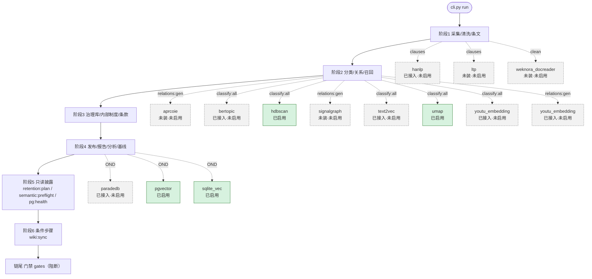

# 全链数据流总图（`cli.py run`）

> **本文件由 `tools/gen_flow_map.py` 机器生成**（事实源：`STEP_ORDER` + `_run` 调用点 + `config/schema/semantic_tools.json`）。**请勿手工编辑** —— 改链路请改源码后重跑本工具。
>
> 步骤数：**28**；工具：**13**（可用 9，未装 4）

## 一、链路总览（Mermaid：**含全部接入模型节点**）

> 图中**每个接入模型都作为一个节点**挂在它所属阶段的链路节点上（虚线=挂接关系，边标签为**具体步骤**）；**无论是否启用均已入图**，并以样式区分：**实线绿=已启用**、**虚线灰=未启用**。

图例：**已启用 4 个**（实线绿）／**未启用 10 个**（虚线灰，原因见 §三）—— **未启用模型同样作为节点存在**，便于在链路上定位其将来挂接的位置。

## 二、逐步骤表（顺序 = `STEP_ORDER`；命令自源码抽取）

> 说明：**命令列为节选**（自源码 `_run` 调用点抽取）。少数行的调用形态较复杂（多行列表 / 相邻调用紧邻），抽取结果可能含**相邻片段** —— 该列的用途是**快速定位脚本**，精确参数请以源码为准。

| # | 步骤 | 作用 | 脚本/命令（节选） | 降级 / 失败语义 |
|---|---|---|---|---|
| 1 | `collect:nfra_weekly` | nfra 周报采集（按周触发） | `nfra_weekly.py` | **阻断**（失败即停） |
| 2 | `collect:{src}` | 各源原始采集（gov/mof/nfra/pbc/supp）（本步：`collect:{src}`） | `（条件调用或未见字面量）` | **阻断**（失败即停） |
| 3 | `supp:ingest_batch` | 补充库批量摄取（backlog 驱动） | `supp_ingest_batch.py` | **阻断**（失败即停） |
| 4 | `clean:{src}` | 原始 → 清洗（6 态抽取 + 校验隔离）（本步：`clean:{src}`） | `（条件调用或未见字面量）` | **阻断**（失败即停） |
| 5 | `timeliness:verify` | 时效核验（北大法宝；Node 侧 MCP） | `timeliness_verify timeliness:consolidate consolidate_timeliness.py` | **阻断**（失败即停） |
| 6 | `timeliness:consolidate` | 时效核验结果汇总 | `consolidate_timeliness.py` | **阻断**（失败即停） |
| 7 | `apply:{src}` | 时效核验结果回写清洗产物（本步：`apply:{src}`） | `（条件调用或未见字面量）` | **阻断**（失败即停） |
| 8 | `classify:all` | 主题分类（_t*_base / _t*_final 派生） | `cli.py classify` | **阻断**（失败即停） |
| 9 | `relations:gen` | 关系抽取（含条款级定位：**窗口优先 + 跨度退路**） | `cli.py relations gen` | **阻断**（失败即停） |
| 10 | `reconcile` | 清洗漂移对账（clean_drift） | `scripts reconcile_clean_drift.py` | **阻断**（失败即停） |
| 11 | `recall` | 召回复核与四门禁（clean/validity/contract/schema） | `recall_audit run_retrieval_after_checks.py` | **阻断**（失败即停） |
| 12 | `inbox:drop` | 收件箱投放（人工投递的制度文件入库） | `inbox_drop internal:update internal_update 阶段 1 governance:artifacts` | **阻断**（失败即停） |
| 13 | `internal:update` | 内部制度索引更新（原件同步） | `internal_update 阶段 1 governance:artifacts tools governance_register_artifacts.py` | **阻断**（失败即停） |
| 14 | `governance:artifacts` | 原件注册（治理库 artifact 表） | `tools governance_register_artifacts.py` | **阻断**（失败即停） |
| 15 | `governance:sync` | 治理库同步（run_log / gate_result / relation 等，**全量替换**） | `tools governance_sync.py` | **阻断**（失败即停） |
| 16 | `internal:merged` | 内部制度**合并视图**（供条款对照与检索） | `cli.py internal merged` | **阻断**（失败即停） |
| 17 | `reports:build` | 总览报告生成 | `scripts report_builders build_overview_report.py` | **阻断**（失败即停） |
| 18 | `reports:theme` | 主题报告生成 | `scripts report_builders build_theme_report.py` | **阻断**（失败即停） |
| 19 | `draft:clause` | 条款对照素材（drafter 视图） | `cli.py draft` | **阻断**（失败即停） |
| 20 | `base:publish` | 底座发布（发布清单 publish_manifest） | `cli.py base publish` | **阻断**（失败即停） |
| 21 | `analysis:gen` | 分析交付物（docs/reports，含 17 项 manifest sha） | `cli.py analysis gen` | **阻断**（失败即停） |
| 22 | `watch:baseline` | 观测基线快照 | `cli.py source diff` | **阻断**（失败即停） |
| 23 | `retention:plan` | 数据生命周期**只读披露**（dry-run + 台账；`--apply` 为人工闸门） | `tools retention.py` | **只读披露 · 恒 rc=0**（后端不可用为合法状态） |
| 24 | `quarantine:triage` | 清洗隔离件分类与处置登记（零回写 → worklist） | `tools quarantine_triage.py` | **阻断**（失败即停） |
| 25 | `semantic:preflight` | P1 语义增强**启用前置披露**（五道闸逐项） | `std_lib.common_lib.semantic_tools` | **只读披露 · 恒 rc=0**（后端不可用为合法状态） |
| 26 | `pg:health` | 向量存储**只读**健康检查（pgvector / sqlite_vec 降级链披露） | `std_lib.common_lib.vector_store` | **只读披露 · 恒 rc=0**（后端不可用为合法状态） |
| 27 | `wiki:sync` | llm_wiki 源同步（条件步骤，未触发即跳过） | `wiki_sync 最后一道门 gates cli.py gates` | 条件步骤（未触发即跳过） |
| 28 | `gates` | 全部门禁（**阻断**；置于链尾以终态产物为准） | `cli.py run_at %Y-%m-%d %H:%M:%S total_elapsed_s raw` | **阻断**（失败即停） |

## 三、模型 ↔ 链路节点定位表（**全部接入模型，含未启用**）

> 纪律：**每个接入模型都必须在此表定位到链路节点**；未启用者须给出**原因**与**降级措施**（不得留空、不得写「无」）。绑定事实源：`gen_flow_map.MODEL_BINDINGS`。

| 模型 | 挂接链路节点 | 阶段 | 在该节点做什么 | 状态 | 未启用原因 | 降级措施 |
|---|---|---|---|---|---|---|
| `aprcoie` | `relations:gen` | 阶段2 | 中文**开放信息抽取**（自动生成抽取模式，P3-1） | 未装 · 未启用 | 依赖未安装 | 回退正则关系抽取（P3 可选，未启用不影响主链） |
| `bertopic` | `classify:all` | 阶段2 | **主题内子簇语义化**（P1-5，仅产出分析视图） | ⚠️ 已接入 · **未启用** | **模型权重未取得**（白名单网络不含模型站）→ 启用前须预置 | 不做子簇（仅影响分析视图，不产事实源） |
| `hanlp` | `clauses` | 阶段1 | 条文**分句/结构增强**（ML 分句替代正则切分） | ⚠️ 已接入 · **未启用** | **模型权重未取得**（白名单网络不含模型站）→ 启用前须预置 | 回退 `std_lib/scraper_std` 的规则分句（既有 SSOT，零依赖） |
| `hdbscan` | `classify:all` | 阶段2 | bertopic 的聚类依赖（**不单独使用**） | **已启用** | 依赖与权重均就绪，可被调用 | 随 bertopic 一并跳过 |
| `ltp` | `clauses` | 阶段1 | 条文分句（**hanlp 的二选一备选**，按质量择优） | ⚠️ 未装 · 未启用 | 依赖未安装 | 同 hanlp；两者皆不可用即用规则分句 |
| `paradedb` | **按需节点**（无独立链步骤；由 `pg:health` 披露、业务按需调用） | 阶段4 | 向量+BM25 混合检索（**已被 pgvector 替代**，可选外部后端） | 已接入 · **未启用** | **服务未部署 / 端点未配置** | 使用 pgvector / sqlite_vec（**不建议随仓分发**：AGPL-3.0） |
| `pgvector` | **按需节点**（无独立链步骤；由 `pg:health` 披露、业务按需调用） | 阶段4 | **向量检索**后端（P2-2；`vec` schema，最小权限角色） | **已启用** | 依赖与权重均就绪，可被调用 | 降级 `sqlite_vec`（同库同源）→ 再退 SQLite FTS5 全文 |
| `signalgraph` | `relations:gen` | 阶段2 | **零 Token 确定性图构建**（P3-2） | 未装 · 未启用 | 依赖未安装 | 回退关系三元组 → 既有图构件 |
| `sqlite_vec` | **按需节点**（无独立链步骤；由 `pg:health` 披露、业务按需调用） | 阶段4 | 向量检索**降级后端**（与既有 SQLite FTS5 同库同源） | **已启用** | 依赖与权重均就绪，可被调用 | 回退 SQLite FTS5 全文检索（零服务依赖） |
| `text2vec` | `classify:all` | 阶段2 | 同上（**已被 youtu_embedding 取代**，保留为备选） | ⚠️ 已接入 · **未启用** | **模型权重未取得**（白名单网络不含模型站）→ 启用前须预置 | 优先 youtu_embedding；再退关键词规则 |
| `umap` | `classify:all` | 阶段2 | bertopic 的降维依赖（**不单独使用**） | **已启用** | 依赖与权重均就绪，可被调用 | 随 bertopic 一并跳过 |
| `weknora_docreader` | `clean` | 阶段1 | 文档**版面分析**（25+ 格式渲染，补正文抽取） | 未装 · 未启用 | 依赖未安装 | 回退 `crawler_common.extract_document_text`（既有 6 态） |
| `youtu_embedding` | `classify:all` | 阶段2 | **主题辅助裁定**（语义向量近邻投票，P1-1） | ⚠️ 已接入 · **未启用** | **模型权重未取得**（白名单网络不含模型站）→ 启用前须预置 | 回退关键词/规则判定（既有主题分类器） |
| `youtu_embedding@relations`（`@`：同工具的第二用途） | `relations:gen` | 阶段2 | **关联语义档**（P1-2：依据/废止关系的语义近似判定） | ⚠️ 已接入 · **未启用** | **模型权重未取得**（白名单网络不含模型站）→ 启用前须预置 | 回退正则关系抽取（既有 `common_lib/relations`） |

合计 **14** 个模型节点（**已启用 4** ／ **未启用 10**）—— 两者**均已入图**（§一），未启用者标注了将来挂接的确切位置。

### 3.1 ⚠️ 未取得模型权重的环节（**单独标记**）

以下工具**代码依赖已就绪、但权重未取得**（网络白名单不含模型站；`offline_ready=False`）→ **相关环节在权重落地前不得启用**：

| 工具 | 挂接节点 | 方案项 | 预置方式 |
|---|---|---|---|
| `bertopic` | `classify:all` | v2 P1-5（主题内子簇语义化，可选） | 在可达环境预置后迁入（`HF_HOME` / `HANLP_HOME`） |
| `hanlp` | `clauses` | v2 P1-3（分句/结构增强层） | 在可达环境预置后迁入（`HF_HOME` / `HANLP_HOME`） |
| `text2vec` | `classify:all` | v2 P1-1（主题辅助裁定）、P1-2（关联语义档） | 在可达环境预置后迁入（`HF_HOME` / `HANLP_HOME`） |
| `youtu_embedding` | `classify:all` | v2 P1-1（主题辅助裁定）、P1-2（关联语义档） | 在可达环境预置后迁入（`HF_HOME` / `HANLP_HOME`） |
| `youtu_embedding@relations` | `relations:gen` | v2 P1-1（主题辅助裁定）、P1-2（关联语义档） | 在可达环境预置后迁入（`HF_HOME` / `HANLP_HOME`） |

**受影响的链路环节**：`semantic:preflight` 的 `offline` 闸（当前唯一未过闸）；
**不受影响**：主链（采集→清洗→条文→关系→报告→门禁）**不依赖任何模型权重**，
全部走确定性正则/规则路径；上表全部模型均为**可选叠加**，缺失即按「降级措施」列回退。

## 四、向量检索接入（P2-2，按需）

- **接入层**：`std_lib/common_lib/vector_store.py`（`*_store` 家族；与 `governance_store` 同级）
- **降级链**：`pgvector`（`vec` schema，最小权限角色）→ `sqlite_vec`（与既有 SQLite FTS5 同库同源）→ `none`（走既有全文/正则）
- **连接**：env `PGVECTOR_DSN`（口令**仅经 env**，不入库；`gate_secret_scan` 守护）
- **异常语义**：`VectorStoreUnavailable` 供调用方降级；`search_or_fallback()` 失败返回 `None`（**不抛**）
- **不影响主链**：主链**不调用**其读写；`pg:health` 仅做只读披露

## 五、披露步骤的失败语义（统一口径）

`retention:plan` / `semantic:preflight` / `pg:health` 三者同为**只读披露**，统一口径：

> **「未就绪」是合法状态** —— 未启用增强、无待归档、后端未部署，都不是链路故障。故披露步骤**恒 rc=0**；真正需要阻断的判定保留给各自的人工/CI 口径（如 `semantic_tools --preflight` 的 rc 反映可否启用）。
