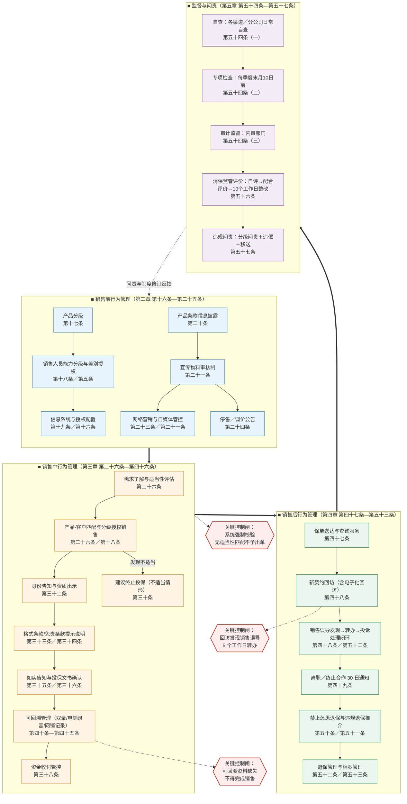
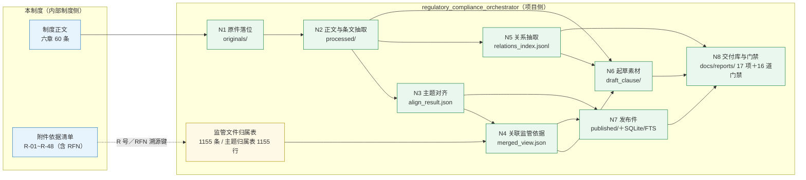

# 核心流程简图

**对象制度**：《阳光人寿保险股份有限公司保险销售行为管理办法》（2026修订版）
**编制日期**：2026-09-14
**说明**：本件一页呈现 **①业务主流程泳道图**、**②关键控制点表**、**③制度落地与本项目数据链的对应关系图**。

---

## 一、业务主流程泳道图

**读图说明**

- 上部为**业务动线**（销售前 → 销售中 → 销售后），下部为**监督闭环**；监督环节的问责与制度修订结果回流至销售前，形成闭环。
- 三个"关键控制闸"是制度中**不可绕过的硬控制点**，均在正文有系统级/时限级要求。
- 第三章第三节「可回溯管理」（第四十条—第四十五条）覆盖电销、网销、现场双录三类场景，是销售中环节的证据底座。

---

## 二、关键控制点表（含责任部门、时限、输出物）

| 序 | 控制点 | 制度条款 | 责任部门 | 时限／频次 | 输出物 |
|:---:|---|:---:|---|---|---|
| 1 | 产品分级与动态更新 | 第十七条 | 产品管理部门（会同消保、渠道） | 产品风险等级调整时**同步**更新系统配置 | 产品分级清单、系统配置变更记录 |
| 2 | 销售人员能力分级与差别授权 | 第十八条／第五条 | 各渠道管理部门 | 持续；等级变更即时生效 | 分级台账、系统授权记录 |
| 3 | 销售系统授权范围配置与拦截 | 第十六条 | 各渠道管理部门＋信息技术部门 | 持续 | 系统拦截日志 |
| 4 | 产品信息披露与更新 | 第二十条 | 产品与服务信息披露归口部门 | 条款变更**正式实施前**更新 | 披露页面更新记录 |
| 5 | 宣传物料审核制 | 第二十一条 | 渠道管理部门初审 → 品牌发展部（战略企划部）复审 | 发布前；记录保存 ≥ 停用后 **3 年** | 审核留痕、宣传素材库 |
| 6 | 自媒体营销监测与处置 | 第二十一条 | 品牌发展部（战略企划部）＋渠道管理部门 | 发现即处置 | 违规处置记录 |
| 7 | 网络营销内容与平台审核 | 第二十三条 | 互联网业务归口部门＋品牌发展部 | 发布前 | 网络营销内容审核记录 |
| 8 | 停售／调价公告 | 第二十四条 | 产品管理部门发起、信息披露归口部门发布 | 起始日期**不得早于**公告日期 | 公告文本、物料回收记录 |
| 9 | 适当性评估与匹配留痕 | 第二十六条 | 各销售渠道 | 投保前**强制**；记录保存 ≥ 可回溯资料保管期限 | 风险测评记录、匹配记录 |
| 10 | 身份告知与资质出示 | 第三十二条 | 保险销售人员／各渠道 | 每次销售 | 执业证件展示、机构简称告知 |
| 11 | 格式条款／免责条款提示说明 | 第三十三条／第三十四条 | 运营管理部门配置＋销售人员执行 | 投保前；**未提示说明的条款不产生效力** | 投保提示书、条款说明留痕 |
| 12 | 适老化服务 | 第三十三条 | 运营管理部门＋各渠道 | 持续；保留人工渠道 | 适老化材料版本记录 |
| 13 | 投保文书确认（禁止代签） | 第三十六条 | 运营管理部门 | 投保时 | 投保单确认栏、抄录语句记录 |
| 14 | 可回溯管理（双录／电销／网销） | 第四十条—第四十五条 | 运营管理部门归口 | 按销售方式；资料保管 1 年内 ≥ **5 年**、超 1 年 ≥ **10 年** | 视听资料、页面与轨迹记录、质检记录 |
| 15 | 资金收付管控 | 第三十八条 | 各渠道＋财务归口部门 | 每笔业务 | 收付费记录 |
| 16 | 保单送达与资料补正告知 | 第四十七条 | 运营管理部门 | 核保通过后及时；资料补正 **5 个工作日**内一次性告知 | 保单送达记录、补正告知书 |
| 17 | 新契约回访与销售误导转办 | 第四十八条 | 回访归口管理部门 | 发现销售误导 **5 个工作日**内转办 | 回访记录、转办单 |
| 18 | 离职／终止合作通知 | 第四十九条 | 各渠道管理部门＋运营管理部门 | 手续完成／终止合作后 **30 日**内 | 可留痕送达记录 |
| 19 | 退保投诉处理 | 第五十二条 | 消保归口部门 | 按 R-45 与公司投诉制度规定时限办结反馈 | 投诉处理台账 |
| 20 | 中介渠道业务合规自查 | 第十一条／第五十四条 | 中介渠道业务归口管理部门 | **每季度末月 10 日前** | 自查报告（报分管领导、抄送法律合规部） |
| 21 | 银保渠道费用回溯与保单核对 | 第十四条 | 总公司银保渠道管理部门 | 各分公司**每季度末月 25 日前**报送 | 核对报告（分管领导审阅后归档） |
| 22 | 销售行为合规专项检查 | 第五十四条（二） | 法律合规部会同消费者权益保护部门 | **每年至少 1 次** | 专项检查报告（纳入年度合规报告） |
| 23 | 消保监管评价自评与整改 | **第五十六条** | 消费者权益保护工作归口管理部门 | 报送前自评；收到结果后 **10 个工作日**内制定整改方案 | 自评估报告、整改方案及跟踪验证记录 |
| 24 | 保险知识普及与风险提示计划 | 第八条 | 消费者权益保护工作归口管理部门 | 每年 **12 月 31 日前**制定次年计划 | 年度工作计划 |
| 25 | 依据清单更新 | 附则（体例说明第 6 条） | 法律合规部 | 非 valid 依据效力明确后 **30 个工作日**内 | 附件依据清单修订版 |

---

## 三、制度落地与本项目数据链的对应关系图

**对应关系说明**

| 制度侧要素 | 项目侧承载 | 说明 |
|---|---|---|
| 制度正文条文 | `processed/<ipn>_clauses.json`（章—条结构）+ `_fulltext.json`（正文） | 制度条文的程序可读形态 |
| 附件依据清单 R 号 | `merged_view.json` 的 `associated_rfns` + 归属表 RFN | **当前存在缺口**：视图仅 1 条 vs 清单 48 条（详见 00 与 06） |
| 条款中的监管引用 | `relations_index.jsonl`（`src_kind=internal` 的 `basis` 边） | **当前为 0 条**；正文引用形态影响抽取召回 |
| 制度版本／效力 | 索引 `status`/`file_type`；发布件 `eff_status`；时效 SSOT | 时效单源四层一致由 `gate_timeliness_ssot` 守 |
| 制度条款对照 | `data/draft_clause/<ipn>_条款对照素材.md` | 起草素材（当前结构陈旧） |
| 制度全文检索 | `published/internal_index.sqlite` + FTS5 | 供检索/调用 |

---

**编制**：AI 助手（life-insurance-system-drafter 技能 · 核心流程简图规范）
