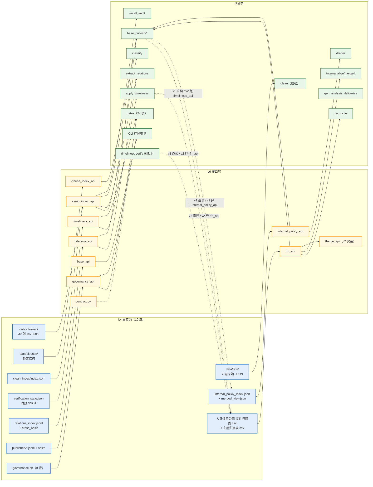
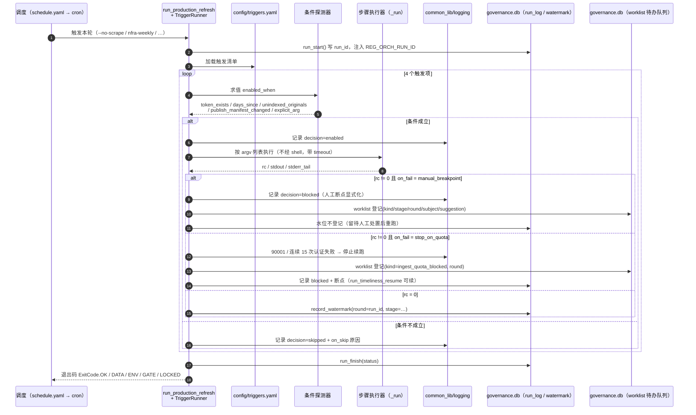
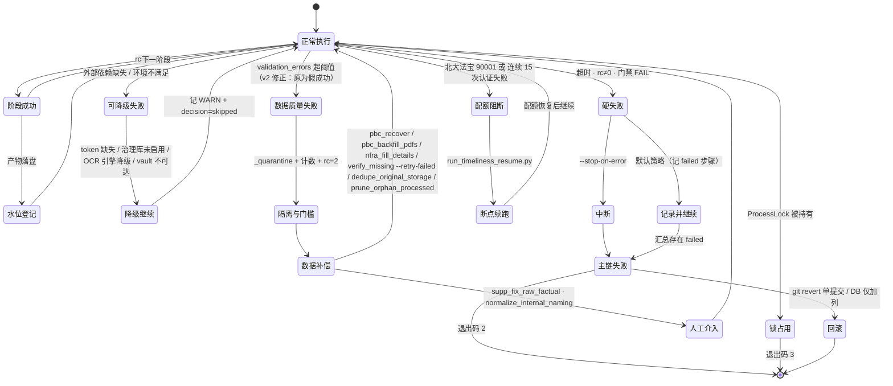

# 全链路数据流链路图（v2）

> 配套文档：`reports/全链路重构方案_修订版_v2_20260926.md`（施工依据）
> 基准：本仓当前工作树（仓库根，2026-09-26）；路径一律写仓库相对路径（避免盘符字面量）
> 渲染：本文所有 ```mermaid 代码块可直接在 GitHub / VS Code / Obsidian / mermaid.live 渲染；也可将「图 A」单独另存为 `.mermaid` 文件供工具链消费。

---

# 第 1 部分 图形布局说明（结构化文本）

## 1.1 纵向分层（9 层）

| 层 | 名称 | 内容 | 说明 |
|---|---|---|---|
| **L0** | 外部数据源与外部服务 | 五源官网、supp 本地材料、外部语料、内部制度原件、北大法宝、OCR 引擎、Obsidian vault | 全部为仓外实体；**只读**为本仓输入 |
| **L1** | 引导与配置层 | `bootstrap.py`、`paths.py`、`config/{constants,exitcodes,enums,loader,triggers,schedule,ocr,sources}`、`config/schema/contract_manifest.json` | v2 新增/改动最集中；**不搬运业务数据，只提供清单与契约** |
| **L2** | 采集与同步层 | `collectors/*`、`supp_ingest_*`、`ingest_corpus`、`normalize_internal_naming`、`timeliness verify 三脚本` | 产出「原始态」数据；含在线 API 调用 |
| **L3** | 清洗与转换层 | `clean/run_clean_pipeline` + `scraper_std.pipeline`、`clause_index`、`ocr_engine`、`consolidate/apply_timeliness` | 产出「统一契约态」数据（39 列） |
| **L4** | 存储与事实源层 | `data/raw`、`data/cleaned`、`data/clauses`、`clean_index/index.json`、`governance.db`、归属表/主题表、`relations_index.jsonl`、`internal_policy_index.json`、`merged_view.json`、`published/*`、`exports/`、`backups/`、`archive/` | **10 个数据域的唯一事实源**（对应方案 §2.1） |
| **L5** | 派生与计算层 | `classify`、`extract_relations`、`reconcile`、`governance_sync`、`recall_audit`、`align`、`merged`、`report_builders`、`base_publish/*`、`gen_analysis_deliveries`、`rfn/registry`、`rfn_backlog`、`retention`、`gen_schedule_doc`、`sync_wiki_sources` | 只做"读事实源 → 算 → 写回事实源"；经 L6 接口访问 L4 |
| **L6** | 接口层 | `interfaces/*_api.py`（9）+ `contract.py` + `protocols.py`（v2 新增） | **跨模块唯一访问面**；v2 起为 L5/L7 提供 `Protocol` |
| **L7** | 编排与门禁层 | `run_production_refresh.py`、`ProcessLock`、`gates/`（18 → 24）、`common_lib/logging.py`、`gen_benchmark`、`cli.py` | 横切治理：不产出业务数据，只做调度、断言、台账 |
| **L8** | 交付与消费层 | `docs/reports/` 17 项、`reports/_wiki_sources/`、Obsidian vault、CLI 在线查询（FTS5）、drafter 六件套、`graphify-out/` | 面向人/前端的最终出口 |

## 1.2 流类型与视觉编码

**本仓无流式处理**：无常驻服务、无消息队列、无流式框架。三类流须区分：

| 流类型 | 定义 | 线型 | 典型节点 |
|---|---|---|---|
| **批量流（Batch）** | cron / 人工触发的确定性阶段链；每轮全量重建或幂等增量 | **实线粗箭头** `-->` | `run_production_refresh` 的 14 阶段 / 22 步 |
| **在线按需流（Online）** | 运行时对外部服务的请求-响应（配额受限） | **点线箭头** `-.->` | 北大法宝效力核验、OCR 引擎调用、CLI FTS5 查询、vault 写入 |
| **人工/条件流（Manual/Conditional）** | 人工断点、条件触发、补偿修复 | **空心粗箭头** `==>` | `rfn_backlog` 补登、内部制度入库、`retention --apply`、数据补偿脚本族 |

**节点颜色（`classDef`）**

| 颜色 | 含义 |
|---|---|
| 🟩 绿实线框 | **v2 新增**（`added`） |
| 🟨 黄实线框 | **v2 修改**（`changed`） |
| 🟥 红虚线框 | **v2 废弃 / 移除**（`removed`） |
| 🟦 蓝实线框 | 存储/事实源（`store`） |
| 🟪 紫实线框 | 门禁/治理（`gate`） |
| ⬜ 灰实线框 | 保留未改（默认） |
| 🟣 淡紫框 | 外部实体（`ext`） |
| 🟢 浅绿框 | 交付/消费（`consume`） |

## 1.3 阅读顺序

```
图 A（主图，端到端批量主链）
  └─▶ 图 B（事实源 × 接口 × 消费者映射，细粒度）
  └─▶ 图 C（条件触发链时序）
  └─▶ 图 D（异常 / 降级 / 补偿 / 回滚）
  └─▶ 图 E（v2 变更总览）
表 5（节点清单）· 表 6（格式与协议）· 表 7（异常矩阵）· 表 8（v2 ↔ v1 对照）
```

---

# 第 2 部分 图 A：端到端全链路主图

```mermaid
flowchart TB
  classDef ext      fill:#ede7f6,stroke:#5e35b1,stroke-width:1px
  classDef added    fill:#d9f2d9,stroke:#2e7d32,stroke-width:2.5px
  classDef changed  fill:#fff4cc,stroke:#b8860b,stroke-width:2.5px
  classDef removed  fill:#f9d6d9,stroke:#b02a37,stroke-width:2px,stroke-dasharray:6 4
  classDef store    fill:#e2eefb,stroke:#1565c0,stroke-width:1.5px
  classDef gate     fill:#f3e5f5,stroke:#7b1fa2,stroke-width:1.5px
  classDef consume  fill:#e8f5e9,stroke:#1b5e20,stroke-width:1.5px

  subgraph L0["L0 外部数据源与外部服务"]
    direction LR
    EXT_GOV["① gov 官网法规库<br/>+ 国务院政策文件库（zhengceku 子源）"]
    EXT_MOF["② 财政部 fgk.mof.gov.cn"]
    EXT_NFRA["③ 金融监管总局 nfra"]
    EXT_PBC["④ 人民银行 pbc"]
    EXT_SUPP["⑤ supp 本地补充材料<br/>PDF / DOCX / XLSX"]
    EXT_DROP["投放区 data/inbox/<br/>internal · regulatory_stats<br/>（人工放入 PDF/DOCX/XLSX）"]
    EXT_ORIG["内部制度原件库 originals/"]
    EXT_PKULAW["北大法宝 MCP（Node CLI）<br/>效力核验服务"]
    EXT_OCR["OCR 引擎<br/>PaddleOCR 3.7 / Tesseract"]
    EXT_VAULT["Obsidian vault（llm_wiki）"]
  end

  subgraph L1["L1 引导与配置层（v2 变更集中）"]
    direction LR
    BOOT["bootstrap.py<br/>唯一 sys.path 引导点"]
    PATHS["paths.py<br/>路径 SSOT（清死常量）"]
    C_CONST["config/constants.py<br/>模块/阶段/层 清单 SSOT"]
    C_EXIT["config/exitcodes.py<br/>ExitCode 枚举"]
    C_ENUM["config/enums.py<br/>受控枚举 SOURCE_SET 等"]
    C_LOADER["config/loader.py<br/>占位符展开 5 轮"]
    C_TRIG["config/triggers.yaml<br/>条件触发清单"]
    C_SCHED["config/schedule.yaml<br/>调度唯一事实源"]
    C_SRC["config/ocr.yaml · sources.yaml"]
    C_MANIFEST["config/schema/contract_manifest.json<br/>6 契约（v2 接入门禁）"]
    C_SCHEDOLD["运行手册定时表（手抄）<br/>+ .codebuddy/automations 口径二义"]
  end

  subgraph L2["L2 采集与同步层"]
    direction LR
    COL_WEB["collectors/{gov,mof,nfra,pbc}_collector.py<br/>四源官网采集"]
    COL_GOVZK["collectors/gov_zhengceku.py<br/>gov 第二子源"]
    COL_NFRAW["collectors/nfra_weekly.py<br/>周增量（备份留 3 份）"]
    COL_SUPP["collectors/supp_ingest_batch.py<br/>supp_ingest_local_dir.py<br/>显式参数触发"]
    COL_ATT["collectors/{src}_fetch_attachments.py<br/>· supp_ocr_pdf.py · pbc_backfill_pdfs.py"]
    SYN_CORPUS["tools/ingest_corpus.py<br/>语料归集（sha256 幂等）"]
    SYN_NAMING["tools/normalize_internal_naming.py --apply<br/>规范命名 + 归集"]
    TL_VERIFY["timeliness verify 三脚本<br/>verify_missing + authority_backfill_verify<br/>+ classifier_pkulaw_verify"]
  end

  subgraph L3["L3 清洗与转换层"]
    direction LR
    CLEAN["clean/run_clean_pipeline.py<br/>→ std_lib/scraper_std/pipeline.py"]
    VALID["validate_record 校验<br/>失败 → _quarantine（v2 修正）"]
    CLAUSE["clause_index<br/>条文结构抽取（不重排条号）"]
    OCR_RT["std_lib/scraper_std/ocr_engine.py<br/>引擎选择 + 自动降级"]
    TL_CONS["consolidate_timeliness.py<br/>全量清单 + 冲突台账"]
    TL_APPLY["apply_timeliness_to_cleaned.py<br/>三字段回写 + 同轮刷新派生"]
  end

  subgraph L4["L4 存储与事实源层（10 个数据域）"]
    direction LR
    RAW["data/raw/<br/>gov_laws · mof_laws · nfra_regulations<br/>· pbc_laws · supplementary_regulations<br/>+ gov_zhengceku · _zhengceku_partial"]
    CLEANED["data/cleaned/<br/>src_cleaned_YYYYMMDD.csv / .jsonl<br/>39 列统一契约 · CSV UTF-8 BOM"]
    CLSDS["data/clauses/<br/>src_clauses_DATE.jsonl / .md"]
    CIDX["clean_index/index.json<br/>五源快照索引 + SHA256"]
    CORPUS["data/corpus/<domain>/<br/>dept_policies · regulatory_stats<br/>归集本体（审计层·只读，与 originals 硬链接）"]
    CORPUS_MAN["reports/corpus/*.manifest.json<br/>+ _index.json（入库，可审计入口）"]
    TLSTATE["timeliness_review/verification_state.json<br/>时效 SSOT + verify_summary_*.json"]
    GOVDB["data/governance.db<br/>原 9 表（5 观测 + 4 投影）· WAL<br/>v2: watermark + round/stage"]
    WORKLIST["governance.db.worklist<br/>待办队列（D1–D6 + 断点显式化）<br/>open / resolved / dismissed"]
    ATTR["classifier/data/<br/>人身保险公司-文件归属表.csv（8 列）"]
    THEME2["classifier/data/<br/>人身保险公司-主题归属表.csv（3 列）"]
    RELS["classifier/data/relations/<br/>relations_index.jsonl（27 字段）<br/>+ cross_basis.jsonl + relations_stat.json"]
    BRIDGE["classifier/data/<br/>rfn_clean_bridge.csv + drift state"]
    IIDX["ipb/data/internal_policy_index.json<br/>+ _ingest_state.json（sha256 游标）"]
    IORIG["ipb/data/originals/（硬链接）<br/>+ processed/IPN-*.json"]
    MERGED["ipb/data/merged_view.json<br/>制度 × RFN 对齐视图"]
    PUBX["scrapers/published/<br/>external_records · clauses · attachments · relations.jsonl<br/>+ publish_manifest.json"]
    PUBI["ipb/published/<br/>internal_policies · internal_clauses.jsonl<br/>+ publish_manifest.json"]
    FTSX["published/external_index.sqlite<br/>SQLite + FTS5(trigram)"]
    FTSI["published/internal_index.sqlite<br/>SQLite + FTS5(trigram)"]
    EXPORTS["exports/*.csv + manifest.json<br/>治理库只读交换层"]
    BACKUPS["backups/ · *.bak_* · incident_*<br/>v2: retention 统一治理"]
    ARCHIVE["archive/<br/>超期归档（纳入门禁排除集）"]
  end

  subgraph L6["L6 接口层（跨模块唯一访问面）"]
    direction LR
    IF_BASE["base_api"]
    IF_CIDX["clean_index_api"]
    IF_CLAUSE["clause_index_api"]
    IF_RFN["rfn_api"]
    IF_TL["timeliness_api"]
    IF_REL["relations_api"]
    IF_GOV["governance_api"]
    IF_IPB["internal_policy_api"]
    IF_THEME["theme_api<br/>v2: 实装 3 个空壳"]
    IF_CONTRACT["contract.py"]
    IF_PROTO["protocols.py<br/>CleanIndexProvider / RfnProvider …"]
    IF_DEAD["THEME_MAP_P0 硬编码副本<br/>与 rfn.THEME_MAP 双份"]
  end

  subgraph L5["L5 派生与计算层"]
    direction LR
    CLS["classify.py --all<br/>主题底座强序重建"]
    RELEX["tools/extract_relations.py<br/>三类关系全量重抽（v2: skipped 计数）"]
    RECON["reconcile_clean_drift.py<br/>RFN ↔ clean 溯源桥 + 漂移"]
    GSYNC["tools/governance_sync.py<br/>project_metadata 单事务投影"]
    RECALL["recall_audit/{scanner,build_outputs,report}.py<br/>召回复核 + 边界案例"]
    ALIGN["ipb/align.py<br/>制度 × 主题对齐"]
    IPMERGED["ipb/merged.py<br/>制度 × RFN 引用（依赖归属表 + 主题表）"]
    RPT["scripts/report_builders/*<br/>全景 / 主题报告"]
    RFNREG["rfn/registry.py<br/>RFN 注册唯一写口（WinFileLock）"]
    RFNBK["tools/rfn_backlog.py<br/>补登（dst_class=corpus）"]
    BPX["base_publish/build_external.py"]
    BPI["base_publish/build_internal.py"]
    BPF["base_publish/build_fts.py<br/>临时库 → 原子换入"]
    ANGEN["tools/gen_analysis_deliveries.py<br/>规划 §2.1 17 项交付库"]
    GENSCH["tools/gen_schedule_doc.py<br/>由 schedule.yaml 生成手册/cron"]
    RETENT["tools/retention.py<br/>备份保留 / 归档（--dry-run 默认）"]
    WIKI["tools/sync_wiki_sources.py<br/>+ gen_theme_moc.py + check_llm_wiki_upstream.py"]
    INBOX["tools/inbox_scan.py<br/>投放区扫描 + sha256 路由<br/>+ needs_review 清单"]
    EBACK["tools/build_east_backlog.py<br/>主通知 → supp backlog<br/>（落点按域参数化）"]
    RECOVER["数据补偿脚本族<br/>pbc_recover · pbc_backfill_pdfs<br/>· nfra_fill_details · supp_fix_raw_factual<br/>· dedupe_original_storage · prune_orphan_processed"]
    RELEV["classifier/relevance/ + filter_clean_relevance.py<br/>有产出无消费（v2 待决）"]
  end

  subgraph L7["L7 编排与门禁层（横切治理）"]
    direction LR
    ORCH["tools/run_production_refresh.py<br/>主链 14 阶段 / 22 步<br/>v2: TriggerRunner 驱动"]
    RUNLOCK["ProcessLock 单实例锁<br/>占用 → rc=3"]
    GATES["gates/ 18 道<br/>→ v2: 24 道"]
    GATES_NEW["v2 新增 6 道<br/>module_registry · import_bootstrap<br/>· config_integrity · clean_schema<br/>· runtime_hygiene · cross_module_data"]
    LOGP["std_lib/common_lib/logging.py<br/>→ logging_setup（JSON lines）"]
    BENCH["tools/gen_benchmark.py<br/>BENCHMARK.md 区间标记替换"]
    TMANIFEST["tools/_manifest.json<br/>+ tools/retired/ 隔离层<br/>category: pipeline · tool · retired"]
    CLI["cli.py<br/>COMMANDS 12 → 17<br/>+ run / doctor / status / worklist / schedule"]
  end

  subgraph L8["L8 交付与消费层"]
    direction LR
    DELIVERY["docs/reports/ 17 项<br/>+ _manifest.json"]
    WIKIOUT["reports/_wiki_sources/*.md<br/>+ .wiki_sync_manifest.json"]
    DRAFT["internal_policy_drafter<br/>data/draft_clause/ → docs/ 六件套"]
    CLIQ["CLI 在线查询<br/>base query/search（FTS5）<br/>· relations show · internal merged"]
    GRAPH["graphify-out/ 知识图谱（派生）"]
    NOTIFY["reports/_alerts/*.md<br/>告警通道（notify.kind=file）"]
  end

  %% ===== L0 → L2 采集（批量流为主）=====
  EXT_GOV --> COL_WEB
  EXT_MOF --> COL_WEB
  EXT_PBC --> COL_WEB
  EXT_GOV --> COL_GOVZK
  EXT_NFRA --> COL_NFRAW
  EXT_SUPP -.-> COL_SUPP
  EXT_DROP -.-> INBOX
  EXT_ORIG -.-> SYN_NAMING
  EXT_OCR -.-> OCR_RT
  EXT_PKULAW -.-> TL_VERIFY
  EXT_VAULT -.-> WIKIOUT

  %% ===== L2 → L4 =====
  COL_WEB --> RAW
  COL_GOVZK --> RAW
  COL_NFRAW --> RAW
  COL_SUPP --> RAW
  COL_ATT -.-> RAW
  SYN_CORPUS --> CORPUS
  SYN_CORPUS --> CORPUS_MAN
  INBOX --> SYN_CORPUS
  INBOX ==> SYN_NAMING
  CORPUS -.-> EBACK
  EBACK -.-> COL_SUPP
  SYN_NAMING ==> IORIG
  TL_VERIFY --> TLSTATE

  %% ===== L4 → L3（原始态 → 统一契约态）=====
  RAW --> CLEAN
  CLEAN --> VALID
  VALID --> CLEANED
  CLEAN --> CLAUSE
  CLAUSE --> CLSDS
  CLEANED --> CIDX

  %% ===== 时效回写环（阶段 2）=====
  TLSTATE --> TL_CONS
  TL_CONS --> TL_APPLY
  TL_APPLY ==> CLEANED
  TL_APPLY -.-> CIDX
  TL_APPLY -.-> CLSDS

  %% ===== L1 配置/清单注入（点线，不传业务数据）=====
  C_CONST -.-> PATHS
  C_CONST -.-> C_MANIFEST
  C_EXIT -.-> CLI
  C_TRIG -.-> ORCH
  C_SCHED -.-> GENSCH
  C_SCHEDOLD ==> GENSCH
  C_LOADER -.-> C_SRC
  BOOT -.-> PATHS
  PATHS -.-> CLI

  %% ===== L5 计算：读经接口，写回事实源 =====
  CLEANED -.-> IF_CIDX
  CLSDS -.-> IF_CLAUSE
  ATTR -.-> IF_RFN
  THEME2 -.-> IF_RFN
  TLSTATE -.-> IF_TL
  RELS -.-> IF_REL
  GOVDB -.-> IF_GOV
  IIDX -.-> IF_IPB
  MERGED -.-> IF_IPB
  PUBX -.-> IF_BASE
  FTSX -.-> IF_BASE
  ATTR -.-> IF_THEME

  IF_CIDX --> CLS
  IF_CIDX --> RELEX
  IF_CIDX --> BPX
  IF_CIDX --> RECALL
  IF_RFN --> RECON
  IF_RFN --> IPMERGED
  IF_RFN --> BPX
  IF_REL --> RFNBK
  IF_REL --> GSYNC
  IF_TL --> GSYNC
  IF_IPB --> BPI
  IF_CLAUSE --> BPX
  IF_PROTO -.-> GATES

  RELEX --> RELS
  RECALL ==> RFNBK
  RFNBK --> RFNREG
  RFNREG --> ATTR
  RFNREG --> THEME2
  CLS --> ATTR
  CLS --> THEME2
  CLS --> RPT
  RECON --> BRIDGE
  ALIGN --> IIDX
  IIDX --> ALIGN
  IIDX --> IPMERGED
  IPMERGED --> MERGED
  CLEANED --> RELS
  IIDX --> RELEX
  GSYNC --> GOVDB
  GOVDB --> EXPORTS

  CLEANED --> BPX
  CLSDS --> BPX
  BRIDGE --> BPX
  ATTR --> BPX
  RELS --> BPX
  BPX --> PUBX
  IIDX --> BPI
  MERGED --> BPI
  BPI --> PUBI
  PUBX --> BPF
  PUBI --> BPF
  BPF --> FTSX
  BPF --> FTSI

  RELS --> ANGEN
  MERGED --> ANGEN
  ATTR --> ANGEN
  ANGEN --> DELIVERY
  MERGED --> DRAFT
  IF_BASE --> CLIQ

  PUBX -.-> WIKI
  PUBI -.-> WIKI
  WIKI -.-> WIKIOUT
  WIKIOUT -.-> EXT_VAULT

  BACKUPS -.-> RETENT
  RETENT ==> ARCHIVE
  RECOVER ==> RAW
  RECOVER ==> IIDX
  RELEV -.-> CLS

  %% ===== L7 编排：调度一切 =====
  ORCH -.-> C_CONST
  ORCH -.-> TL_VERIFY
  ORCH -.-> CLEAN
  ORCH -.-> CLS
  ORCH -.-> RELEX
  ORCH -.-> RECON
  ORCH -.-> GSYNC
  ORCH -.-> RECALL
  ORCH -.-> IPMERGED
  ORCH -.-> RPT
  ORCH -.-> BPX
  ORCH -.-> GATES
  ORCH -.-> ANGEN
  ORCH -.-> SYN_NAMING
  ORCH -.-> RUNLOCK
  ORCH -.-> LOGP
  ORCH -.-> WORKLIST
  WORKLIST -.-> CLI
  ORCH -.-> NOTIFY
  GATES -.-> GATES_NEW
  GATES ==> GOVDB
  BENCH -.-> GATES
  TMANIFEST -.-> GATES

  %% ===== 类分配 =====
  class EXT_GOV,EXT_MOF,EXT_NFRA,EXT_PBC,EXT_SUPP,EXT_DROP,EXT_ORIG,EXT_PKULAW,EXT_OCR,EXT_VAULT ext
  class BOOT,C_CONST,C_EXIT,C_TRIG,C_SCHED,GENSCH,RETENT,IF_PROTO,LOGP,GATES_NEW,INBOX,TMANIFEST added
  class PATHS,C_MANIFEST,COL_NFRAW,COL_SUPP,COL_ATT,SYN_NAMING,TL_VERIFY,VALID,TL_APPLY,RELEX,IPMERGED,RECON,BPX,BPI,RFNBK,GOVDB,EXPORTS,IF_THEME,ANGEN,BENCH,ORCH,EBACK,CLI changed
  class C_SCHEDOLD,IF_DEAD removed
  class RAW,CLEANED,CLSDS,CIDX,CORPUS,CORPUS_MAN,TLSTATE,ATTR,THEME2,RELS,BRIDGE,IIDX,IORIG,MERGED,PUBX,PUBI,FTSX,FTSI,BACKUPS,ARCHIVE,WORKLIST store
  class GATES,RUNLOCK gate
  class DELIVERY,WIKIOUT,DRAFT,CLIQ,GRAPH,NOTIFY consume
```



**图 A 读图要点**

1. **主脊**：`L0 → L2 → RAW → L3(CLEAN→VALID→CLEANED) → L4 → L6 接口 → L5 计算 → L4 回写 → L8 交付`。
2. **唯一一处"回环"**：时效回写环（`TLSTATE → TL_CONS → TL_APPLY ==> CLEANED`），且该回环**只被允许发生在阶段 2**（方案 §3.3.1 的 `round/stage` 机制即为此回环提供水位语义）。
3. **L1 全部为点线**：配置/清单层**不承载业务数据**，只把清单注入到 `paths`/`ORCH`/`GATES`/`GENSCH`。
4. **L6 是必经带**：所有 `L5` 计算节点对 `L4` 的访问都经过接口节点；v2 修复的三条"穿墙"边为 `TL_APPLY → ATTR`（原直读 CSV）、`BPX → ATTR`、`BPI → IIDX`（原直读目录）。
5. **`RELEV` 是悬空节点**：v2 决策为"接入 `classify` 或标记 retired"（图中暂以点线挂到 `CLS`）。
6. **`C_SCHEDOLD`（红虚线）**：手抄的定时表与 `.codebuddy` 口径二义，v2 由 `C_SCHED → GENSCH` 反向生成替代。
7. **投放区 ≠ 归集本体（本次新增的三层语料分层）**：`EXT_DROP → INBOX` 是**投放**（`data/inbox/`，人放文件）→ `INBOX → SYN_CORPUS / SYN_NAMING` 是**归集与摄取** → `CORPUS`（`data/corpus/<domain>/`）是**归集后的只读审计层**。**前三者与 `CORPUS` 必须是不同目录**：`originals/` 的 811/879 个文件与 `CORPUS` 共享 inode，任何"输入即输出"的结构都会形成自指环并写穿原件库（方案 §3.12.1 / R10）。`CORPUS -.-> EBACK` 表示「监管统计域」中**仅"真法规"子集**转 supp（素材不入）。
8. **`WORKLIST` + `CLI` + `NOTIFY` 构成"不依赖记忆"的闭环**：编排器把每个 `manual_breakpoint` / 待裁决项写入 `worklist`（`ORCH -.-> WORKLIST`），`cli.py status/worklist` 读它并把"该做什么"披露出来（`WORKLIST -.-> CLI`），失败经 `NOTIFY` 落到 `reports/_alerts/`（入库可审计）。三者都不读 `.codebuddy/` 记忆、不读手抄定时表（方案 §3.13/§3.14）。

---

# 第 3 部分 图 B：事实源 × 接口 × 消费者映射（细粒度）



**图 B 说明**：4 条带标注的虚线表示 **v1 的穿墙边**（`apply_timeliness`、`base_publish`、`timeliness verify 三脚本` 原先直读归属表 / 内部制度数据目录），v2 起改经 `rfn_api` / `internal_policy_api` / `timeliness_api`。这些边保留在图中是为了让"改动前后"可对比，**不是有效数据通路**。

---

# 第 4 部分 图 C：条件触发链（在线/人工流）



---

# 第 5 部分 图 D：异常 / 降级 / 补偿 / 回滚



**表 7：异常与回滚矩阵**

| # | 触发条件 | 系统行为 | 降级/补偿路径 | 回滚动作 | 是否 v2 新增 |
|---|---|---|---|---|---|
| X1 | 阶段超时（`_run` 的 `timeout`） | `rc=-1`、`tail="timeout"`，计入 `failed`；汇总落 `reports/_tmp/生产刷新汇总_*.json` | 重跑该阶段；时效类走 `--retry-failed` | 单提交 revert | 否（v2 补 `exit_code`/`stderr_tail_len` 字段） |
| X2 | 门禁 FAIL | 当轮链条判失败（`cli.py gates` 退出码 1） | 按 FAIL 定位（24 道各自报出缺失依赖边/漂移/阈值） | 新门禁基线冻结，可临时 `require_impl=False` | 部分（6 道新增） |
| X3 | 单实例锁被占用 | 退出码 **3**，不执行 | 等待前一轮结束 | — | 否 |
| X4 | 治理库未启用/不可读 | 降级为 WARN（`run_start`/`_wm` 失败仅告警，不阻断） | 跑 `cli.py governance init` 重建 | 可删库由刷新链重建（审计链以 `exports/`+`reports/` 为准） | 否 |
| X5 | 北大法宝配额用尽（`90001`）/ 连续 15 次认证失败 | **停止续跑**（`pkulaw_cli.py:497-508`） | `run_timeliness_resume.py` 断点续跑；`--retry-failed` | 无（数据未写入） | 部分（v2 写入触发清单 `on_fail`） |
| X6 | OCR 不可用 | PaddleOCR → Tesseract 自动降级；均不可用 → `extract_status=library_missing` | 补装引擎后 `internal reocr` / `pbc_backfill_pdfs` | 无 | 部分（v2 要求下游消费 `extract_status`） |
| X7 | `PyMuPDF`/PIL 缺失 | **v1 顶层无保护 → 直接崩溃**；v2 补 `try/except ImportError` | 与 `crawler_common` 同风格降级 | 单提交 revert | **是** |
| X8 | 记录校验失败 | **v1：照常进入交付（假成功）**；v2：进 `_quarantine` + 计数 + 超阈值 `rc=2` | 修正源数据后重跑 clean | 保留 `--allow-schema-errors` 逃生阀一个版本 | **是** |
| X9 | 关系/索引单行解析失败 | **v1：`continue` 无计数**；v2：累计 `skipped_lines`/`skipped` 落 `relations_stat.json` / `index` 元数据 | 定位畸形行重抽 | 单提交 revert | **是** |
| X10 | 写盘中断（进程被杀） | 原子写保证：`.tmp` + `os.replace`（`fs_lock`/`io_atomic`） | 重跑覆盖 | 无残留 | 否 |
| X11 | 回写 cleaned 出错 | 先备份（`apply_timeliness` 备份 + `csv_warn` 行列数不一致时跳过 CSV） | 从备份恢复 | 用备份目录回填 | 否 |
| X12 | 内部制度命名/归集出错 | `normalize_internal_naming` 写 `backups/naming_<ts>/manifest.json`（from→to） | 按 manifest 反向重命名 | 用 manifest 回滚 | 否 |
| X13 | 治理库投影部分失败 | `project_metadata` **单事务**（全有或全无） | 重跑 `governance sync --apply` | — | 否 |
| X14 | 备份堆积（`classifier/backups` 256 项） | **v1：无策略**；v2：`tools/retention.py` 保留最近 N 份 → `archive/` | `--dry-run` 先看清单；台账入库 | 从 `archive/` 取回 | **是** |
| X15 | `exports/` 快照键集陈旧 | **v1：无人发现**；v2：门禁断言键集与 `SYNC_TABLES` 一致 | 重跑 `governance export` | 单提交 revert | **是** |
| X16 | 投放区重复投放（如整批 1019 份 `dept_policies` 再投一次） | **v1：无投放区**；v2：`inbox_scan` 以 sha256 命中归集本体/`originals` → 报 `duplicate` 并跳过，**不触发摄取** | 无（防重复摄取与写穿 `originals`） | 删除投放文件 | **是** |
| X17 | 语料迁移**跨卷**执行 | 硬链接断裂 → 复制 296 MB → 双份存储回归（2026-09-13 修复成果作废） | 反向 rename 回收 | 反向 rename 回原位 + 重新 `--hardlink` | **是**（新增风险 R9） |
| X18 | 投放区出现不可识别扩展名（`.db`/`.png`/`.zip`/`.rtf`/`.htm`） | **v1：无投放区**；v2：入 `needs_review` 清单，**不静默丢弃**（对照 v1 `ingest_corpus` 的 `--exclude` 会静默剔除） | 人工判定归属（`misc/` 或 `ledgers/`） | — | **是** |
| X19 | 待办队列滞留（`worklist` 中 `open` 超 `aged_days`，默认 14） | v2：**不阻断门禁**（与 `gate_rfn_drift` 的"存量治理项不阻断"口径一致），但 `doctor`/`status` 告警 + `notify` 出 `worklist_aged` | 人裁决 → `cli.py worklist resolve <item_id> --resolution <text>` | — | **是** |
| X20 | 主链中断后重入 | **v1：只能整轮重跑**（无步骤级续跑）；v2：`cli.py run --resume` 读 `run_log` 步骤表，**跳过已 rc=0 的步骤**，从首个失败/未执行步骤续跑 | 直接 `run --resume` | — | **是** |
| X21 | **误退役**：把"按需工具"（低频但有触发场景，如 `reconcile_original_paths.py` 是 `gate_original_resolvable` 的处置入口）当一次性脚本移入 `tools/retired/` | v2：退役充分条件收紧为「一次性 + **零仓内引用**」；J3 的零引用检查覆盖 `gates/`/`tests/` 的引用（§3.15.4 已列 6 类"看似过期实为在役"清单） | 从 `tools/retired/` 反向 rename 回 `tools/` | 同卷 rename 反向恢复 | **是**（新增风险 R15） |
| X22 | 隔离层成为新盲区：有人把在役脚本挪进 `tools/retired/` 以规避门禁 | v2：A1–A3 使 `retired` 不再参与合规扫描，但 **J2 双向断言**（`retired` ⟺ 路径在 `retired/`）要求同时改 `_manifest.json` 并写明 `since`/`note`；J3 零引用保证挪进去即断链 | — | 回退 `_manifest.json` 条目 | **是**（新增风险 R16） |

---

# 第 6 部分 图 E：v2 变更总览

```mermaid
flowchart LR
  classDef added   fill:#d9f2d9,stroke:#2e7d32,stroke-width:2px
  classDef changed fill:#fff4cc,stroke:#b8860b,stroke-width:2px
  classDef removed fill:#f9d6d9,stroke:#b02a37,stroke-width:2px,stroke-dasharray:6 4

  subgraph NEW["v2 新增（24）"]
    direction TB
    N1["bootstrap.py"]
    N2["config/constants.py"]
    N3["config/exitcodes.py"]
    N4["config/triggers.yaml"]
    N5["config/schedule.yaml"]
    N6["interfaces/protocols.py"]
    N7["std_lib/common_lib/logging.py"]
    N8["tools/_manifest.json"]
    N9["tools/retention.py"]
    N10["tools/gen_schedule_doc.py"]
    N11["tests/conftest.py"]
    N12["gates 新增 6 道"]
    N13["archive/"]
    N14["watermark.round / stage"]
    N15["_quarantine 隔离区"]
    N16["data/inbox/ + _registry.yaml<br/>投放区（三层语料分层）"]
    N17["tools/inbox_scan.py"]
    N18["data/corpus/ 归集层落点"]
    N19["governance.db.worklist 表<br/>+ WORKLIST_KIND 枚举"]
    N20["cli.py run/doctor/status<br/>worklist/schedule 五命令"]
    N21["tools/install_schedule.py"]
    N22["notify 告警通道<br/>reports/_alerts/"]
    N23["tools/retired/ 隔离层<br/>+ retired/README.md"]
    N24["gate_repo_hygiene（J6）<br/>仓根白名单 + untracked 残留"]
  end

  subgraph MOD["v2 修改（24）"]
    direction TB
    M1["paths.py 清死常量"]
    M2["pipeline.py 修假成功"]
    M3["governance_store 校验 + round"]
    M4["interfaces/theme_api 实装"]
    M5["timeliness_review 经 rfn_api"]
    M6["base_publish 经 interfaces"]
    M7["extract_relations 跳过计数"]
    M8["indexer 跳过计数"]
    M9["run_production_refresh → TriggerRunner"]
    M10["cli.py 帮助文本派生"]
    M11["pyproject 补 Pillow/urllib3<br/>PyMuPDF 上移"]
    M12["gate_contract 读契约清单"]
    M13["gate_no_cross_module_import + 判据 D"]
    M14["gate_no_duplicate_libs 纳入日期符号"]
    M15["gen_benchmark 区间标记替换"]
    M16["ruff/mypy/coverage/E402 口径"]
    M17["ingest_corpus sha256 强制 + 清单回填"]
    M18["删除清单域内双副本（SSOT）"]
    M19["east2_m20 → regulatory_stats 域改名"]
    M20["run_production_refresh 降为库<br/>（__main__ 打印弃用提示）"]
    M21["gate_config_integrity 扩面<br/>worklist 闭合 + .codebuddy 零引用"]
    M22["tools/_manifest.json 判据扩展<br/>J1–J5（含仓根白名单）"]
    M23["watcher 工具链处置<br/>（改写相对路径 或 退役）"]
    M24["_p.log 出库 + .gitignore 规则"]
  end

  subgraph DEL["v2 废弃 / 移除（7）"]
    direction TB
    D1["THEME_MAP_P0 硬编码副本"]
    D2["paths.py 9 个死常量"]
    D3["E402 全局豁免"]
    D4["relevance/ 悬空（接入或 retired）"]
    D5["顶层 pipeline/ 与 tmp/ 迁移<br/>（v1 计划，不采纳）"]
    D6["仓根残留 file_list_watcher_bak.py<br/>（UNTRACKED、零引用）"]
    D7["_p.log（已入库的临时日志）"]
  end

  class N1,N2,N3,N4,N5,N6,N7,N8,N9,N10,N11,N12,N13,N14,N15,N16,N17,N18,N19,N20,N21,N22,N23,N24 added
  class M1,M2,M3,M4,M5,M6,M7,M8,M9,M10,M11,M12,M13,M14,M15,M16,M17,M18,M19,M20,M21,M22,M23,M24 changed
  class D1,D2,D3,D4,D5,D6,D7 removed
```



---

# 第 7 部分 表 5：节点清单（模块 / 职责 / 输入 / 输出）

## L0 外部实体（10）

| 节点 | 实体 | 职责 | 输出/协议 |
|---|---|---|---|
| `EXT_GOV` `EXT_MOF` `EXT_NFRA` `EXT_PBC` | 四源官网（含 gov 的 zhengceku 子源） | 提供法规列表与详情页 | HTTP(S) → HTML/JSON |
| `EXT_SUPP` | supp 本地补充材料 | 提供线下收集的 PDF/DOCX/XLSX | 本地文件系统 |
| `EXT_DROP` | 投放区 `data/inbox/{internal,regulatory_stats}` | 人投放待归集语料（`internal` 仅新增制度；`regulatory_stats` 监管统计域） | 本地文件系统 |
| `EXT_ORIG` | 内部制度原件库 `originals/` | 提供本公司制度原件 | PDF/DOC/XLSX（硬链接入仓） |
| `EXT_PKULAW` | 北大法宝 MCP | 文件现行效力核验 | Node CLI（配额受限，`90001` 拦截） |
| `EXT_OCR` | PaddleOCR 3.7 / Tesseract | 图像型 PDF 文本还原 | `external/` junction + `tessdata/` |
| `EXT_VAULT` | Obsidian vault（llm_wiki） | 人工阅读与检索出口 | Markdown |

## L1 引导与配置（11）

| 节点 | 模块 | 职责 | 输入 | 输出 | v2 |
|---|---|---|---|---|---|
| `BOOT` | `bootstrap.py` | 唯一 `sys.path` 引导点 | `config.constants.MODULE_PKGS` | 已注入的 `sys.path` | 🟩 新增 |
| `PATHS` | `paths.py` | 路径 SSOT（`ROOT`/`MODULES_DIR`/`DATA_DIR`/`REPORTS_DIR`/`SOURCES_YAML`/`OCR_YAML`） | env `REG_ORCH_ROOT` | 绝对路径常量 | 🟨 改（清 9 个死常量、`module_dir` 接入） |
| `C_CONST` | `config/constants.py` | **结构清单 SSOT**：`MODULE_SPECS`/`MODULE_PKGS`/`STAGES` | — | 被 5 处派生消费 | 🟩 新增 |
| `C_EXIT` | `config/exitcodes.py` | `ExitCode` 枚举（OK/USAGE/DATA/ENV/GATE/LOCKED） | — | 全仓统一退出码 | 🟩 新增 |
| `C_ENUM` | `config/enums.py` | 受控枚举 SSOT（`SOURCE_SET` 5 值、`TIMELINESS_STATUS` 7 值、`RELATION_*`…）+ `assert_enum_bindings()` | — | 枚举常量 | ⬜ 保留 |
| `C_LOADER` | `config/loader.py` | 配置读取与 `${VAR}` 展开（5 轮） | `sources.yaml`/`ocr.yaml`/env | 已展开配置对象 | ⬜ 保留 |
| `C_TRIG` | `config/triggers.yaml` | 条件触发唯一事实源（4 项：时效核验/内部更新/supp/wiki） | — | `TriggerRunner` 决策表 | 🟩 新增 |
| `C_SCHED` | `config/schedule.yaml` | 调度唯一事实源 | — | cron 片段 + 手册定时表 | 🟩 新增 |
| `C_SRC` | `config/{sources,ocr}.yaml` | 源配置 / OCR 引擎与路径 | — | active 源集合、引擎优先序 | ⬜ 保留 |
| `C_MANIFEST` | `config/schema/contract_manifest.json` | 6 契约登记（列头/键集/主题映射） | — | 被 `gate_contract` 消费 | 🟨 改（接入消费方 + 加 `version`） |
| `C_SCHEDOLD` | 运行手册定时表 + `.codebuddy/automations` | 手抄口径（与本仓 automation 无一手 cron 源） | — | — | 🟥 废弃（改由 `C_SCHED` 生成） |

## L2 采集与同步（8）

| 节点 | 模块 | 职责 | 输入 | 输出 | v2 |
|---|---|---|---|---|---|
| `COL_WEB` | `collectors/{gov,mof,nfra,pbc}_collector.py` | 四源官网采集（含断点续跑、缓存） | HTTP(S) | raw JSON 片段 | ⬜ |
| `COL_GOVZK` | `collectors/gov_zhengceku.py` | gov 第二子源（部门文件） | HTTP(S) | `gov_zhengceku.json` 片段 | ⬜ |
| `COL_NFRAW` | `collectors/nfra_weekly.py` | nfra 周增量（单实例锁/顶部窗口） | 上一轮 nfra raw | 增量 raw + `backups`（留 3 份） | 🟨 改（触发纳入 `C_TRIG`） |
| `COL_SUPP` | `supp_ingest_batch.py` / `supp_ingest_local_dir.py` | supp 本地摄取 | `--backlog` JSON / `--src-dir` | `supplementary_regulations.json` | 🟨 改（诚实标注为显式参数触发） |
| `COL_ATT` | `{src}_fetch_attachments.py` / `supp_ocr_pdf.py` / `pbc_backfill_pdfs.py` | 附件正文与表格抽取、PDF OCR 回填 | 官网附件 URL / 本地 PDF | 附件正文（入 raw 或独立 jsonl） | 🟨 改（PIL/pymupdf 导入保护） |
| `SYN_CORPUS` | `tools/ingest_corpus.py` | 语料归集（sha256 幂等） | `EXT_CORPUS` | `data/corpus/*` + `reports/corpus/*.manifest.json` | ⬜ |
| `SYN_NAMING` | `tools/normalize_internal_naming.py` | 内部制度规范命名与归集（dry-run 前置 + 备份） | `EXT_ORIG` | `originals/` 规范名 + `backups/naming_<ts>/` | 🟨 改（触发改用 `unindexed_originals()`） |
| `TL_VERIFY` | `verify_missing` / `authority_backfill_verify` / `classifier_pkulaw_verify` | 效力缺失核验、存量复核、归属表核验 | `EXT_PKULAW` + 归属表 | `verification_state.json` + 台账 | 🟨 改（一条命令驱动三者 + 接 resume） |

## L3 清洗与转换（6）

| 节点 | 模块 | 职责 | 输入 | 输出 | v2 |
|---|---|---|---|---|---|
| `CLEAN` | `clean/run_clean_pipeline.py` → `scraper_std/pipeline.py` | 五源 raw → 39 列统一契约（清洗/OCR/表格/断句） | `data/raw/*` | `data/cleaned/*.{csv,jsonl}` | ⬜ |
| `VALID` | `validate_record` + `NullThresholdMonitor` | 记录级校验（必填/类型/日期/URL/enum）+ 空值率监控 | cleaned 记录 | 校验结论（errors 列表） | 🟨 改（失败 → `_quarantine`，超阈值 rc=2） |
| `CLAUSE` | `clause_index/__init__.py` | 条文结构抽取（章/条骨架，不重排条号） | `data/cleaned` | `data/clauses/*.{jsonl,md}` | ⬜ |
| `OCR_RT` | `scraper_std/ocr_engine.py` | 引擎选择（PaddleOCR→Tesseract）与自动降级 | `ocr.yaml` + 图像 | OCR 文本 + `extract_status` | ⬜ |
| `TL_CONS` | `timeliness_review/consolidate_timeliness.py` | 多轮核验结论 → 唯一权威时效清单 + 冲突台账 | `verification_state.json` | 全量清单 + 冲突台账 | ⬜ |
| `TL_APPLY` | `timeliness_review/apply_timeliness_to_cleaned.py` | 三字段回写 cleaned + **同轮**刷新 clean_index/clauses | 时效清单 | 回写后的 cleaned + 刷新后的索引 | 🟨 改（改经 `timeliness_api`/`rfn_api`） |

## L4 存储与事实源（22）

| 节点 | 路径 | 唯一事实源职责 | 格式 | v2 |
|---|---|---|---|---|
| `RAW` | `data/raw/` | 五源原始数据（`RAW_MASTER_NAMES`） | JSON | ⬜ |
| `CLEANED` | `data/cleaned/` | 统一契约数据（39 列） | CSV(UTF-8 BOM) + JSONL | ⬜ |
| `CLSDS` | `data/clauses/` | 条文结构 | JSONL + MD | ⬜ |
| `CIDX` | `clean_index/index.json` | 五源快照索引（含内容 SHA256） | JSON | ⬜ |
| `CORPUS` | `data/corpus/<domain>/` | 语料归集本体（**审计层·只读**；为 `originals/` 的硬链接目标，811/879） | 原目录树（保留源结构）；清单在 `reports/corpus/` | 🟨 改（落点迁移 + 域改名 + 删域内副本） |
| `CORPUS_MAN` | `reports/corpus/` | 语料归集清单（入库，唯一可审计入口） | JSON | ⬜ |
| `TLSTATE` | `verification_state.json` | 时效 SSOT | JSON | ⬜ |
| `GOVDB` | `data/governance.db` | 治理库（水位/审计/原件/门禁历史/四表投影） | SQLite（WAL，`_SCHEMA_INT` 2→4） | 🟨 改（`watermark.round/stage`、`produced_by` 校验） |
| `WORKLIST` | `governance.db` 的 `worklist` 表 | **待办队列**：D1–D6 决策项 + 全部 `manual_breakpoint` / 配额阻断的显式化（`kind` ∈ `WORKLIST_KIND`） | SQLite 表（`open/resolved/dismissed`） | 🟩 新增（§3.14.3） |
| `ATTR` | `classifier/data/人身保险公司-文件归属表.csv` | RFN 权威台账（唯一写口 `registry`） | CSV 8 列 | ⬜ |
| `THEME2` | `classifier/data/人身保险公司-主题归属表.csv` | 主题权威 | CSV 3 列 | ⬜ |
| `RELS` | `classifier/data/relations/relations_index.jsonl` | 关系 SSOT（依据/废止/交叉） | JSONL 27 字段 + `cross_basis.jsonl` + `relations_stat.json` | ⬜ |
| `BRIDGE` | `classifier/data/rfn_clean_bridge.csv` | RFN ↔ clean 溯源桥 + 漂移 | CSV + drift state | ⬜ |
| `IIDX` | `ipb/data/internal_policy_index.json` | 内部制度主索引 + 摄取游标 | JSON + `_ingest_state.json` | ⬜ |
| `IORIG` | `ipb/data/{originals,processed}/` | 原件库（硬链接）+ 逐制度产物 | 二进制 + JSON/MD | ⬜ |
| `MERGED` | `ipb/data/merged_view.json` | 制度 × RFN 引用视图 | JSON（schema v1.0，含 inputs 指纹） | ⬜ |
| `PUBX` | `scrapers/published/` | 外部底座发布件 | 4 个 JSONL + `publish_manifest.json` | ⬜ |
| `PUBI` | `ipb/published/` | 内部底座发布件 | 2 个 JSONL + `publish_manifest.json` | ⬜ |
| `FTSX`/`FTSI` | `published/*_index.sqlite` | FTS5 全文检索（trigram） | SQLite | ⬜ |
| `EXPORTS` | `exports/` | 治理库只读交换层 | CSV + `manifest.json` | 🟨 改（键集门禁） |
| `BACKUPS` | `backups/` `*.bak_*` `incident_*` | 备份/事故快照 | 混合 | 🟨 改（纳入 retention） |
| `ARCHIVE` | `archive/` | 超期归档 | 混合 | 🟩 新增 |

## L5 派生与计算（23）

| 节点 | 模块 | 职责 | 输入 | 输出 | v2 |
|---|---|---|---|---|---|
| `CLS` | `classify.py --all` | 主题底座强序重建（base/cluster/match/detail/clause_graph/upper） | `CLEANED`（经接口） | `ATTR`/`THEME2`/明细表/`clause_graph`/报告 | ⬜ |
| `RELEX` | `tools/extract_relations.py` | 三类关系全量重抽（唯一抽取实现 `common_lib/relations.py`） | `CLEANED` + `IIDX` | `RELS` + `rfn_backlog.csv` | 🟨 改（`skipped_lines` 计数 + warning） |
| `RECON` | `reconcile_clean_drift.py` | RFN ↔ clean 溯源桥 + 漂移核验 | `CLEANED` + `ATTR` | `BRIDGE` + drift state | 🟨 改（经 `rfn_api`） |
| `GSYNC` | `tools/governance_sync.py` | 四类元数据 → 治理库事务化投影 | `RELS` + `ATTR` + `TLSTATE` | `GOVDB` 四表 | ⬜ |
| `RECALL` | `recall_audit/{scanner,build_outputs,report}.py` | 语料召回复核 + 边界案例 + 四门禁 | `CLEANED`（经接口） | 复核报告 + `scan_records.csv` + 边界案例 | ⬜ |
| `ALIGN` | `ipb/align.py` | 制度 × 主题对齐（T0–T10 / UNALIGNED） | `IIDX` + `processed` | 回写 `IIDX` + `align_result.json` | ⬜ |
| `IPMERGED` | `ipb/merged.py` | 制度 × RFN 引用关联 | `IIDX` + `ATTR` + `THEME2` | `MERGED`（含 `attr_sha`/`theme_sha`） | 🟨 改（经 `rfn_api`） |
| `RPT` | `scripts/report_builders/*` | 全景/主题报告（11 份） | `CLS` 产物 | `classifier/docs/reports/*.md` | ⬜ |
| `RFNREG` | `rfn/registry.py` | RFN 注册唯一写口（`WinFileLock`，编码规则 md5[:16]） | `CLS`/`RFNBK` | `ATTR`/`THEME2` | ⬜ |
| `RFNBK` | `tools/rfn_backlog.py` | RFN 补登（候选 = `dst_class=corpus`） | `RELS` | `ATTR` 新增行 + `RFN补登候选清单.md` | 🟨 改（CLI 化 + 必带 `--theme-mode`） |
| `BPX` | `base_publish/build_external.py` | 外部底座构建 | `CLEANED`/`CLSDS`/`BRIDGE`/`ATTR`/`RELS` | `PUBX` | 🟨 改（经 interfaces） |
| `BPI` | `base_publish/build_internal.py` | 内部底座构建 | `IIDX`/`MERGED` | `PUBI` | 🟨 改（经 interfaces） |
| `BPF` | `base_publish/build_fts.py` | FTS5 索引构建（临时库 → 原子换入） | `PUBX`/`PUBI` | `FTSX`/`FTSI` | ⬜ |
| `ANGEN` | `tools/gen_analysis_deliveries.py` | 规划 §2.1 五级分析交付库（17 项） | `RELS`/`MERGED`/`ATTR` | `docs/reports/*` + `_manifest.json` | ⬜ |
| `GENSCH` | `tools/gen_schedule_doc.py` | 由 `schedule.yaml` 生成手册定时表与 cron | `C_SCHED` | 运行手册定时表 | 🟩 新增 |
| `INSTSCHED` | `tools/install_schedule.py` | `--print/--install/--verify/--remove`：由 `schedule.yaml` 生成并注册计划任务（Windows Task XML / crontab），`--verify` 比对已安装任务 | `C_SCHED` | 已注册计划任务；不一致即非零退出 | 🟩 新增（§3.13.6） |
| `RETENT` | `tools/retention.py` | 备份保留与归档（`--dry-run` 默认） | `BACKUPS` | `ARCHIVE` + 清理台账 | 🟩 新增 |
| `WIKI` | `sync_wiki_sources` + `gen_theme_moc` + `check_llm_wiki_upstream` | 发布件导出 vault + 主题 MOC + 上游监测 | `PUBX`/`PUBI` | `WIKIOUT` | ⬜ |
| `RECOVER` | `pbc_recover` / `pbc_backfill_pdfs` / `nfra_fill_details` / `supp_fix_raw_factual` / `dedupe_original_storage` / `prune_orphan_processed` | 数据补偿与修复 | 各类事实源 | 修复后的 `RAW`/`IIDX` | ⬜ |
| `INBOX` | `tools/inbox_scan.py` | 投放区扫描 + sha256 指纹 + 按 `_registry.yaml` 路由；命中已有内容即报 `duplicate` 并跳过；不可识别扩展名入 `needs_review` | `data/inbox/**` | `_inbox_manifest.json` + 触发信号 | 🟩 新增（P2-3b） |
| `EBACK` | `tools/build_east_backlog.py` | EAST2.0「真法规」主通知 → supp backlog（附件素材不入 supp） | `CORPUS`（`regulatory_stats` 域） | `backlog.json` → `COL_SUPP` | 🟨 改（落点按域参数化） |
| `RELEV` | `filter_clean_relevance.py` + `relevance/` | clean→classify 之间相关性筛选（三档口径） | `CLEANED` | `relevance/*.jsonl` | 🟥 悬空（接入或 retired） |

## L6 接口层（12）

| 节点 | 模块 | 职责 | 消费者 | v2 |
|---|---|---|---|---|
| `IF_BASE` | `base_api.py` | 双底座唯一读取面（manifest/query/search/version_chain） | `CLIQ`、drafter | ⬜ |
| `IF_CIDX` | `clean_index_api.py` | 五源 cleaned 快照索引唯一访问 + 唯一引导点 | `CLS`/`RELEX`/`BPX`/`RECALL` | ⬜ |
| `IF_CLAUSE` | `clause_index_api.py` | 条文产物唯一访问 | `BPX`、drafter | ⬜ |
| `IF_RFN` | `rfn_api.py` | RFN/归属表唯一访问 | `RECON`/`IPMERGED`/`BPX`/**`TL_APPLY`**/**`P13`** | 🟨 改（新增消费方，切断穿墙） |
| `IF_TL` | `timeliness_api.py` | 时效状态唯一访问（单写方越权已登记） | `TL_APPLY`/`GSYNC` | ⬜ |
| `IF_REL` | `relations_api.py` | 关系产物统一读取 | `RFNBK`/`GSYNC` | ⬜ |
| `IF_GOV` | `governance_api.py` | 治理库只读消费（`wm_status` 三态） | `GATES`/`CLIQ` | ⬜ |
| `IF_IPB` | `internal_policy_api.py` | 内部制度唯一访问（`UNALIGNED_BUCKET`） | `ALIGN`/`BPI`/`DRAFT` | ⬜ |
| `IF_THEME` | `theme_api.py` | 主题体系唯一读写 | — | 🟨 改（实装 3 个 `NotImplementedError`） |
| `IF_CONTRACT` | `contract.py` | 列头/键集契约（re-export `unified_schema`） | `GATES`/`RFNREG` | ⬜ |
| `IF_PROTO` | `protocols.py` | `CleanIndexProvider`/`RfnProvider`/`InternalPolicyProvider`/`RelationsProvider` | `GATES`/`tools` | 🟩 新增 |
| `IF_DEAD` | `THEME_MAP_P0` | `rfn.THEME_MAP` 的硬编码副本（双份定义） | — | 🟥 废弃（改 re-export） |

## L7 编排与门禁（8）

| 节点 | 模块 | 职责 | 输入 | 输出 | v2 |
|---|---|---|---|---|---|
| `ORCH` | `run_production_refresh.py` | 唯一主链编排（14 阶段 / 22 步）+ TriggerRunner | `C_TRIG`/`C_CONST` | 执行台账 + `reports/_tmp/生产刷新汇总_*.json` | 🟨 改 |
| `RUNLOCK` | `ProcessLock` | 单实例锁（48h max_age） | — | 锁文件；占用即 rc=3 | ⬜ |
| `GATES` | `gates/__init__.py` + 24 个 `gate_*.py` | 全链质量闸门（任一项 FAIL 当轮判失败） | 全部事实源（经接口/协议） | `gate_result` 表 + PASS/FAIL | 🟨 改（18 → 24） |
| `GATES_NEW` | 6 道新增门禁 | 模块清单一致性 / 引导点 / 配置完整性 / 校验质量 / 运行时卫生 / 跨模块数据 | — | 新增判据 | 🟩 新增 |
| `LOGP` | `std_lib/common_lib/logging.py` | 统一日志门面（→ `logging_setup`，JSON lines） | — | 结构化日志 | 🟩 新增 |
| `BENCH` | `tools/gen_benchmark.py` | 回归对照基线生成 | `gates/`、`tests/`、`.coverage` | `BENCHMARK.md` | 🟨 改（区间标记替换，保留人工段） |
| `TMANIFEST` | `tools/_manifest.json` + `tools/retired/` | **脚本清单唯一事实源**：`category ∈ {pipeline, tool, retired}`；判据 J1–J6（含仓根白名单、`retired ⟺ retired/` 双向、untracked 残留） | `tools/**`、仓根文件、`git status` | 被 `gate_config_integrity` 消费 | 🟩 新增（§3.15，决策 D-11） |
| `CLI` | `cli.py` | **全流程唯一执行入口**：12 → 17 命令（+ `run`/`doctor`/`status`/`worklist`/`schedule`），`COMMANDS` 注册表分发 | argv | 退出码（`ExitCode` 枚举） | 🟨 改（帮助文本派生 + 新增五命令，§3.13） |

## L8 交付与消费（6）

| 节点 | 载体 | 职责 | 消费者 | v2 |
|---|---|---|---|---|
| `DELIVERY` | `docs/reports/` 17 项 + `_manifest.json` | 五级分析交付库 | 人 | ⬜ |
| `WIKIOUT` | `reports/_wiki_sources/*.md` + `.wiki_sync_manifest.json` | vault 可读 Markdown 导出（SHA256 增量） | `EXT_VAULT` | ⬜ |
| `DRAFT` | `ipb data/draft_clause/` → `docs/` 六件套 | 条款级对照素材 → 起草终稿 | 人 | ⬜ |
| `CLIQ` | CLI 在线查询 | `base query/search`（FTS5）、`relations show`、`internal merged` | 人/脚本 | ⬜ |
| `GRAPH` | `graphify-out/` | 代码知识图谱（派生产物） | 助手侧 | ⬜ |
| `NOTIFY` | `reports/_alerts/*.md` | **告警通道**（`schedule.yaml` 的 `notify.kind: file`；触发 `failed_step`/`gate_fail`/`worklist_aged`/`doctor_fail`） | 值守者 | 🟩 新增（§3.13.6；无人值守的必要件） |

---

# 第 8 部分 表 6：数据格式与协议清单

| 载体 | 格式/协议 | 关键约束 |
|---|---|---|
| `data/raw/*.json` | JSON（UTF-8） | 五源主库 + gov 第二子源 + `_zhengceku_partial.json` 中间件 |
| `data/cleaned/*.csv` | CSV（**UTF-8 BOM**，39 列固定列序） | 契约唯一源 `unified_schema.CSV_COLUMNS`；末行有 `len==len(set)` 断言 |
| `data/cleaned/*.jsonl` | JSONL（UTF-8） | 与 CSV 行号对齐（回写时校验行数一致，不一致则跳过 CSV 并记 `csv_warn`） |
| `data/clauses/*.jsonl` / `*.md` | JSONL + Markdown | 条文结构；`structure[]` 层级 ∈ `{一级,二级,条,项,目}` |
| `clean_index/index.json` | JSON | 含 `scraper_root` 与各快照 `path`（**内嵌绝对路径** → 已 gitignore） |
| `governance.db` | SQLite（WAL） | 9 表；`user_version` = 2 → 3；`watermark.inputs_json` 为依赖边载体 |
| `人身保险公司-文件归属表.csv` | CSV（8 列） | 契约源 `interfaces.contract.REGISTRY_CSV_FIELDS`；`WinFileLock` 串行写 |
| `人身保险公司-主题归属表.csv` | CSV（3 列） | `THEME_FIELDS` |
| `relations_index.jsonl` | JSONL（27 字段） | 契约源 `interfaces.contract.RELATION_FIELDS`；`dst_class ∈ {entity,corpus,organ,generic,external}` |
| `merged_view.json` | JSON（schema v1.0） | 含 `inputs` 指纹（`attr_sha`/`theme_sha`/index sha/processed 签名） |
| `published/*.jsonl` | JSONL | 主键 `record_id`(=dedup_key) / `ipn` |
| `published/*_index.sqlite` | SQLite + **FTS5 `tokenize='trigram'`** | 临时库构建 → `os.replace` 原子换入 + WAL |
| `publish_manifest.json` | JSON | `{base,snapshot_date,schema_version,generated_at,files:{name:{sha256,count}},counts:{…}}` |
| `exports/*.csv` + `manifest.json` | CSV + JSON | 只读交换层；与 `SYNC_TABLES` 键集须一致（v2 门禁） |
| `data/corpus/<domain>/` | 原目录树（**保留源结构与原文件名**） | 归集本体·**只读审计层**；为 `originals/` 的硬链接目标（811/879）；迁移须**同卷 rename**）；清单唯一源在 `reports/corpus/<domain>.manifest.json`（域内副本 v2 删除） |
| `data/inbox/**` + `_registry.yaml` | 待归集原始文件 + YAML 映射 | 投放区（staging）；按 `domain → consumer → pipeline` 路由；**以 sha256 判定重复**（P2-3a 前哈希为空 → 去重不可信） |
| `governance.db` → `worklist` | SQLite 表 | 待办队列：`item_id` 主键；`kind ∈ WORKLIST_KIND`；`payload_json` 为决策上下文；`status ∈ {open,resolved,dismissed}`；`round` 与 `watermark.round` 同源（可回指本轮 run） |
| 官网采集 | **HTTPS**（`requests` + `urllib3.util.retry.Retry`） | 编码探测 `chardet`；PDF 解析 `pymupdf→pypdf→pdfplumber` |
| 北大法宝 | Node CLI（MCP） | 配额受限；`90001`/连续 15 次认证失败即停 |
| OCR | PaddleOCR 3.7 → Tesseract 5 | 引擎优先序来自 `ocr.yaml`；权重在 `~/.paddlex/official_models`（宿主准备，未参数化） |
| 内部原件入库 | **文件系统硬链接**（失败回退复制） | `extract.copy_original` |
| 幂等键 | `dedup_key`（clean）/ `document_number`+fingerprint（RFN）/ `md5(文号\|标题\|扩展名)[:16]`（IPN） | 三套键空间分离 |
| 指纹 | SHA256（文件/内容）；`fingerprint()` 由 `common_lib/io_atomic` 提供 | 水位版本 = 文件 sha 前 N 位 |

---

# 第 9 部分 表 8：v2 ↔ v1（原方案）结构对照

| 结构项 | v1（原方案 §3.1） | v2（本次） | 理由 |
|---|---|---|---|
| 常规流程脚本位置 | 新建顶层 `pipeline/`（移入 4 脚本） | **保留 `tools/`** + `tools/_manifest.json` 语义分区 | 迁移打断 ≥7 处硬引用 + 19 用例失效（方案 §3.0 D-1） |
| 临时工作区 | 新建顶层 `tmp/`（替代 `reports/_tmp/`） | **保留 `reports/_tmp/`** | 顶层 `tmp/` 会让 3 道门禁从盲区变被扫区，并成为密钥扫描盲区（D-2） |
| 模块清单 SSOT | 未涉及 | `config/constants.py`（4 份清单 → 1 份派生） | 修复 A4 |
| `sys.path` 引导 | 未涉及 | `bootstrap.py`（17 处自注入 → 2 处） | 修复 A6 |
| 契约版本 | `ENUMS_VERSION`/`CSV_COLUMNS_VERSION`（符号不存在） | 先给 `contract_manifest.json` **消费者**（`gate_contract`），再加 `version` | M1：无人消费的版本号无意义 |
| 水位缺陷 1/2 | 仅描述，无解法 | `watermark.round/stage` + `ok_within_round` 态 | 同轮推进不再误判 stale |
| 数据校验 | 未涉及 | `_quarantine` 隔离 + `gate_clean_schema` | §2.3.1 假成功 |
| 异常语义 | `timeout` 字段（仅 4 项） | `ExitCode` 枚举 + `on_fail`/`on_skip` 显式化 + 补偿脚本族入图 | §2.4.2、图 D |
| 条件触发 | `_evaluate_triggers()` 返回硬编码 dict | `config/triggers.yaml` + `TriggerRunner`（argv 列表） | §3.5，机制修正 T3/T4/T5 |
| 调度事实源 | `config/schedule.yaml`（由 automation 记忆反推） | `config/schedule.yaml` **为源**，反向生成手册 | `.codebuddy` 无一手 cron 源 |
| 门禁数量 | 未定量（隐含新增若干） | 18 → **24**（新增 6 + 增强 3 + 并入 4 + 条件 1） | §3.8 口径闭合 |
| 数据生命周期 | 策略表（未含门禁排除集） | 策略表 + `retention.py` + `archive/` 纳入排除集 | §3.10 |
| 接口层 | 未涉及 | `protocols.py` + 实装 `theme_api` + 切断 3 条穿墙 | §2.2.3、A3 |
| 语料分层 | **未涉及** | 三层：投放区 `data/inbox/`（新增）+ 归集本体 `data/corpus/`（迁入）+ 清单 `reports/corpus/`（保留）；`east2_m20` → **监管统计域**；`sha256` 强制 + 删清单双副本 | §3.12（实测：`originals` 811/879 已硬链接至 `corpus`） |
| 废弃/一次性脚本 | 仅 §15「一次性工具 / 孤立脚本清单」+ 路线图一句"孤立脚本归档"（**无落点、无门禁适配**） | 落点 **`tools/retired/`**（隔离≠删除）+ `tools/_manifest.json` 判据 J1–J6 + 6 处门禁/ruff 适配 + 仓根残留处置（`file_list_watcher_bak.py` / `_p.log` / watcher 工具链） | §3.15（实测：两道门禁 `EXCLUDE_FILES` 按 **basename** 匹配，故子目录隔离不失效） |
| 依赖/工程化 | 未涉及 | 补 `Pillow`/`urllib3`、`PyMuPDF` 上移、pre-commit、coverage/mypy 口径 | §2.5 |
| 测试 | 仅给验收命令 | `conftest.py` + 自动 `@data` 打标 + 5 类缺测补齐 + 脆弱断言改造 | §2.6 |

---

# 第 10 部分 PlantUML 备用版（供不渲染 Mermaid 的工具链）

```plantuml
@startuml 全链路数据流_v2
skinparam componentStyle rectangle
skinparam shadowing false
skinparam defaultFontName "Microsoft YaHei"

package "L0 外部数据源" as L0 {
  [五源官网 gov/mof/nfra/pbc] as SRC
  [supp 本地材料] as SUPP
  [外部语料 corpus] as CORPUS
  [内部制度原件] as ORIG
  [北大法宝 MCP] as PKU
  [OCR 引擎] as OCR
  [Obsidian vault] as VAULT
}
package "L1 引导与配置" as L1 {
  [bootstrap.py <<new>>] as BOOT
  [paths.py <<mod>>] as PATHS
  [config/constants.py <<new>>] as CONST
  [config/exitcodes.py <<new>>] as EXIT
  [config/triggers.yaml <<new>>] as TRIG
  [config/schedule.yaml <<new>>] as SCHED
}
package "L2 采集与同步" as L2 {
  [collectors/*] as COL
  [supp_ingest_*] as SINC
  [ingest_corpus] as IC
  [normalize_internal_naming] as NIN
  [timeliness verify 三脚本] as TV
}
package "L3 清洗与转换" as L3 {
  [clean/run_clean_pipeline] as CLEAN
  [validate_record <<mod>>] as VAL
  [clause_index] as CLAUSE
  [ocr_engine] as OCHE
  [consolidate_timeliness] as CONS
  [apply_timeliness <<mod>>] as APPLY
}
package "L4 存储与事实源" as L4 {
  database "data/raw" as RAW
  database "data/cleaned 39列" as CLN
  database "data/clauses" as CLS
  database "clean_index/index.json" as CIDX
  database "governance.db 9表 <<mod>>" as GOV
  database "归属表/主题表" as ATTR
  database "relations_index.jsonl" as REL
  database "internal_policy_index.json" as IIDX
  database "merged_view.json" as MRG
  database "published/* + FTS5" as PUB
  database "exports/" as EXP
  database "backups/ -> archive/ <<new>>" as ARCH
}
package "L6 接口层" as L6 {
  interface "clean_index_api" as ICIDX
  interface "clause_index_api" as ICLS
  interface "rfn_api <<mod>>" as IRFN
  interface "timeliness_api" as ITL
  interface "relations_api" as IREL
  interface "internal_policy_api" as IIPB
  interface "base_api" as IBASE
  interface "governance_api" as IGOV
  interface "theme_api <<mod>>" as ITHEME
  interface "protocols.py <<new>>" as IPROTO
}
package "L5 派生与计算" as L5 {
  [classify] as CLSF
  [extract_relations <<mod>>] as RELEX
  [reconcile] as RECON
  [governance_sync] as GSYNC
  [recall_audit] as RECALL
  [ipb align/merged] as IPB
  [base_publish build_external/internal/fts] as BP
  [gen_analysis_deliveries] as ANGEN
  [rfn/registry] as REG
  [rfn_backlog <<mod>>] as RBK
  [retention.py <<new>>] as RET
  [sync_wiki_sources + gen_theme_moc] as WIKI
}
package "L7 编排与门禁" as L7 {
  [run_production_refresh <<mod>>] as ORCH
  [ProcessLock] as LOCK
  [gates 18->24 <<mod>>] as GATES
  [common_lib/logging.py <<new>>] as LOGP
  [cli.py <<mod>>] as CLI
}
package "L8 交付与消费" as L8 {
  [docs/reports 17项] as DEL
  [reports/_wiki_sources] as WO
  [draft_clause -> 六件套] as DRAFT
  [CLI 在线查询 FTS5] as Q
}

SRC --> COL
SUPP ..> SINC
CORPUS ..> IC
ORIG ..> NIN
PKU ..> TV
OCR ..> OCHE
COL --> RAW
SINC --> RAW
RAW --> CLEAN
CLEAN --> VAL
VAL --> CLN
CLN --> CLAUSE
CLAUSE --> CLS
CLN --> CIDX
TV --> CONS
CONS --> APPLY
APPLY ..> CLN
CLN --> ICIDX
CLS --> ICLS
ATTR --> IRFN
REL --> IREL
GOV --> IGOV
IIDX --> IIPB
PUB --> IBASE
ICIDX --> CLSF
ICIDX --> RELEX
IRFN --> RECON
IRFN --> IPB
IREL --> RBK
RBK --> REG
REG --> ATTR
CLSF --> ATTR
RELEX --> REL
RECON --> REL
IPB --> MRG
GSYNC --> GOV
GOV --> EXP
CLN --> BP
CLS --> BP
REL --> BP
ATTR --> BP
BP --> PUB
PUB ..> WIKI
WIKI ..> WO
WO ..> VAULT
RELEX --> ANGEN
MRG --> ANGEN
ANGEN --> DEL
MRG --> DRAFT
IBASE --> Q
ARCH ..> RET
ORCH ..> GATES
ORCH ..> LOCK
ORCH ..> LOGP
CONST ..> PATHS
CONST ..> GATES
TRIG ..> ORCH
SCHED ..> ORCH
EXIT ..> CLI
IPROTO ..> GATES
GATES ..> GOV
@enduml
```



---

# 第 11 部分 落地与维护约定

1. **单一图形资产**：本文件（含 5 张图）为 v2 的流程可视化权威件。仓库既有的 `reports/端到端联动流程图.mermaid` 记录的是 **v1 现状**（阶段 0/1/2…），建议在其文件头加一行指向本文件，避免两份图各说一套。
2. **图与代码的同步机制**：图 A 中的「阶段数 / 步骤数 / 门禁数」应改为**不写死**——建议在 `docs/reports/` 增一个由 `gen_benchmark.py` 自动生成的数字段，图内文字只写「14 阶段 / 22 步」「24 道」的**当前值**并在方案文档中标注采集日期。
3. **新增/修改节点的判定规则**（供后续维护）：
   - 新增文件 → 🟩；行为变更（含接口实现、校验语义、依赖声明）→ 🟨；删除/不采纳 → 🟥；
   - **只在 v2 方案 §3 或第 4 章路线图中出现的节点**才允许着色，避免"图超前于方案"。
4. **异常路径的验证方式**：图 D 与表 7 的每一条应在 `tests/` 有对应负例（当前多数缺失，属方案 §3.11 T2 的补齐范围）；建议按 `X1…X15` 编号建测试命名（`test_failure_x01_timeout`），使"图上有的异常"与"测试里有的负例"一一对应。
5. **v2 落地后需回填的数字**（当前值 → v2 值）：
   | 项 | 现值 | v2 值 | 增量 |
   |---|---|---|---|
   | 门禁 | 18 | 24（+ 条件 1 → 25） | `gates/` |
   | `_SCHEMA_INT` | 2 | **4** | 两次迁移：3 = `watermark.round/stage`；4 = `worklist` 表 |
   | 治理库表 | 9（5 观测 + 4 投影） | **10** | + `worklist`（待办队列） |
   | `cli.py` 命令数 | 12 | **17** | + `run` / `doctor` / `status` / `worklist` / `schedule` |
   | `interfaces/` 文件 | 11（9 api + `contract.py` + `__init__.py`） | 12 | + `protocols.py` |
   | `config/` 文件 | 7 | 11 | + `constants.py`/`exitcodes.py`/`triggers.yaml`/`schedule.yaml` |
   | `tools/` 脚本 | 24 个 `.py` | **28** 个 `.py` | + `retention.py`/`gen_schedule_doc.py`/`inbox_scan.py`/`install_schedule.py`（`build_east_backlog.py` 为改造）（另 + `_manifest.json` 非 `.py`） |
   | `tools/retired/` | 不存在 | 1 目录（2 个退役脚本）+ `README.md` | 决策 D-11、§3.15 | 
   | 仓根 `.py` 文件 | 4（含残留 `file_list_watcher_bak.py`） | 3（`cli.py`/`paths.py`/`bootstrap.py`；`file_list_watcher.py` 按 §3.15.4 二选一处置） | §3.15.4 |
   | `std_lib/common_lib/` | 7 个 `.py` | 8 个 `.py` | + `logging.py` |
   | `tests/` | 26 个 `.py` | 27 个 `.py` | + `conftest.py` |
   | `data/` 顶层条目 | 1（`governance.db`） | 3（`governance.db` / `inbox/` / `corpus/`） | + `inbox/`（新增）、`corpus/`（由 `modules/regulatory_scrapers/data/corpus` 同卷迁入） |
   | 语料域 | 2（`dept_policies` / `east2_m20`） | 2（`dept_policies` / `regulatory_stats`） | `east2_m20` → **监管统计域**；无新增域数，但新增域语义与 `_registry.yaml` 登记 |

6. **本图的验证方式**：5 个代码块已通过**结构校验**（`subgraph`/`end` 配对、箭头语法、引号平衡、flowchart 边端点合法性、stateDiagram 标签不含 `<br/>`）——校验脚本为一次性工具，已从仓库移除；本机无 `mermaid`/`mmdc` 渲染包，**未做像素级渲染验证**，首次在目标渲染器中打开时请留意「图 A 的 `direction LR` 子图」与「图 B 的边标注」两处。

**文档结束。**
