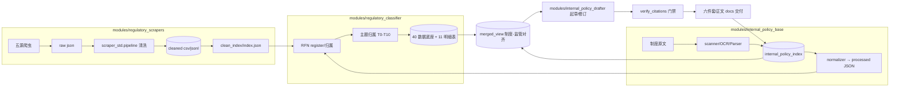

# regulatory_compliance_orchestrator — 四子项目整体重构方案（v1 · 待确认）

> 状态：**方案待确认**（未开始任何代码迁移/改造）
> 日期：2026-09-07
> 方案范围：`regulatory_scrapers` + `regulatory_classifier` + `internal_policy_drafter` + **新增 `internal_policy_base`**
> 目标根目录：`D:\WorkBuddy\regulatory_compliance_orchestrator`
> 方案参考：`regulatory_compliance_orchestrator/reports/` 下《端到端联动流程图.mermaid》《物理目录结构.txt》（仅作参考，本文档基于真实代码资产作出取舍，见 §11）

---

## 1. 背景与目标

现有三项目已完成监管外部数据侧（采集→清洗→RFN 归属→主题分类→报告）的成熟闭环，但存在结构性约束：

| 现状痛点 | 代码证据 |
|---|---|
| 路径纪律与硬编码并存 | `paths.py` 声明禁止硬编码盘符，但 `recall_audit/scanner.py:26`、`build_outputs.py:11`、`report.py:16`、`run_retrieval_after_checks.py:61-78` 仍直写 `D:/WorkBuddy/...` |
| 主题/归属脚本多目录叠置 | T1–T10 报告加工脚本在 `2026-09-02-T1纵向深化分析/`（`T1...报告.md:625` 自述），node2 语义引擎在 `classifier/theme_analysis/node2_rebuild/`，两处并存 |
| 内部制度侧无结构化底座 | `internal_policy_drafter` 为纯文档交付 + 2 个校验脚本，制度全文/版本/条款无程序可读底座 |
| 触发碎片化 | 爬虫走独立 automation（周二 01:00）、classifier 走门禁编排（06:00），无统一调度语义 |
| 枚举虽统一但散布在共享库 | `std_lib/scraper_std/unified_schema.py` 已定义受控枚举，但仅 scraper 侧消费 |

**重构目标**：
1. 四子项目代码统一收纳进 `regulatory_compliance_orchestrator`，职责边界、接口、数据流全部代码化；
2. `internal_policy_base` 作为**内部制度扫描服务**，产出结构化制度底座，并与 `regulatory_classifier` 的 T0–T10 主题体系**对齐承接**；
3. `internal_policy_drafter` 从"读 docs"升级为"读结构化底座"，获得起草/修订的结构化数据支撑；
4. 全链路（采集→清洗→索引→分类→内部扫描对齐→起草支撑→门禁）单一编排入口、单一触发语义；
5. **杜绝硬编码**（路径/快照日期/枚举值），全部收敛到 config + paths + 门禁。

---

## 2. 现状资产盘点（重构 = 保留资产 + 治理负债，不是推倒重来）

### 2.1 必须保留/迁移的成熟资产

| 资产 | 位置 | 保留理由 |
|---|---|---|
| RFN 唯一事实源体系 | `classifier/rfn/`（registry / query_or_register / RFNIndex） | 唯一键规则、幂等注册、三级查询成熟，下游大量消费 |
| 归属表 8 列 / 主题归属表 3 列 | `classifier/data/人身保险公司-{文件,主题}归属表.csv` | 全局唯一事实源（Gate4 以 `rfn.registry.CSV_FIELDS` 为准） |
| 五源统一 Schema 39 列 / 枚举 v3 | `scrapers/std_lib/scraper_std/unified_schema.py` | `CSV_COLUMNS`、`TIMELINESS_STATUS(7)/BODY_SOURCE(3)/SOURCE_SET(5)`、`assert_enum_bindings` |
| 统一清洗管道 | `scraper_std/pipeline.py::run_pipeline` | load→map→clean→ocr→validate→dedup→双轨写出→history |
| clean_index 单一索引 | `scrapers/clean_index/` | classifier 取最新快照的唯一入口（含陈旧自愈重建） |
| 召回判定引擎 | `classifier/recall_audit/{scanner,build_outputs,report}.py` | INCLUDE/BOUNDARY/EXCLUDE 分层 + 动态统计 |
| 门禁式重跑编排 | `recall_audit/run_retrieval_after_checks.py` | 四门禁 + 签名幂等（含 Gate3 契约 / Gate4 schema 预检） |
| 数据底座 40 JSON + 11 明细表 | `classifier/data/_t{n}_*.json`、`T{n}_{m}*.csv` | T1–T10 结构化分析结果，供下游消费 |
| 顶层 7 门禁 | `run_gates.py` | 交付前一体化验收 |
| 反硬编码 lint | `lint_hardcoded_snapshots.py` | N-3 快照日期扫描，被 Gate1 复用 |
| 索引/主题写入器 | `classifier/theme_analysis/node2_rebuild/merge_final_theme.py` 等 | 主题归属表（1,059 全量）写入链路 |
| 起草文档交付物 | `internal_policy_drafter/docs/**`（六件套等） | 已是权威制度正文 V2.0，迁移不改内容 |
| 制度引用门禁 | `internal_policy_drafter/scripts/verify_regulatory_citations.py --strict` | R-01~R-43 引用/文号一致性核验 |

### 2.2 必须治理的负债

| 负债 | 治理方式 |
|---|---|
| 三仓各自 `paths.py` 却普遍未被业务代码引用 | 重构后统一单例 `paths.py`，全代码只许引用它，门禁扫描盘符字面量 |
| classifier 死路径脚本（`*_protocol.py`、theme_analysis 大量历史脚本） | 迁移时**只迁现行链路成员**，历史脚本留原目录并加 `README.md` 标注"历史归档，勿运行" |
| T1–T10 报告脚本散落在 `2026-09-02-T1纵向深化分析/`（一次性过程目录） | 报告生成脚本迁入 `modules/regulatory_classifier/scripts/report_builders/`，产物规范入 `data/` |
| 跨项目仅靠 `sys.path.insert` + 盘符 import | 重构后经 `interfaces/` 统一函数/契约引用，禁止裸盘符 |
| nfra 一周调度、classifier 06:00、爬虫 automation 三套触发 | 收敛到 orchestrator 编排器 + 单一 automation |
| `run_clean_pipeline.py` 中 raw 路径候选含旧 `output/` 兜底 | 收敛为 config 声明的数据根，消除 output/ 路径 |

---

## 3. 目标架构总览

### 3.1 顶层目录结构（目标）

```
D:\WorkBuddy\regulatory_compliance_orchestrator\
├── pyproject.toml                 # 编排器统一工程（含四子模块依赖声明）
├── README.md                      # 运行说明（单点）
├── paths.py                       # 路径 SSOT（环境变量 REG_* 覆盖，唯一事实源）
├── cli.py                         # 统一入口 orchestrator-cli
├── config/
│   ├── enums.py                   # ★ 受控枚举唯一事实源（v3 + internal 扩展）
│   ├── sources.yaml               # 五源 + internal + 采集配置
│   ├── alert_channels.yaml        # （预留，参考蓝图）
│   └── schema/
│       ├── cleaned_csv_columns.json    # 39 列序契约（由 unified_schema 导出）
│       ├── internal_policy_schema.json # 内部制度记录 schema
│       └── merged_view_schema.json     # 制度-监管对齐视图 schema
├── interfaces/                    # ★ 跨模块唯一调用层（禁止直连数据文件）
│   ├── __init__.py
│   ├── clean_index_api.py         # 封装 scraper clean_index（latest_csv_path 等）
│   ├── rfn_api.py                 # 封装 classifier rfn（register/query/rebuild）
│   ├── theme_api.py               # 封装 classifier THEME_MAP / 主题归属对齐
│   ├── internal_policy_api.py     # 内部制度登记/检索/对齐接口
│   └── contract.py                # 数据契约常量（列头、枚举、JSON key 超集定义）
├── gates/                         # ★ 交付门禁（由 cli gate 统一跑）
│   ├── gate_hardcoded_paths.py    # 新增：盘符字面量扫描（含 D:/、D:\、WorkBuddy 引用）
│   ├── gate_hardcoded_snapshots.py# 迁移 lint_hardcoded_snapshots
│   ├── gate_enum_values.py        # 迁移 check_enum_values（范围扩至四模块）
│   ├── gate_rfn_sync.py           # 迁移 check_rfn_sync
│   ├── gate_flat_layout.py        # 迁移 check_flat_layout
│   ├── gate_contract.py           # 迁移 check_pipeline_contract
│   └── gate_citations.py          # 迁移 drafter verify_regulatory_citations
├── std_lib/                       # 共享库（自 scraper std_lib 迁入，单副本）
│   └── scraper_std/（含 common/）
├── modules/
│   ├── regulatory_scrapers/       # 外部监管采集+清洗（原仓迁移，仅现行链）
│   │   ├── cn_law_hub_crawlers/
│   │   ├── gov_regulations_scraper/ ...（五源目录，去除 output 兜底）
│   │   ├── timeliness_review/     # 效力核验
│   │   └── scripts/run_clean_pipeline.py
│   ├── regulatory_classifier/     # RFN + 主题 + 报告（原仓迁移，仅现行链）
│   │   ├── rfn/
│   │   ├── recall_audit/          # scanner→build_outputs→report + 编排器
│   │   ├── theme_analysis/        # node2 语义引擎 + merge_final_theme
│   │   ├── scripts/               # base/clause_graph/detail/upper_laws 构建
│   │   ├── scripts/report_builders/  # T1–T10 报告脚本（自 2026-09-02-* 迁入）
│   │   └── data/                  # 归属表/主题表/40底座/11明细表（数据随迁或 config 指向，见 D5）
│   ├── internal_policy_base/      # ★ 新增：内部制度扫描服务
│   │   ├── scanner/               # 目录扫描/文件指纹/增量
│   │   ├── ocr/                   # OCR 编排（PaddleOCR/Tesseract 抽象）
│   │   ├── parser/                # PDF/DOCX/文本 → 结构化（章-条-款解析）
│   │   ├── normalizer/            # 内部制度统一 Schema 映射
│   │   ├── indexer/               # internal 索引（版本链/废止关系）
│   │   ├── aligner/               # ★ 与 classifier T0–T10 主题对齐承接
│   │   └── data/                  # processed/originals/archive（参考蓝图）
│   └── internal_policy_drafter/   # 制度起草/修订（原仓迁移）
│       ├── scripts/               # dump_related_systems / verify_citations（改走 interfaces）
│       ├── drafters/              # 草稿/对照表/映射生成器（读结构化底座）
│       └── docs/                  # 权威交付物（原 docs 全量迁移，内容不变）
├── tools/                         # 共享工具
│   ├── ocr/  common/  text_utils/
├── data/                          # （可选）统一数据根，见 D5
└── reports/                       # 方案/门禁/分析报告输出目录（本目录）
```

> 说明：目录名沿用四子项目既有名称（`regulatory_scrapers` 等）作 `modules/*` 子名，保证代码内 docstring、import 语义与历史资产对应，避免二次改名漂移。

### 3.2 端到端数据流（目标）

```
[采集层]  external: 官网/五源 → cn_law_hub(可选) + gov/mof/nfra/pbc/supp → data/raw → scraper_std 清洗
          internal: 内部制度原文(PDF/Word/扫描) → internal_policy_base.scanner → OCR/parser → 结构化 JSON
                      │
                      ▼
[索引层]  clean_index/index.json（external 位置 SSOT） · internal_policy_index（internal SSOT）
                      │
                      ▼
[对齐层]  classifier（RFN 注册/归属表/主题归属 T0–T10；40 底座；11 明细）
                ▲                  │
    internal_policy_base.aligner  │
        （内部制度 ←对照→ 监管主题/RFN 支撑链）
                      │
                      ▼
[合并视图] merged_view（制度条目 × 监管条目 × 主题 × 支撑/冲突关系）→ interfaces
                      │
                      ▼
[应用层]  internal_policy_drafter：读 merged_view + 明细表/底座 → 草稿/对照表/六件套 → verify_citations 门禁 → 回写 internal 索引（版本演进）
[监控/报告] compliance-closure / query-report / monitor-daemon（参考蓝图；是否本期实现见 D6）
```



---

## 4. 各子项目职责边界与模块划分

### 4.1 modules/regulatory_scrapers（外部监管采集域）
- **职责**：从外部官网采集监管文件；输出统一 Schema 的 cleaned 双轨产物 + clean_index 索引；执行效力核验（timeliness）。
- **边界**：只管"外部监管原始数据 → cleaned"。**不**写 classifier 归属表、**不**做主题判断、**不**直接服务于起草。
- **对外接口**：`interfaces.clean_index_api`（latest_csv_path/latest_jsonl_path/validate/is_fresh）。
- **不迁入**：`backups/`、`cache/`、`defect_reports/`、历史数据文件（放回原目录并备注，见 D4）。

### 4.2 modules/regulatory_classifier（监管知识域 · RFN + 主题中枢）
- **职责**：RFN 唯一登记与归属表维护；召回复核；T0–T10 主题归属与数据底座（40 JSON/11 明细）构建；对外提供主题体系 **THEME_MAP 唯一事实源**。
- **边界**：管理"监管文件"侧；对内部制度只提供**对齐打标服务**（经 aligner），自身不落内部制度数据。
- **对外接口**：`interfaces.rfn_api`（register_doc/query_or_register/rebuild_index）、`interfaces.theme_api`（by_theme/by_docno/all_themes/align_record）。
- **现行链路成员（迁移白名单）**：`rfn/`、`recall_audit/{scanner,build_outputs,report,run_retrieval_after_checks,verification_state_mirror}.py`、`scripts/{build_base_from_attr,build_clause_graph,build_detail_tables,build_upper_laws,cluster_by_keywords,match_theme_docs,check_*}.py`、`theme_analysis/node2_rebuild/{semantic_core,merge_final_theme,reorder_json,build_report,build_detail_tables_v2,analysis_steps34,extract_refs_v2}.py`、`report_builders/*`（T1–T10 报告脚本迁入）。
- **不迁入**：全部 `*_protocol.py`、`recall_audit/protocol/`、ruff 排除清单中的历史脚本（`apply_perspective/curate/chk_theme_drift/review2/review3/peek/...`）。

### 4.3 modules/internal_policy_base（内部制度扫描域 · 新增）
- **职责**：内部制度原文（PDF/Word/扫描件）入库 → 扫描/OCR/解析 → 统一 Schema 结构化（章条款级）→ 版本链/废止管理 → 建立"内部制度 ↔ 监管主题(T0–T10)/RFN"对齐关系 → 向 drafter 提供结构化制度查询。
- **子模块**：
  - `scanner/`：目录扫描、增量、文件指纹（复用 scraper_std 指纹思路），事件/定时触发（见 §7 调度）。
  - `ocr/`：OCR 引擎抽象（PaddleOCR 优先、Tesseract 兜底；编排复用 `std_lib/tools/s62_pbc_body_refill.py` 已实践的 OCR 模式）。
  - `parser/`：正文结构解析（章/条/款/项），内部制度常为 docx/pdf，可复用 scraper_std `docx_utils` / `doc_number` 思路。
  - `normalizer/`：映射内部制度统一 Schema（参考 external 39 列但**不混用**，见 §6 内部 Schema）。
  - `indexer/`：内部索引（含版本链 version_chain_id、supersedes、status）；`originals/archive/processed` 数据布局（对齐参考蓝图）。
  - `aligner/`：**与 classifier 对齐承接**——对每条内部制度判定关联监管主题与支撑监管文件（经 `theme_api`/`rfn_api`），输出对齐记录。
- **边界**：不做监管文件分类、不做制度正文起草。
- **对外接口**：`interfaces.internal_policy_api`（register/query/version_chain/align）。

### 4.4 modules/internal_policy_drafter（内部制度起草域）
- **职责**：制度制定/修订全流程的起草工具与交付物管理——读取结构化底座（内部制度现状 + 监管对齐视图），产出草稿/条款对照表/双向映射/覆盖校验，最终发布并回写内部索引。
- **改造**：现有 `verify_regulatory_citations.py --strict` 保留为交付门禁（迁 gates），其数据来源从 `docs/监管文件编号与分类对齐表.md` 改为 `interfaces.rfn_api + theme_api`（同一数据，消除 md 手工表漂移）。
- **不迁入**：`backups/`（编号重写/修订 2026 系列历史脚本）。

---

## 5. 数据流向与接口设计

### 5.1 阶段编排（全部经 orchestrator cli）

| 阶段 | 动作 | 入口 | 产出 | 幂等 |
|---|---|---|---|---|
| P1 外部采集 | 五源增量抓取 | `orchestrator collect --source gov` | `data/raw/*.json` | 增量+断点 |
| P2 外部清洗 | run_pipeline 五源 | `orchestrator clean --source all` | `data/cleaned/{s}_cleaned_{date}.{csv,jsonl}` | 是（原子写+history） |
| P3 clean_index | 重建/校验索引 | `orchestrator index --refresh` | `clean_index/index.json` | 是 |
| P4 召回复核 | scanner→build_outputs→report | `orchestrator retrieval --force` | recall 交付物 | 门禁幂等 |
| P5 主题/底座 | base/final/matched/citerefs/明细 | `orchestrator classify` | 40 JSON/11 明细/主题归属 | 是（_verify_written 后验） |
| P6 内部扫描 | scanner/OCR/parser/indexer | `orchestrator internal scan` | `internal_policy_index` | 增量 |
| P7 对齐 | internal×监管主题/RFN | `orchestrator internal align` | 对齐记录/merged_view | 是 |
| P8 起草支撑 | drafter 草稿/对照 | `orchestrator draft` | 草稿/对照表/交付物 | 是 |
| P9 门禁 | gates 全量 | `orchestrator gates` | exit 0/1 | 是 |

### 5.2 接口设计约定（跨模块唯一通道）
1. **`interfaces/` 是唯一跨模块调用层**：`modules/*` 之间禁止直接 `import` 兄弟包、禁止 `sys.path.insert(盘符)`、禁止裸 `open()` 兄弟仓数据文件。
2. 每个 API 模块导出一组纯函数，docstring 标注"数据契约版本"；实现内部做异常收敛（返回 `None`/`raise` 语义统一）。
3. **CLI 约定**：每模块入口保持 `argparse` + `exit code`；由 `cli.py` 以 `subprocess` 调用（保留现有 cli 模式），不跨进程共享可变状态。
4. **数据契约**：列头顺序、枚举值、JSON key 超集在 `config/schema/*.json` + `interfaces/contract.py` 声明；门禁 `gate_contract` 校验（沿用 Gate3/Gate4 判定模式并扩展到 internal schema）。
5. 杜绝硬编码细则：
   - 所有盘符路径一律改经 `paths.py`（模块内 `from paths import ...`，且 `paths.py` 常量全部支持 `REG_*` 环境变量覆盖）；
   - 新增 `gates/gate_hardcoded_paths.py`：扫描 `regulatory_compliance_orchestrator/` 下所有 `.py`，禁止出现 `D:/`、`D:\`、`d:/`、`d:\`、`WorkBuddy/`、`sys.path.insert(0, "D:` 字面量（`backups/`、`gates` 自身、`paths.py` 定义区排除）；
   - 快照日期 lint 随迁（`gate_hardcoded_snapshots`），范围扩为整个 orchestrator 树。

---

## 6. 唯一事实源（SSOT）与枚举一致性

### 6.1 唯一事实源矩阵（重构后全项目唯一权威）

| 事项 | 唯一权威 | 读取接口 | 备注 |
|---|---|---|---|
| 路径 | `paths.py`（env: `REG_SCRAPERS_ROOT/REG_CLASSIFIER_ROOT/REG_INTERNAL_ROOT/REG_INTERNAL_BASE_ROOT`） | 直接 import | 重构后根统一，env 保留用于 CI/测试 |
| 受控枚举 | `config/enums.py` | `from config.enums import *` | 单一文件；`std_lib` 只允许从本文件再导出 |
| 清洗 39 列契约 | `config/schema/cleaned_csv_columns.json` | contract | 由 `unified_schema.CSV_COLUMNS` 导出校验 |
| external cleaned 位置 | `clean_index/index.json` | `interfaces.clean_index_api` | 禁硬编码 `*_cleaned_YYYYMMDD` |
| 监管文件归属/RFN | `classifier/data/人身保险公司-文件归属表.csv` | `interfaces.rfn_api` | `rfn.registry` 唯一写者 |
| 监管主题 | `classifier/data/人身保险公司-主题归属表.csv` + `rfn.THEME_MAP` | `interfaces.theme_api` | `merge_final_theme.py` / registry 唯一写者 |
| 数据底座 | `classifier/data/_t{n}_*.json`（40） | classifier 内部脚本 | 键集超集定义在 contract |
| 内部制度索引 | `internal_policy_base/data/index/internal_policy_index.json` | `interfaces.internal_policy_api` | scanner/drafter 发布写者 |
| 制度-监管对齐视图 | `merged_view.json`（由 aligner 维护） | interfaces | 供 drafter/closure/query |
| 效力核验状态 | `timeliness_review/verification_state.json` | 镜像接口 | 90 日复用 |
| 审计 | `audit_log.json` | — | 所有 register/发布写操作留痕 |

### 6.2 枚举值一致方案（延续《三项目状态码值统一规范》v3）

- 保留 v3 已固化枚举：`source ∈ {gov,mof,nfra,pbc,supp}`、`timeliness_status ∈ {valid,amended,repealed,partially_repealed,expired,pending,uncertain}`、`body_source ∈ {webpage,downloaded_doc,both}`、doc_type/category 受控值——全部迁入 `config/enums.py` 单一定义，`unified_schema.py` 改为引用本文件并保留 `assert_enum_bindings()`。
- **新增 internal 侧枚举**（与外部不混用、命名不冲突）：
  - `internal_status ∈ {draft,active,expiring,deprecated,archived}`（对齐参考蓝图 ACTIVE/EXPIRING/DEPRECATED 语义，缩写统一为小写英文）；
  - `internal_file_type ∈ {policy,process,guideline,manual,other}`；
  - 内部制度版本状态不新增字段级枚举，版本演进用 `version_chain_id + supersedes` 表达。
- 一致性守则：**任何模块不得本地定义枚举字面量**；门禁 `gate_enum_values.py --strict` 扫描四模块所有 `.py` 中出现的枚举值字符串，不在 `config/enums.py` 内即 FAIL（对既有合法代码配置豁免清单，随迁移收敛为零）。

---

## 7. 触发机制（统一调度）

| 事件 | 频率 | 入口 | 语义 |
|---|---|---|---|
| 外部五源增量采集 | 每周二 01:00 | automation → `orchestrator collect --source {gov,mof,nfra,pbc,supp}` | fs_lock 单实例 + 增量窗口 |
| 外部清洗 + clean_index 重建 | 采集后 | `orchestrator clean --source all && orchestrator index --refresh` | 原子写 + history 3 版 |
| classifier 召回复核/底座 | 每日 06:00 | automation → `orchestrator retrieval`（四门禁幂等） | 数据签名不变则跳过 |
| 内部制度扫描 | 每日 / 事件 | automation 或文件监听 → `orchestrator internal scan` | 增量 + 指纹 |
| 对齐刷新 | 扫描后 | `orchestrator internal align` | 幂等 |
| 起草触发 | 手动 | `orchestrator draft` | — |
| 交付门禁 | 发布前/定时 | `orchestrator gates` | exit code 聚合 |

统一由**一个** automation 描述词调用 orchestrator cli（消除 nfra 自有 weekly_refresh、06:00 独立 prompt、周二爬虫 prompt 三套并存；nfra 的 `weekly_refresh.py` 降级为 `collect --source nfra` 的内部实现细节）。

---

## 8. 目录/文件规范（全项目）

1. **数据与代码分离**：`modules/*/data/` 仅存放运行期数据；代码中禁止写死数据子路径，一律由 `paths.py` 提供。
2. **命名**：`{source}_cleaned_{YYYYMMDD}.{csv,jsonl}` 双轨保持；internal 产物 `{制度名}_{版本}.json`（processed）；索引文件统一 camelCase `*.json`。
3. **报告输出**：所有方案/门禁/分析/交付报告 → `regulatory_compliance_orchestrator/reports/`（本方案即按此落盘）。
4. **备份/历史**：`backups/` 一律不进新仓；历史数据与退役脚本留在原目录，新仓 `docs/历史归档索引.md` 记录指向。
5. **docstring 纪律**：禁止在代码注释中写死"当前条数/日期口径"（如 1073/1076/808 漂移问题），统计一律动态推导。
6. `.gitignore`（若启用 git）：`data/`、`cache/`、`logs/`、`__pycache__/`、`.venv/`、`*.pyc`。

---

## 9. 分阶段实施路线（每阶段有验收门禁）

| 阶段 | 内容 | 验收标准 |
|---|---|---|
| **P0 骨架**（本期） | 建目录骨架：paths.py / config/enums.py / interfaces/contract.py / gates 壳 / cli.py 空壳 / pyproject | `python cli.py --help` 通过；`paths` 单测 |
| **P1 外部域迁移** | regulatory_scrapers + classifier 现行链迁入 modules/，import 全部改走 paths + interfaces；跑通 P1–P5 命令 | 迁移后五源清洗/召回复核产物与迁移前 diff 一致；gates 全绿；`gate_hardcoded_paths` 零命中 |
| **P2 internal_policy_base** | scanner/OCR/parser/normalizer/indexer + internal schema + 样本库（内部制度 5–10 份）验证 | 样本制度结构化成功率/字段完整率达标；与 classifier THEME_MAP 对齐样例输出 |
| **P3 对齐 + merged_view** | aligner 实现 + merged_view schema + 回填 06 六件套所用 R-01~R-43 对齐 | 对齐表与现有六件套之五（双向映射表）抽查一致 |
| **P4 drafter 结构化支撑** | drafter 从 interfaces 读 merged_view 生成草稿/对照；verify 门禁数据源切换 | 对照表/覆盖校验报告可与六件套 V2 对照一致 |
| **P5 统一调度+门禁固化** | 单一 automation 词 + gates 全绿 + 硬编码零容忍 | 新一周自动运行全链路无手工步骤 |
| **P6（可选）** | compliance-closure / query-report / monitor-daemon（见 D6） | 按需 |

---

## 10. 明确"代码固化、杜绝硬编码"的落点清单

| # | 固化项 | 落地机制 |
|---|---|---|
| 1 | 路径 | `paths.py` 唯一 + `gate_hardcoded_paths` 扫描 |
| 2 | 快照日期 | `gate_hardcoded_snapshots`（沿 N-3） |
| 3 | 枚举值 | `config/enums.py` 唯一 + `gate_enum_values --strict` |
| 4 | 列序/JSON 契约 | `config/schema/*` + `gate_contract`（Gate4 模式扩展） |
| 5 | RFN/归属一致性 | `gate_rfn_sync`（check_rfn_sync --fix） |
| 6 | 主题引用 | 全部经 `theme_api`（禁裸 import THEME_MAP 副本） |
| 7 | cleaned 获取 | 全部经 `clean_index_api` |
| 8 | 制度引用门禁 | `gate_citations --strict`（数据源切 interfaces） |
| 9 | 编排幂等 | 每阶段签名 + checkpoint（沿用 run_retrieval 模式扩展为全链路） |
| 10 | 调度 | orchestrator cli + 单一 automation |

---

## 11. 与参考蓝图（reports 现有文件）的差异与取舍

| 参考蓝图主张 | 本方案处理 | 理由 |
|---|---|---|
| `data_bases/` 作为独立数据层顶层目录 | **不照搬**；数据归 `modules/*/data/` + 可选统一 `data/`（D5） | 现有代码大量按仓组织数据，强迁 data_bases 会引发大规模路径重写 |
| `unified_knowledge_index/{external/internal/merged}.json` | 保留**概念**：external=clean_index，internal=internal_policy_index，merged_view=merged_view.json；但 external 索引沿用既有 `clean_index/index.json` 格式 | 已有成熟 clean_index，不新建平行索引 |
| 分类器"读取双索引打标 T1–T8" | T1–T8 扩展为**既有 T0–T10 + 上位法锚点**体系 | classifier 现行 THEME_MAP 已是 T0–T10 |
| `regulatory-classifier 写 merged_view` | 调整为：classifier 只写监管侧；merged_view 由 `internal_policy_base.aligner` 融合 | 职责边界更清晰（分类器不落内部数据） |
| `monitor-daemon` 监听+钉钉/企微 | **降级为可选 P6** | 本期核心是数据闭环；监控告警可后续接入 |
| OCR 用 PaddleOCR 术语 | 采用：OCR 编排层复用环境已有 `PaddleOCR-3.7.0` / Tesseract | 与参考蓝图一致 |
| internal 状态 ACTIVE/EXPIRING/DEPRECATED | 采纳但**枚举小写统一**进 `config/enums.py`：active/expiring/deprecated/archived/draft | 与外部 timeliness 小写风格一致，门禁可校验 |

---

## 12. 待确认决策点（D-01 ~ D-06）

| # | 决策 | 选项 | 建议 |
|---|---|---|---|
| D-01 | 原四个目录（D:\WorkBuddy\regulatory_scrapers 等）处置 | A 只读保留（加归档标注）　B 迁移后删除　C 重命名加 `_legacy` | **A**：历史 backups/过程数据仍在原处，风险最低 |
| D-02 | `modules/` 子目录命名 | A 沿用现有名　B 参考蓝图更名（regulatory-crawler-trigger 等） | **A**：避免 docstring/脚本大改与追溯漂移 |
| D-03 | 内部制度编号体系 | A 复用 RFN 前缀（RFN-…内部制度也登记 classifier 归属表）　B 独立编号（如 `IPN-<hex>`，classifier 仅做主题对齐） | **B**：监管/内部两类实体编号空间分离，RFN 语义纯净 |
| D-04 | 大体积数据（五源 raw/cleaned、classifier data、内部原文）是否物理迁入新仓 | A 全部迁入（新仓 `data/` 统一）　B 保持原位置，config/paths 指向　C 现行活跃数据迁入、历史归档留原地 | **C**：兼顾单目录完整与体积可控（现 scraper data 数千 PDF/GB 级） |
| D-05 | 顶层是否设统一 `data/` 数据根 | A 设（对齐参考蓝图 data_bases 精神）　B 不设，数据随仓 | 配合 D-04-C：**B**（活跃数据随仓，路径由 paths.py 声明） |
| D-06 | 参考蓝图 App/监控模块（compliance-closure/query-report/monitor-daemon）是否本期实现 | A 一并实现　B 二期预留（interfaces/merged_view 预留 schema） | **B**：先固化四子项目数据闭环，App 层留接口 |
| D-07 | 是否启用 git 纳入版本管理 | A 是（新仓 git init + .gitignore）　B 否，沿用无 git | **A 建议**（如用户无 git 政策则 B） |

---

## 附：本方案对应真实代码证据索引

- RFN 体系：`regulatory_classifier/rfn/registry.py:94-109,205-263`；`rfn/__init__.py:34-46,67-141`
- 归属表 8 列/主题表 3 列：`rfn/registry.py:70-73`；Gate4 校验：`recall_audit/run_retrieval_after_checks.py:485-564`
- 统一 Schema/枚举：`std_lib/scraper_std/unified_schema.py:59-66,584-595`
- clean_index：`clean_index/__init__.py:392-424`
- 现行召回链路：`recall_audit/scanner.py → build_outputs.py → report.py`
- 主题归属写入器：`theme_analysis/node2_rebuild/merge_final_theme.py`（1073 全量）
- T1–T10 报告脚本真实所在：`2026-09-02-T1纵向深化分析/*.py`（报告尾注自证，如 `docs/T1...报告.md:625`）
- 7 门禁：`run_gates.py:36-51`
- drafter 门禁：`internal_policy_drafter/scripts/verify_regulatory_citations.py --strict`

（以上均为本次审查中实际核验到的代码事实）
